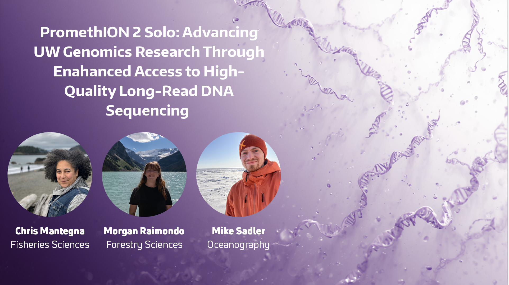
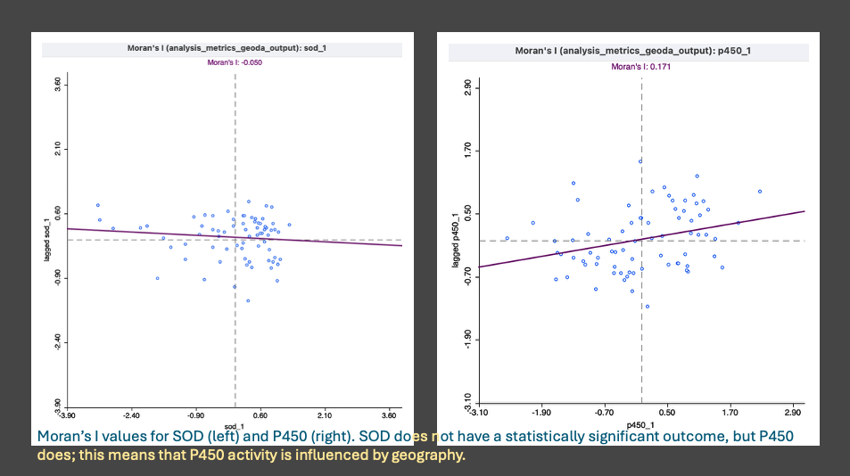
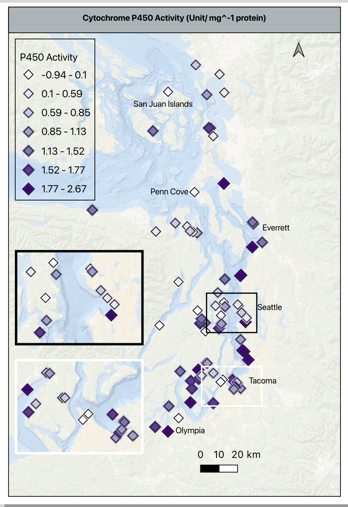
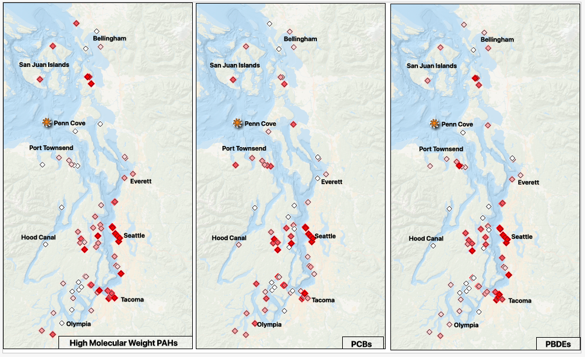
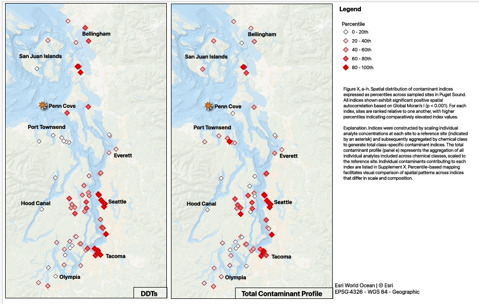

> This page compiles ***all*** daily posts for the month.

------------------------------------------------------------------------

## 2026-02-01 — February Goals

### February Goals

1.  Get the biomarker manuscript over to WDFW for review and sign-off for 31 March 2026 ICB submission deadline.

2.  Begin mussel experiment for Chapter 3 & 4.

3.  Complete DNA methylation data processing and begin exploratory analysis.

### Strategies for Success

#### Goal 1

1.  Finish polished visualizations, tables, and captions for the biomarker manuscript.
2.  Prepare a folder of polished supplementary materials, i.e., index maps, transformed data tables, and cleaned up R scripts.
3.  Send manuscript to complete committee for feedback.

#### Goal 2

1.  Put together a detailed experimental plan including timeline, materials needed, and data collection methods with 1-3 options for setup.
2.  Complete the Lab Risk Assessment form from EH&S to discuss with Steven to get approval for the experiment.
3.  Connect with Jon W and Sam W to work through physical space, setups, and ordering materials.

#### Goal 3

1.  Re-familiarize myself with where I left off in late 2025 and backup the large files.
2.  Move through the initial Bismark pipeline (which I believe I finished) into optimizing alignment parameters and using that outcome for subsequent steps.
3.  Quantify methylation levels and visualize using IGV or JBrowse.
4.  Get feedback on initial results from Steven and/or other lab members before moving into downstream analyses.

## 2026-02-02 — Tuesday's are for UW-RUA, but Monday's are Sometimes for Prep

-   No science done today except for sketching out better ways to map the contaminant and integrated indices for the biomarker manuscript (about 45 minutes of work...), no deep work. I spent most of the day prepping for Tuesday's deliverables.

## 2026-02-03 — Lab Notebook Posts v Notion Notes

### Projects Touched Today

-   lab notebook
-   mentoring
-   mussel pilot experiment

### New Knowledge

-   I first knocked out Darian's recommendation letter for a summer internship; had to get back into the writing groove.
-   Next, I put together a weekly wrap-up post on my 1/25/26 resazurin trial with my pilot experiment mussels.
-   I built the table with the observations of the pilot experiment to add to the pilot repo, and I made a few notes about what should go in the README for a small task later this week.
-   I finished by moving my Notion daily notes to my daily notebook post template and updating the entire month of January. The ease of just adding a few lines in Notion (via my button) doesn't really translate into an easy post setup, so I need to think about how to streamline that process. I like that I can capture what I'm doing or questions I have in the moment, but those are a bit too loosey- goosey.

### Old Tricks

-   It was a RUA day, so getting some of my admin tasks out of the way was a bigger win than I expected.

### Word Count (Productivity)

*A note on word count/ productivity: I do not include task- based writing, for example the recommendation letter and cleaning up my January notebooks posts, because those don't directly move my work forward. I do count the resazurin post, because it was a synthesis of the work, a reflection on the results, and a plan for next steps.*

-   Resazurin post: 713 words
-   **Today's total: 713 words**
-   **Monthly total to date: 713 words**
-   **Annual total to date: 10,969 words**

### Questions or Concerns?

-   None.

### Tomorrow's Plan

-   Will be made tomorrow to include resazurin analysis, editing and refining biomarker viz, and updating February noteboook posts.

## 2026-02-04 — Taking Inventory & Making a Plan

### Projects Touched Today

-   lab notebook
-   mussel experiment planning and design
-   mussel pilot experiment

### New Knowledge

-   I created my February Goals Post with specific steps and strategies to complete them.
-   I worked with KPJ for a 3-hour writing block where I collated and cleaned up about half of my lit notes to support the mussel experiment design choices.

### Old Tricks

-   Continued refining my literature support for the mussel experiment (second bullet point)
-   Returned to mapping for the biomarker visualizations (from yesterday). I cleaned up the sampling site map, and went to work on the individual biomarker activity maps for p450 and sod but didn't finish those today.

### Word Count (Productivity)

*A note on word count/ productivity: I do not include task- based writing, for example the recommendation letter and cleaning up my January notebooks posts, because those don't directly move my work forward. I do count the resazurin post, because it was a synthesis of the work, a reflection on the results, and a plan for next steps.*

-   February Goals + Strategy Post: 191 words
-   Viz made: 1 map

> **Today's total: 191 words**
>
> **Monthly total to date: 904 words**
>
> **Annual total to date: 11,160 words**

### Questions or Concerns?

-   None.

### Tomorrow's Plan

-   Will be made tomorrow to include resazurin analysis, editing and refining biomarker viz, and continuing experimental planning for my 2/11 meeting with Steven.

## 2026-02-05 — What did John Lennon Say About Plans...

Oh, that's right, he said "Life is what happens to you while you're busy making other plans." Well, life today definitely didn't agree with my plans.

### Projects Touched Today

-   mussel biomarkers

### New Knowledge

-   So, in my quest to wrap up mapping, I found a mistake in my spatial analysis of the biomarker metrics and indices. When I mapped my spatial results, I started with the geographic clusters designated using K-Means clustering that I verified with variance and significance testing ensure the groups were statisically different enough to be meaningful. When I threw the groups in the map, it looked like I just threw out a handful of fruit loops and said 'ok'...
    -   First, I went back and double checked the sites and assigned color palette were correct. Next I went to the data table to verify the values were in the correct format and not mistakenly overwritten. Finally, I moved over to check the code I used to analyze the clusters.
    -   One seven letter word got me- degrees. I completed the SPATIAL analysis in degrees, not distance. I made a note in the R code, and moved back over to GIS to redo the analysis.
-   To redo the analysis, I did the following:
    -   Imported a clean table of the metrics and identifiers, and formatted the columns from characters to actual numbers for next steps
    -   Next we need to link the table to the map, so I created a point layer to link the Puget Sound map. This takes the lat/ long data and converts it from coordinates (degrees) to actual distances. I confirmed the projection and moved to confirm the results.
    -   To verify that worked, beyond the points showing up on the map, I ran a distance matrix summary (by site_id, k=5) to verify the point layer and to guide the parameters I select in the Moran's I analysis. The summary gives you a quick table of minimum and mean distances and the standard deviation; these guide the distance bands (scale) for Moran's.
    -   I confirmed the distance matrix by running a linear matrix that shows if the distances are actually varying, there aren't any self-comparisons, and verify both tests returned consistent results.
    -   Happy with the confirmation, I ran the Moran's I (spatial autocorrelation- regional or global) for p450, mapped the result, and then moved to sod.
        -   P450 showed a few significant clusters, SOD did not. This aligns with the KW comparisons and the Spearman's correlations results. Thank goodness.
-   Tomorrow, I will return to the Moran's I analysis of the remaining metrics (18 of 20 total), the LISA analysis (all 20), and begin mapping the results one metric at a time.

### Old Tricks

The log of mapping decisions I may need to return to:

-   Returned to the sampling site map, added insets for Seattle and Tacoma, and threw it in canva to clean up the format.

-   I chose to add the following city labels:

    -   Olympia, Tacoma, Seattle, Everett, Penn Cove, and San Juan Islands

-   The insets have the city label only for Tacoma and both the city label and Bainbridge Island for the Seattle one because of the geography captured in the inset

-   Next maps will most likely not need the Canva step since I figured out how to do adjust borders independently in QGIS, but we’ll see.

    -   I created a specific color palette for reporting areas in QGIS to be used in all plotting/ mapping for consistency. Hex codes follow a pound sign with no spaces, and are as follows:

        -   6 - 0f6f6c (dark teal)

        -   7 - 6a4c93 (plum)

        -   8.1 - c7352d (brick red)

        -   8.2 - d4a437 (gold)

        -   9 - e07a5f (coral/ salmon)

        -   10 - 4fb3a2 (light teal)

        -   11 - ff7f00 (orange)

        -   12 - 33a02c (yellow)

        -   13 - 1f3c5b (navy blue)

    -   My sampling site basemap is in purple with black borders

        -   Seattle inset is framed in black

        -   Tacoma inset is framed in white - may need to change to yellow or something brighter

    -   My sites by reporting area map is just like the sites map, except color coded as outlined above.

        -   The legend is framed in the same weight as the other frames, and has no background so that it doesn’t stand out so starkly.

        -   This map feels VERY busy, feedback will help for refining

### Questions or Concerns?

-   I made a quick protocol for converting non-geometric data into geometric data in QGIS. Mainly to help myself not miss a step, but secondarily to make sure I am creating mapping layers in the right projections with the right formats before I start mapping, rather than get stuck in the middle because nothing is working correctly.

-   This and the maps will be in my weekly wrap-up.

### Tomorrow's Plan

-   Tomorrow (2/6), I will return to the Moran's I analysis of the remaining metrics (18 of 20 total), the LISA analysis (all 20), and begin mapping the results one metric at a time.
-   The documentation and analysis of the mussel pilot experiment and resazurin trials will get put back in the queue behind finishing the biomarker work.

## 2026-02-06 — Mapping Biomarkers: Spatial Analyses and Mapping in QGIS and R

### Projects Touched Today

-   Mussel biomarkers

### Plan of the Day

-   Complete spatial analyses in QGIS and R, complete mapping for the biomarker manuscript and supplement, and possibly get back to working on the resazurin analyses.

### Progress Notes

-   Today’s work started with drafting presentation text for our Student Technology Proposal: PromethION 2 Solo: Advancing UW Genomics Research Through Enhanced Access to High-Quality Long-Read DNA Sequencing. The proposal is being led by Mike Sadler in Oceanography. We have 3 minutes to pitch our submission followed by 10 minutes of Q&A from the panel, so it has to be clear and quick.

{width="500"}

-   After that, I spent my work block with KPJ reworking the spatial analyses for all metrics in QGIS and confirming in R so I can build the tables to be plotted on the maps succinctly.

    -   Picking up from the p450 and sod analysis from the day before, I plotted the results on a scatter plot to confirm no self- autocorrelation across the sites and was pleased to see it worked!
    -   I continued with the Global Moran’s I analysis for the remaining 17 metrics, there are 19 metrics not 20- I misspoke in yesterday’s post. Global Moran’s was run first because the results answer the question of whether or not there is a statistically significant spatial structure to the measured metrics (p450, sod, shell thickness, condition index), the integrated response indices (IBR biomarker, morphometric, combined), and the contaminant indices (chlordanes, ddt, hch, metals, 4 pah groups, pbde, pcb, pesticides, and total contaminants).

-   

    -   Next up was the ‘local moran’s’ also known as LISA (local indicators of spatial autocorrelation). Since there were 9 metrics indicating a ‘global’ significance, the LISA test tells us what kind of spatial structure exists and if the pattern is consistent across the metrics.
    -   While I don’t expand this into a connection to the physical geography of each of the sampling sites, that can be easily done as a point in the Discussion/ Conclusion of the manuscript or left to assess at a later time.

-   Once I had the QGIS results, I then went back to see if I could fix the errors I made in R to replicate the results. The main reason is to confirm the outcome, and the secondary reason is to create data tables of the results that aren’t GeoPackages so they can be used to plot, build a supplementary spatial results table, and export as a csv in the correct format.

    -   Rather than try to adjust the existing markdown script, I built the script from the beginning, paying special attention to the conversion from coordinate (degrees) to a distance matrix that matched the QGIS matrix.
    -   I ran an analysis of variance between the ‘clusters’ and used the K Nearest Neighbors statistical grouping of geographic groups to continue the analysis. My last attempt used K-Means Clustering, which is not effective in non-normal data since it is built on response variables, not geographic location first- something that was very unclear in my earlier understanding of the test. The K-NN test resulting in an n=6 that was statistically significant and balanced the number of sites per group.
    -   Once that was established, I spent a ridiculous amount of time building a loop to assess all of the metrics for each test. With the help of ChatGPT, I found that I was building the function sandwich in the wrong order… should have just checked that earlier.
    -   The outputs of each of the tests were saved as csv’s, then only the statistically significant results were saved in another csv. Those outputs were then joined to the full csv of identifiers (site number, site name, lat/ long) and metric values, converted to GeoPackages for mapping, and added to QGIS for visualization.

-   I felt very comfortable in stopping at this point since I was making silly mistakes reviewing them in QGIS - time to throw in the towel for the day.

### Tomorrow's Plan

-   Continue mapping the spatial results.

## 2026-02-07 — Mapping Biomarkers: Mapping Spatial Analyses Results in QGIS

### Projects Touched Today

-   Mussel biomarkers

### Plan of the Day

-   Map the analysis results.

### Progress Notes

-   Back at the mapping in QGIS.
    -   First map to make is the Global Moran’s I outcomes. Since just plotting the Moran’s value or p-values isn’t helpful, I am exploring ways to plot the 9 significant results to tell the story with the actual stats in the caption. Using the significant results, I will go back to my complete metrics and indices table, convert the columns to the format I need, add geometry, and test plotting each of the 9 significant metrics.
    -   The mapping choices are as follows:
    -   A multi-panel layout will have P450, Total contaminants, PAH, PBDE and PCB in the top row in that order, and DDT, pesticides, chlordanes and HCHs in the bottom row in that order.
    -   P450 will use a different single color gradient than the contaminant ones; all contaminants will use the same single color gradient for consistency. The higher the value, the darker the color.
    -   For visual consistency, the category breaks for all 8 of the contaminants will be exactly the same - all of the concentrations are in ng/kg, so the comparison is super important to make clearly.
    -   As a reminder, the contaminants are in ng/g, and p450 is in activity/mg protein
    -   Using the histogram of values in p450, I moved the default from 30 bins to 7 to clearly visualize the values gradient between -1 to 2.7 without inflating the activity values and remembering that these are the values scaled based on the reference site. A zero means the value is the same at the reference site, and negative number means it is lower than the reference site, and any positive number is higher than the reference.
    -   The basemap is at 75% opacity to allow the symbols to stand out. The p450 symbol is a 4mm purple diamond with an outline/ stroke of dark grey (#2b2b2b) and a weight of 0.4 and a round join style. This is important because each of these settings, except for the color will be used in the contaminant maps.
    -   I added a duplicate symbol layer below the one described above to add a bit of depth. It is the same symbol shape, drug below the primary, set to 5.5mm, color is very pale grey (#f7f7f7), opacity at 30%, stoke/ outline off. This halo effect helps makes the higher density sites clearer without an inset.

{width="600"}

-   Shifting gears a bit, I pulled the summary stats for the contaminant indices, put them in a quick view table, and then thought through how to make consistent groupings, or how to explain the differences in scale.
    -   None of the contaminant indices will follow a uniform color gradient, so I am trying to group similar scaled classes together rather than group them as I had planned earlier.
    -   There are three groups that are zero- dominant and 5 groups that have a significant range in concentrations, so I am splitting them into two groups for mapping. Group 1 will go to the supplement as detected/ not detected and group 2 will be in maps alongside the p450 map; the main difference is that the contaminants in group two will be broken down into percentiles of concentrations for consistency and p450 activity will remain scaled to the reference site to prevent inflation or deflation of variability.
    -   I created the templates for both groups, created the base maps for all 8 indices, and began refining them in the print layout to export. I need to create a single legend that can be displayed for them all, and tweak the details, but the base information and outcomes are complete - finally!
-   Putting two maps per print layout
    -   Width- 139.640
    -   Height- 205.216

### Products & Word Count

-   STP Presentation Draft: 327 words

-   Complete Spatial Analysis RMD (excluding header, doc settings & library loads): 487 words

-   Viz made: 1 map

    

    > **Today's total: 814 words**
    >
    > **Monthly total to date: 1718 words**
    >
    > **Annual total to date: 12,878 words**

    

### Tomorrow's Plan

-   Watch the Seahawks win the Super Bowl.

## 2026-02-08 — SEA- HAWKS... I mean, More Mapping

### Plan of the Day

-   While the OG plan of the day was to watch the Seahawks redeem the worst decision in football... I really wanted to complete the draft maps of the significantly spatially autocorrelated contaminant classes so I could start fresh on some of the other tasks for the week on Monday.

{fig-align="center"}

### Projects Touched Today

-   Mussel Biomarkers

### Progress Notes

-   Started off today reviewing what I knocked out yesterday, and picked back up on mapping the contaminant indices.

    -   Splitting the significant indices into percentiles and detected/ not detected, that makes my layout simpler - I am going to put a grid together for the percentile maps; one shared legend. The top row will be (L-R) pah, pcb, pbde; the bottom row will be (L-R) ddt, total contaminants, legend.

    -   Set my print layout to ANSI B - Landscape; 431.8mm x 279.4mm to make sure I can get 3 across without crowding.

    -   The maps have the same exact setup, only the data varies, so this feels like it should be a clean way to compare the information.

    -   Can’t forget to add the map attribution: Basemap: Esri World Ocean \| © Esri, and the projection: base- EPSG: 3857, points- EPSG:4326 - WGS 84 - Geographic

-   **NOTE:** When I return to the sampling site and P450 maps- they need to match the extent, scale, and labeling of these maps.

    -   Fix the city/ location labels

    -   Everett is misspelled

    -   Olympia may be misplaced

    -   Add Port Angeles or Port Townsend, lots of sites= label

    -   Consider adding waterway labels, like Commencement Bay, Elliott Bay, greater Salish Sea and/ or Puget Sound

-   Back to the contaminant maps

    -   There is an asterisk indicating the reference site - orange and just slightly larger than the map points; don’t forget to add this in the caption

    -   This is a bit dramatic on the page - adjust when refining the maps

 

-   I am so excited to have finally gotten much closer to aligning the figures with the story in the manuscript draft - since the whole thing is on the shorter side, the figures really have to deliver. There is definite room for improvement; small cleanups on things like aligning frames, text styles, naming convention (I don't think I should pluralize the contaminant abbreviations), and larger refinements for clarity and overall message delivery will be tackled after committee feedback.

### Products & Word Count

-   Viz made: 5 maps + captioning (357 words)

    

    > **Today's total: 357 words**
    >
    > **Monthly total to date: 2,075 words**
    >
    > **Annual total to date: 14,953 words**

    

### Tomorrow's Plan

-   Reminder to committee to review my MS proposal so I can get it submitted

    -   MS proposal must be submitted and signed off NLT 2/20/26

    -   Schedule a meeting for end of February, early March to discuss PhD proposal and manuscript (full committee will receive NLT MS feedback/ submission is completed)

-   Spend some time reviewing the status of my current projects

    -   I have spent so much time in the QGIS rabbit hole that I need to refresh myself on where everything else stands

    -   Map plan for the week based on that review (including blocks for non-dissertation projects that have also lagged)

    -   Put up outline of 1v1 agenda/ statuses to be completed in advance of my meeting with Steven on 2/11

## 2026-02-09 — Catching Up with Other Committments

### Plan of the Day

-   Today's plan is to catch up on tasks outside of my direct dissertation work; only the two below are science related.
    -   Continue to prepare to deliver the presentation to STP for the P2Solo
    -   Compile my notes in preparation for SAFS 10 year graduate group meeting

### Projects Touched Today

-   None

### Progress Notes

-   None that are applicable

### Products & Word Count

-   No dissertation/ thesis products today

    

    > **Today's total: 0 words**
    >
    > **Monthly total to date: 2,075 words**
    >
    > **Annual total to date: 14,953 words**

    

### Tomorrow's Plan

-   Shifting Monday's plan (below) to Tuesday 2/10/26

-   Reminder to committee to review my MS proposal so I can get it submitted

    -   MS proposal must be submitted and signed off NLT 2/20/26

    -   Schedule a meeting for end of February, early March to discuss PhD proposal and manuscript (full committee will receive NLT MS feedback/ submission is completed)

-   Spend some time reviewing the status of my current projects

    -   I have spent so much time in the QGIS rabbit hole that I need to refresh myself on where everything else stands

    -   Map plan for the week based on that review (including blocks for non-dissertation projects that have also lagged)

    -   Put up outline of 1v1 agenda/ statuses to be completed in advance of my meeting with Steven on 2/11

## 2026-02-10 — Task TKO

### Plan of the Day

-   Today's plan is to add a few science tasks into a medium- lift for UW-RUA since I don't have any events or major travelers this week.
    -   After RUA office hours, my plan is to spend 30 minutes the specific deliverables for my current science work in progress
    -   Create my 1v1 agenda to send Steven before our meeting on 2/11
    -   Send the reminder email to my committee for proposal feedback and scheduling of our next meeting
    -   Aspirationally - complete a draft of the CIL grant application for potentially free chems

### Projects Touched Today

-   1v1 prep

### Progress Notes

-   The only science I did today was put together my agenda for my meeting with Steven for tomorrow.

### Products & Word Count

> **Today's total: 0 words**
>
> **Monthly total to date: 2,075 words**
>
> **Annual total to date: 14,953 words**

### Tomorrow's Plan

-   1v1 with Steven

-   Lab Meeting

-   Meet with interested undergrad for potential bench work support through the mussel experiment

## 2026-02-11 — Tasks and Meetings

### Plan of the Day

-   Advisor 1v1
-   Lab Meeting
-   Potential UG for lab

### Projects Touched Today

-   MS proposal

### Progress Notes

-   Weekly meeting with Steven. He wants me to add more more detail on the Chapter 2 approaches as well as a more expanded results expectation and research questions. Will work on that.
-   The rest of the agenda was a run- through of the statuses of current and upcoming with no additional steps.
-   Lab meeting did not yield any tasks or extra responsibilities
-   Met with the Bio undergrad about what they are looking to gain and looking to contribute. Based on skills and interests, I think I have a 2- prong plan where we can gain some skill exposure, and get them linked to some of the summer opportunities that align with their interests.

### Products & Word Count

> **Today's total: 0 words**
>
> **Monthly total to date: 2,075 words**
>
> **Annual total to date: 14,953 words**

### Tomorrow's Plan

-   Tomorrow is pretty meeting heavy. I have 2 UW-RUA debrief meetings post traveler return, the NW CASC Info-session, the first of 3 ESA *Future-Proofing Your Science Career* sessions, and a meeting with a former mentee to work through the stats and visualizations for his capstone project featuring the data we collected on Yellow Island from 2023 - 24.

-   Specific steps in my own work will be determined post today's meetings.

## No Posts February 12 - 28, 2026
