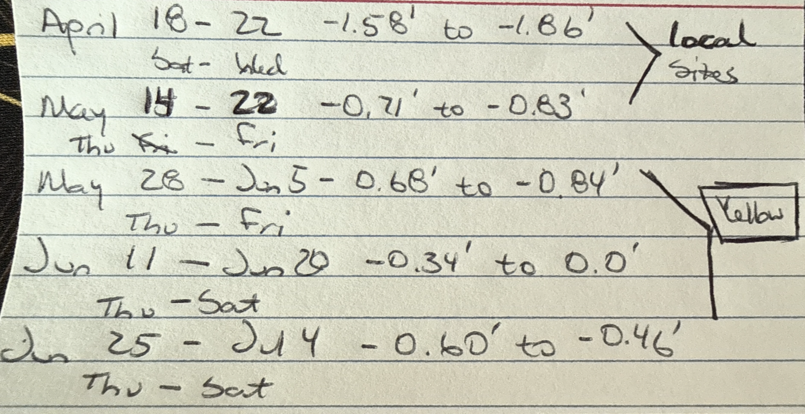
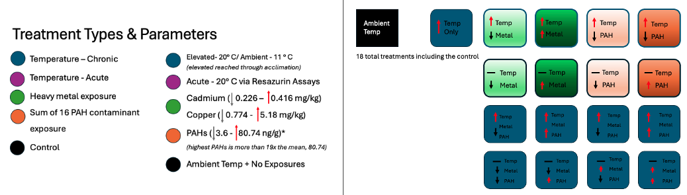
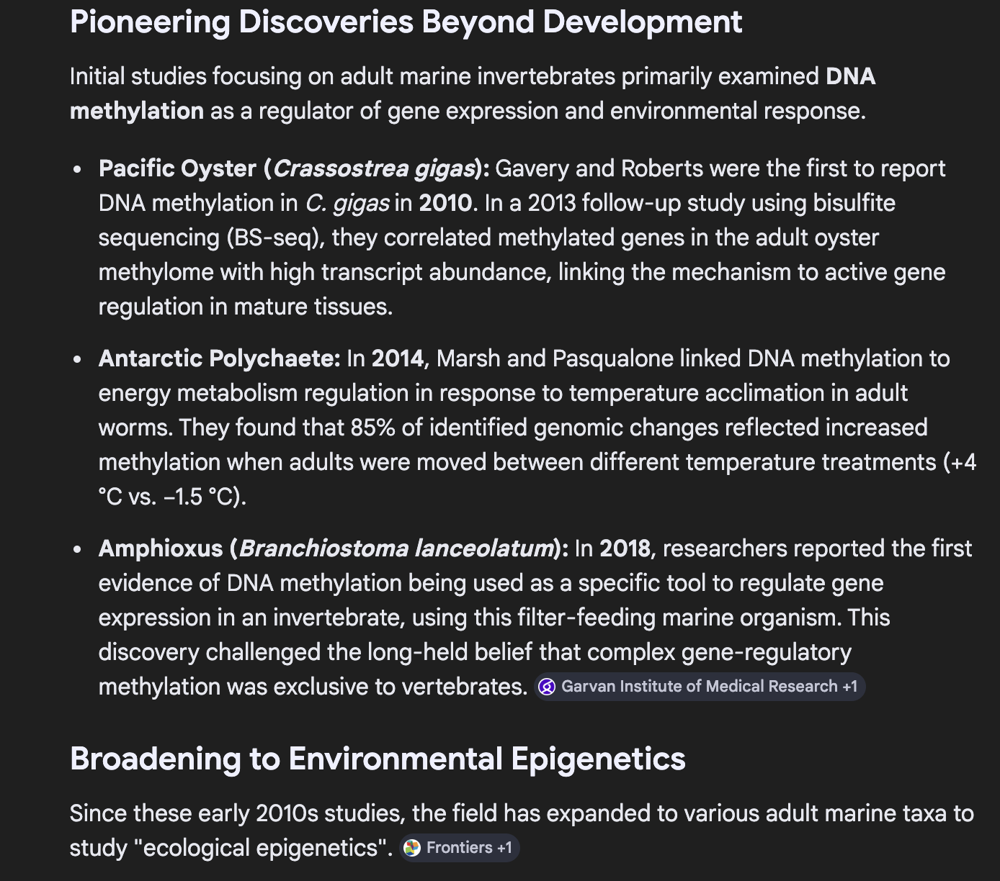
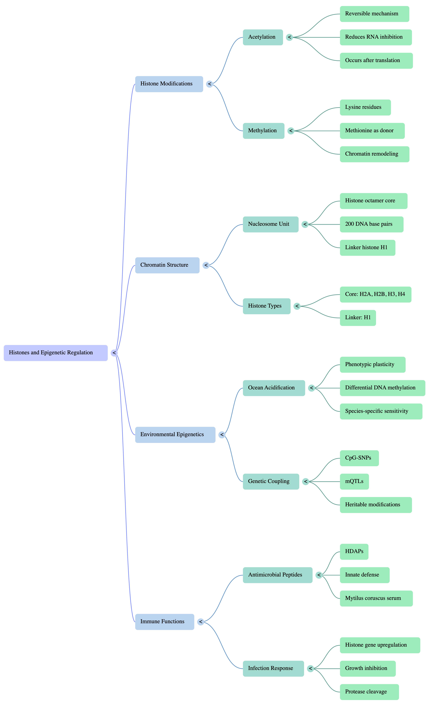
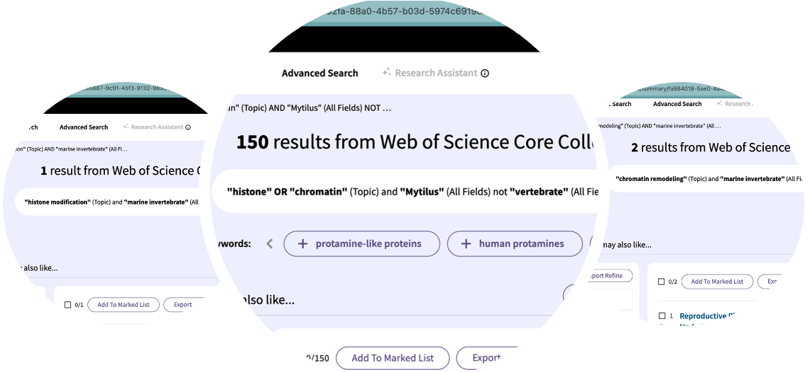
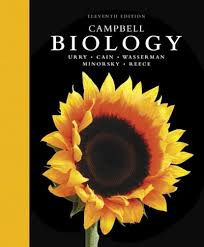

> This page compiles **_all_** daily posts for March 2026.

### 2026-03-01 — March Goals

##### March Goals
##### Reworking February's In-Progress Goals

1. Get the biomarker manuscript over to WDFW for review and out to ICB before the March 31st submission deadline.  

2.  Complete DNA methylation data processing and begin exploratory analysis.

3. Finish PhD proposal and submit to committee for review. 

4. **Aspirational** - Begin mussel experiment for Chapter 3 & 4.

##### Strategies for Success

##### Goal 1: Biomarker Manuscript
1. Re-write results section
2. Write abstract
3. Finish polished visualizations, tables, and captions for the biomarker manuscript.
4. Prepare a folder of polished supplementary materials, i.e., index maps, transformed data tables, and cleaned up R scripts.
5. Send manuscript to complete committee for feedback.

##### Goal 2: DNA Methylation Analysis
1. Re-familiarize myself with where I left off in late 2025 and backup the large files.
2. Move through the initial Bismark pipeline (which I believe I finished) into optimizing alignment parameters and using that outcome for subsequent steps. 
3. Quantify methylation levels and visualize using IGV or JBrowse.
4. Get feedback on initial results from Steven and/or other lab members before moving into downstream analyses.

##### Goal 3: PhD Proposal
1. Review MS proposal and points of expansion.
2. Clarify purpose of chapters 3 & 4 and significance of the work.
3. Rework the introduction to shift the framing from identifying the problem to creating a solution to maximize the current monitoring program OR reduce the monitoring burden.
4. List and clarify the specific methods for each chapter and how they were built based on the results of chapter 2.

##### **Goal 4: Chapter 3 & 4 Mussel Experiment**
1. Put together a detailed experimental plan including timeline, materials needed, and data collection methods with 1-3 options for setup.
2. Complete the Lab Risk Assessment form from EH&S to discuss with Steven to get approval for the experiment.
3. Connect with Jon W and Sam W to work through physical space, setups, and ordering materials.

### 2026-03-02 — Getting Back on Track

##### Plan of the Day

-   Catch up with weekly planning and task management since I've been sick for the last two weeks.
-   Create March Goals and plan for attainment

##### Projects Touched Today

-   Mussel Biomarkers
-   PhD Proposal
-   Lab Notebook

##### Progress Notes

-   It feels like everything is a bit messy currently, so a dedicated session to untangle the projects and required outcomes was truly necessary.
-   I first worked on extending the timelines and required deliverables for my non-dissertation projects before pivoting to planning my dissertation work. I chose to do it this way so I could identify what kind of timeline my non-dissertation projects would require so I could either delegate or manage the tasks for myself.
-   I reviewed the current state of the biomarker manuscript and the PhD proposal and identified some steps to complete both projects.

##### Products & Word Count

-   March Goals and Planning: 294 words

> **Today's total: 294 words**
>
> **March total: 294 words**
>
> **2026 total: 21,041 words**

##### Tomorrow's Plan

-   Tuesday's are UW-RUA days, so the plan is to focus on my RUA deliverables only, returning my science on Wednesday.

### 2026-03-03 — UW-RUA Traveler Tuesday

##### Plan of the Day

-   Focus on UW-RUA deliverables.

##### Projects Touched Today

- None

##### Progress Notes

- Nothing relevant to my work.

##### Products & Word Count

-   No science products today.

> **Today's total: 0 words**
>
> **March total: 294 words**
>
> **2026 total: 21,041 words**

##### Tomorrow's Plan

-   Wednesday's plan is to map out specific tasks in completing the biomarker manuscript to get it out to my committee  for review before submission to ICB at the end of the month.
- After task mapping, I will knock out 1-2 identified tasks on the manuscript.

### 2026-03-04 — Groundhog Day X 1000

##### Plan of the Week: March 2 - 8, 2026

##### Daily Focus

-   Thursday: No science work
-   Friday: Biomarker Manuscript
-   Saturday: No science work
-   Sunday: Biomarker Manuscript

##### Plan of the Day

-   It feels like I just keep repeating the same tasks over and over
    again. Each return is an improvement, but there has to be a better
    way to limit the rework and encourage expeditious support from my
    committee.
-   Based on the list of biomarker manuscript deliverables, my first
    task is to update my Results section to include the corrected
    spatial analyses. Second task is to update Figures 1 and 2.
-   Finally, my current task management communication set-up is not
    effective. Moving forward, general weekly plans will be added to
    Monday notebook posts with specific daily tasks and outcome
    determined in the daily notebook posts. This will allow for more
    flexibility in task management and better communication of progress
    and plans.

##### Projects Touched Today

-   Mussel biomarkers
-   Lab notebook

##### Progress Notes

-   I met my first goal of working on the results written portion of the
    manuscript. It is a laundry list that needs to be more succinct and
    focused on the key findings. To support writing that, the notes
    below were helpful.
-   I did not meet my second goal of updating Figures 1 & 2, reworking
    the results took significantly longer than planned.
-   I have determined that an evening versus morning check-in that has
    both the plan of the day, the completed tasks, and the plan for the
    following day is a more effective tool and cuts down on rework.

##### Biomarker Analysis Tests Performed

-   Shapiro- Wilkes
    -   Purpose: Determines if your data is normally distributed across
        the entirety of the dataset. The result determines parametric or
        non-parametric route for exploratory and subsequent analysis
        testing. Used at individual sample level.
    -   Test H0 and assumption: Is the data normally distributed?
    -   H0= Yes, p\< 0.05 rejects H0
-   Levene’s Test
    -   Purpose: Determines if the variability of your data is
        consistent across different groups. This is the non-parametric
        test that is more robust than the Bartlett Test when facing
        skewed data or outliers. Used at analysis group level to verify
        groups are different.
    -   Test H0 and assumption: Are all group variances the same?
    -   H0= Yes, p\< 0.05 rejects H0
-   KW/ Dunn’s or ANOVA/ Tukey’s
    -   Purpose: Pairwise or one-way comparison of three or more
        independent measurements. Test choice determined by Shapiro-
        Wilkes and Levene’s Test outcomes.
        -   KW/ Dunn’s is the non-parametric test and post-hoc
        -   ANOVA/ Tukey's is the parametric test and pos-hoc
    -   Used at the group- level (site, reporting area) to compare the
        measured metrics, IBRs and chemical analyte concentrations.
    -   Test H0 and assumption: Are the means (ANOVA) or medians (KW) of
        the groups the same?
    -   H0= Yes, p\< 0.05 rejects H0
    -   F-statistic indicates within- group and between- group variance
        as a ration. The higher the statistic, the more likely there is
        a difference to be confirmed. Should be used in interpretations
        verified by post-hoc testing.
    -   Post-hoc testing and assumption: Any rejected null is verified
        with a post-hoc test to control for Type I errors (false
        positives) and identify which means or medians are different.
-   Spearman’s Rank Correlation
    -   Purpose: Non-parametric test to measure the difference in ranks
        of continuous variables in large datasets. Test choice
        determined by Shapiro- Wilkes and Levene’s Test outcomes. Used
        to determine any relationships between measured metrics and
        chemical analyte concentrations at the analysis group level.
    -   Test H0 and assumption: Is there an identifiable association
        between variables?
    -   H0= No, p\< 0.05 rejects H0
    -   Test interpretation: Correlation coefficient (rho) ranges from
        -1 to +1, and should be used in conjunction with the p-value for
        correct interpretation.
        -   -1: Perfect negative association, as one variable increases
            the other variable decreases
        -   0: No association between variables
        -   +1: Perfect positive association, as one variable increases,
            so does the other
-   Kendall’s Tau
    -   Purpose: Conservative, non-parametric test to assess the
        concordance or discordance of pairs of variables in datasets
        with outliers or heavy skew. Used to identify data trends or
        clarify Spearman’s Rho ties in measured metrics and contaminant
        class concentrations at the analysis group level.
    -   Test H0 and assumption: Is there an identifiable association
        between variables?
    -   H0= No, p\< 0.05 rejects H0
    -   Test interpretation: Kendall’s coefficient (tau) ranges from -1
        to +1, and should be used in conjunction with the p-value for
        correct interpretation.
        -   -1: Perfect discordance (disagreement), as one variable
            increases the other variable decreases
        -   0: No relationship between variables
        -   +1: Perfect concordance (agreement), as one variable
            increases, so does the other
-   Global Moran’s I
    -   Purpose: Spatial analysis test that indicates if data is
        clustered, dispersed, or randomly distributed across a defined
        geographic area. Used to identify if there is a geographical
        component that affects the measured metrics, IBRs, and
        contaminant concentrations across all sites in the entire
        sampling region.
    -   Test H0 and assumption: Is there a significant spatial pattern
        in the data?
    -   H0= No, p\< 0.05 rejects H0
    -   Expected I= Assigned theoretical value assuming H0 is true.
    -   Test interpretation: Moran’s I Index ranges from -1 to +1, and
        should be used in conjunction with the Expected Index (above),
        Z-score (determined during test if not already available) and
        p-value for correct interpretation.
        -   -1: Negative Autocorrelation (dispersed), dissimilar data
            values are adjacent to each other
        -   0: No spatial relationship amongst variables (random)
        -   +1: Positive Autocorrelation (clustered), similar data
            values are adjacent to each other
-   Local Indicators of Spatial Autocorrelation (LISA) a.k.a. Local
    Moran’s I
    -   Purpose: Spatial analysis test that indicates patterns of
        autocorrelation when the general Global Moran’s I identified
        clustered or dispersed data within the study’s geographic
        region. Used to identify the local spatial patterns in the
        measured metrics, IBRs, and contaminant concentrations across
        all sites within the entire sampling region.
    -   Test H0 and assumption: Where are the clusters or data outliers
        that drove the Global Moran’s I result and are they significant?
    -   H0= No, p\< 0.05 rejects H0
    -   LISA interpretation: There are five possible outcomes that
        grouped and plotted by color:
        -   High-High / Hot Spot - red
        -   Low-Low / Cold Spot - blue
        -   High-Low / Outlier - pink
        -   Low-High / Outlier - light blue
        -   Not Significant - Gray

##### Results Overview

-   KW/ ANOVA

    -   182 significant comparisons across reporting area and site that
        include the following metrics and indices:

        -   P450, Shell Thickness, Condition Index, Raw mussel
            measurements

        -   IBR Morph

        -   Chlordanes, DDT, PAH- HMW, PBDE, Total Contaminants, Total
            PAH index

-   Spearman’s Correlation

    -   94 total significant results

        -   78 significant correlations between individual analytes and
            both the measured metrics and the IBRs

        -   15 significant correlations between contaminant indices and
            the following:

            -    SOD, IBR Bio, IBR Combined, and raw mussel measurements

-   Kendall’s Tau

    -   89 total significant results

        -   79 significant correlations between individual analytes and
            both the measured metrics and the IBRs

            -   Single P450 and single IBR Morph correlations exist in
                the group whereas multiples for each of the other
                metrics and IBRs are significant

        -   10 significant correlations between contaminant indices and
            the following:

            -    SOD, IBR Bio, IBR Combined, and raw mussel measurements

-   Global Moran’s I

    -   The following chemical indices and measured metrics were
        significant for regional spatial autocorrelation:

        -   Chlordane, DDT, HCH, PBDE, PAH- HMW, PCB, Pesticide, Total
            Contaminant, Total Metal and Total PAH

        -   P450, Shell Thickness, Initial and Final Weights

-   LISA

    -   This result table is significant following the same pattern as
        the Global above with cluster groupings to confirm the Global
        pattern found significant.

##### Products & Word Count

> Biomarker Manuscript Results re-write: 948 words
>
> **Today's total: 948 words**
>
> **Monthly total to date: 1242 words**
>
> **Annual total to date: 21,695 words**

##### Tomorrow's Plan

-   No science focus on Thursday.

### 2026-03-05 — No Science

##### Plan of the Week: March 2 - 8, 2026

##### Daily Focus

-   Friday: No science work
-   Saturday: No science work
-   Sunday: No science work

##### Plan of the Day

-   My weekly plan has shifted. I will return to science on Monday
    3/9/26.

##### Projects Touched Today

-   None

##### Progress Notes

-   None

##### Products & Word Count

-   None

> **Today's total: 0 words**
>
> **Monthly total to date: 1242 words**
>
> **Annual total to date: 21,695 words**

##### Tomorrow's Plan

-   No science focus on Friday.

### 2026-03-06 — No Science

##### Plan of the Week: March 2 - 8, 2026

##### Daily Focus

-   Saturday: No science work
-   Sunday: No science work

##### Plan of the Day

-   My weekly plan has shifted. I will return to science on Monday
    3/9/26.

##### Projects Touched Today

-   None

##### Progress Notes

-   None

##### Products & Word Count

-   None

> **Today's total: 0 words**
>
> **Monthly total to date: 1242 words**
>
> **Annual total to date: 21,695 words**

##### Tomorrow's Plan

-   No science focus on Saturday.

### 2026-03-07 — No Science

##### Plan of the Week: March 2 - 8, 2026

##### Daily Focus

-   Sunday: No science work

##### Plan of the Day

-   My weekly plan has shifted. I will return to science on Monday
    3/9/26.

##### Projects Touched Today

-   None

##### Progress Notes

-   None

##### Products & Word Count

-   None

> **Today's total: 0 words**
>
> **Monthly total to date: 1242 words**
>
> **Annual total to date: 21,695 words**

##### Tomorrow's Plan

-   No science on Sunday.

### 2026-03-08 — No Science

##### Plan of the Week: March 2 - 8, 2026

##### Daily Focus

-   Last day of the week

##### Plan of the Day

-   My weekly plan has shifted. I will return to science on Monday
    3/9/26.

##### Projects Touched Today

-   None

##### Progress Notes

-   None

##### Products & Word Count

-   None

> **Today's total: 0 words**
>
> **Monthly total to date: 1242 words**
>
> **Annual total to date: 21,695 words**

##### Tomorrow's Plan

-   Monday 3/9 will be used to map out my plan for the week.

### 2026-03-09 — Setting Up the Week

##### Plan of the Week: March 9 - 15, 2026

-   *Working week listed from Mon - Sun*

##### Daily Focus

-   Monday: Mapping out the plan of attack for the week
-   Tuesday: UW-RUA & Dean's Office Work
-   Wednesday: Lab Meeting & Prep for Thursday's eDNA 'think tank'
    session and UW-AAF events
-   Thursday: eDNA process & literature 'think tank' session with Kassi
    P and Connor, Nanopore and UW-AAF events
-   Friday: Writing Accountability with KPJ, focus on Biomarkers
-   Saturday: NW Straits Meeting - Ecology/ Conservation/ Public
    Sessions
-   Sunday: Biomarker Manuscript

##### Plan of the Day

-   My goal for today is to plan out the deliverables I have for the
    week - including the steps for making progress on upcoming
    deliverables to mitigate the 11th hour push that is getting really
    old.
-   The remainder of the day will be spent prepping UW-RUA materials.

##### Projects Touched Today

-   Mussel Biomarkers
-   Proposal Chapters 3 & 4
-   Yellow Island
-   Lab Notebook

##### Progress Notes

##### Planning/ Lab Notebook

-   Before setting up my plan for the week, I updated my lab notebook by
    adding daily log posts for the weekend, archiving February and
    putting all of those posts into a single file, reviewing my monthly
    goals, and brain dumping for all projects and tasks.
-   Dean Search- ConEv
    -   I caught up with the Dean candidate search by watching Candidate
        A's presentation and providing feedback in the survey.
    -   I virtually attended Candidate B's presentaiton and submitted my
        feedback in the survey provided by the search committee.

##### Yellow Island

-   I sent my requested dates for Yellow Island surveys this spring/
    summer. Since my schedule and priorities have shifted, I am able to
    batch surveys within the longer/ lower low tide series in late May
    and early June.

{fig-align="center" width="400"}

##### Chapter 3 & 4

-   I worked through a scaled- down version of the lab experiment for
    Chapters 3 & 4
    -   Using the 2021-22 WDFW data, I identified the region's highest
        and lowest concentrations of the potential tx chemicals:
        -   Cadmium (mg/kg) - 0.226 (Arroyo Beach) - 0.416 (Penn Cove),
            mean= 0.310
        -   Copper (mg/kg) - 0.774 (Broad Spit) - 5.18 (Chimacum Creek
            Delta), mean= 1.17
        -   Sum of 16 PAHs (ng/g) - 3.6 (Hood Canal Holly) - 1600 (Des
            Moines Marina), mean= 80.74
    -   Only the 74 sites included in the biomarker work are included.
    -   Values listed above are the wet tissue values (blank corrected
        for PAH) with the Detected qualifier only.
    -   I used the Sum of 16 PAHs because they are the longest defined
        PAHs by the EPA for their toxicity to humans. The lowest PAH
        concentration was at a site not included in the earlier work
        (Drayton Harbor).

The individual PAHs are listed in the image below - if a mixture is not
feasible for experimentation, the high molecular weight PAHs are the
most persistent while the low molecular weight PAHs can have higher
acute toxicity; considering long- term exposure as the baseline for
molecular response, we should prioritize the high weight PAHs.

{width="500"}

-   Looking at the experimental design, there are two paths that can be
    taken regarding elevated water temperatures.

    -   Chronic elevated water temperature at 20° C

    -   Acute elevated temperature exposure through the use of resazurin
        assays to mimic tidal fluctuations in warmer months.

The general design without resazurin looks like the design below.

{fig-align="center"}

##### Products & Word Count

-   Yellow Plan: 50 words + 2 tables/ time schedules with personnel
    allocation for TNC support
-   Chapter 3 & 4 plan: 100 words + diagram/ sketch of tx options

> **Today's total: 150 words**
>
> **Monthly total to date: 1392 words**
>
> **Annual total to date: 21,845 words**

##### Tomorrow's Plan

-   Tuesday is a UW-RUA day, and likely will include no personal science
    work.

### 2026-03-10 — No Science - UW-RUA Tuesdays

##### Plan of the Week: March 9 - 15, 2026

##### Daily Focus

-   Getting through the day.

##### Plan of the Day

-   Completing my UW-RUA tasks and going back to sleep.

##### Projects Touched Today

-   None

##### Progress Notes

-   None

##### Products & Word Count

-   None

> **Today's total: 0 words**
>
> **Monthly total to date: 1392 words**
>
> **Annual total to date: 21,845 words**

##### Tomorrow's Plan

-   Will be made tomorrow based on how I feel.

### 2026-03-11 — No Science - Still Sick

##### Plan of the Week: March 9 - 15, 2026

##### Daily Focus

-   My weekly plan will shift significantly as I try to keep myself healthy.

##### Plan of the Day

-   My plan for today is to rest and recover.

##### Projects Touched Today

-   None

##### Progress Notes

-   None

##### Products & Word Count

-   None

> **Today's total: 0 words**
>
> **Monthly total to date: 1392 words**
>
> **Annual total to date: 21,845 words**

##### Tomorrow's Plan

-   Will be made tomorrow based on how I feel.

### 2026-03-12 — No Science

##### Plan of the Week: March 9 - 15, 2026

##### Daily Focus

-   My weekly plan will shift significantly as I try to keep myself healthy.

##### Plan of the Day

-   My plan for today is to rest and recover. Again, I have either rescheduled or canceled meetings to provide myself the time to rest. I already sent my eDNA protocols and information over to Kassi and Connor, so hopefully we just continue asynchronously until I feel better.

##### Projects Touched Today

-   None

##### Progress Notes

-   None

##### Products & Word Count

-   None

> **Today's total: 0 words**
>
> **Monthly total to date: 1242 words**
>
> **Annual total to date: 21,695 words**

##### Tomorrow's Plan

-   Will be made tomorrow based on how I feel.

### 2026-03-13 — Resting & Reading

##### Plan of the Week: March 9 - 15, 2026

##### Daily Focus

-   My goal this week has been to rest and figure out some low- effort
    ways to get back into the work groove without overextending;
    overdoing it has been prolonging my actual getting down to business.

##### Plan of the Day

-   Rather than focus on products, I focused on reading and note taking
    to get back into low- effort work flow that allows for breaks as
    needed.

##### Projects Touched Today

-   PhD Proposal
-   Literature Review

##### Progress Notes

-   My goal today was to work through the literature to support a pivot
    in chapters 3 and 4 rather than do the deep work on my biomarker
    manuscript. I was able to clean up some sources, reinforce my
    historical epigenetics knowledge, and think through some ideas about
    shifting the lab- based experiment to support (possibly) my earlier
    biomarker and methylation work.

-   Between medication- induced naps, I was able to go back in time to
    read about how epigenetics became 'a thing' in 1942, came to the
    marine invertebrate arena re: developmental bio in urchins in 1973,
    and then be pleasantly reminded that amongst the first marine
    organism non-embryonic epigenetics work was done by Steven and
    published in 2010 with Mac. Pretty cool. Even AI can't make this up!
    Pretty dope.

{fig-align="center"}

Trying to find some base connections between the current work and where
I can go within a dissertation and in the mytilus genome - I built out a
mindmap that can definitely be expanded, but is a decent start.

##### Products & Word Count

-   Personal literature notes + mind map above

> **Today's total: 0 words**
>
> **Monthly total to date: 1242 words**
>
> **Annual total to date: 21,695 words**

##### Tomorrow's Plan

-   Will be made tomorrow based on how I feel. I expect to continue
    connecting the history of work with the Mytilus genome and
    epigenetic mechanisms sans non-coding RNAs.

### 2026-03-14 — Epigenetic Mechanisms

##### Plan of the Week: March 9 - 15, 2026

-   My goal this week has been to rest and figure out some low- effort
    ways to get back into the work groove without overextending;
    overdoing it has been prolonging my actual getting down to business.

##### Plan of the Day

-   Today's plan is to clean up my notes from yesterday and identify
    where I have gaps in my understanding to direct my readings.

##### Projects Touched Today

-   PhD Proposal
-   Literature Review

##### Progress Notes

-   I took my notes, organized them into files separated by topic and
    keyword to help me understand what I was missing and what didn't
    understand at the most fundamental level before pivoting to their
    application to my broader work.

-   I created 3 specific documents in my Epigenetic Mechanisms in Marine
    Invertebrates Knowledge Library. This links to my Notion project
    notes and my Foundational Knowledge Library.

    -   My knowledge library is a space where I keep my notes on
        whatever topics from the ground up. For example, if I want to
        understand DNA methylation in *Mytilus* spp., I need a
        fundamental understanding of *Mytilus* biology, physiology,
        their ecosystem role, population in Puget Sound, general
        cellular biology, the current state of genomic work with marine
        bivalves, and finally the other epigenetic mechanisms that
        influence methylation. I don't need to be an expert at the
        moment, but if I cannot articulate how these pieces interact, I
        cannot build hypotheses worth investigating.

    -   I conducted a quick literature search in both Google Scholar and
        Web of Science. Lots of room (see image below) and lots of
        reading to be done.

    -   From my preliminary notes, I was able to create three areas of
        notes applicable to understanding the role of histone
        modification and chromatin remodeling in a larger context as
        well as add several papers to Zotero for reading beyond
        abstracts, methods and figures.

{fig-align="center"
width="500"}

##### Products & Word Count

-   Notes on epigenetic mechanisms
    -   [Doc
        1](https://docs.google.com/document/d/1Grv526v3eXLsLqbFa1SnmougEd9B4RN_FX0HUK1vRx0/edit?usp=sharing)-
        male bivalve research bias (it's a bit easier): 2187 words
    -   [Doc
        2](https://docs.google.com/document/d/1bDwT335LsFrg05kBhmLozDNd454BvjZP2Q8UacI66Lw/edit?usp=sharing)-
        general history of the research: 548 words
    -   [Doc
        3](https://docs.google.com/document/d/1BDAvvva9h99LLh0JbrCGs4aXIkX55C53Up-QAVzecXc/edit?usp=sharing)-
        role of epigenetic regulation in *Mytilus* spp.: 396 words

> **Today's total: 3131 words**
>
> **Monthly total to date: 4373 words**
>
> **Annual total to date: 26,068 words**
>
> **Annual target total to date: 36,500 words**

##### Tomorrow's Plan

-   Will be made tomorrow based on how I feel. I expect to build out my
    weekly plan and figure out what is on fire and what is just
    smoldering since I am super behind in just about everything.

### 2026-03-15 — Epigenetic Mechanisms- More Notetaking

##### Plan of the Week: March 9 - 15, 2026

-   My goal this week has been to rest and figure out some low- effort
    ways to get back into the work groove without overextending;
    overdoing it has been prolonging my actual getting down to business.

##### Plan of the Day

-   Today's plan is to clean up my notes from Friday and Saturday and
    identify where I have gaps in my understanding to direct my
    readings.

##### Projects Touched Today

-   Foundational knowledge- epigenetic mechanisms
-   Literature Review

##### Progress Notes

-   I continued the work outlined yesterday and created one additional
    document while diving a bit deeper into the literature from the
    search results on Friday and Saturday.

##### Products & Word Count

-   Notes on epigenetic mechanisms
    -   [Doc
        4](https://docs.google.com/document/d/18j-PT_9V2FtiYRrvmwtLtzP2dytnwpdmnx_iKtzmZpg/edit?usp=sharing)-
        concept mapping the mechanisms to my research: 385 words

> **Today's total: 385 words**
>
> **Monthly total to date: 4758 words**
>
> **Annual total to date: 26,453 words**
>
> **Annual target total to date: 37,000 words**

##### Tomorrow's Plan

-   Will be to plan out the week, keep it low key and start prioritizing my in- progress work.

### 2026-03-16 — Celeste!!!!!! & Histones

##### Plan of the Week: March 16 - 22, 2026

-   I am feeling marginally better, and since I didn't map the week on
    Sunday, the plan today is to keep it low key so I don't put myself
    back at square one.
-   **Monday**: Map the week, catch up on UW-RUA work, confirm my
    spring/ summer tide schedule, build base histone and chromatin
    knowledge notes.
-   **Tuesday**: UW-RUA work, no science.
-   **Wednesday**: Return to epigenetic mechanisms to outline new
    Chapter 3 for my proposal.
-   **Thursday**: Biomarker manuscript
-   **Friday**: Biomarker manuscript
-   **Saturday**: Return to Chapter 3 outline and start drafting options
    for the introduction and methods.
-   **Sunday**: Continue Chapter 3 work.

Missing from the plan is the DNA Methylation work - it will be worked
into the other priorities as time permits, or be a focus for spring
break week next week.

##### Plan of the Day

-   Today's plan is to set up my science deliverables, catch up on my
    own learning, pivot from that learning into actionable application.
    -   First, review the basic biology of histones and create my notes
        on this aspect.
    -   Second, pull out the questions in my handwritten notes to
        compile and address later this week.
-   Next, create my JKP 1v1 agenda and pivot to UW-RUA work.

##### Projects Touched Today

-   PhD Proposal
-   Literature Review

##### Progress Notes

-   I pulled out my questions/ thoughts about linking the histone,
    chromatin, and methylation information to an actionable plan using
    current open source resources. Am I asking relevant and testable
    questions... we shall see!
-   I spent my morning work block with Kristin building my notes about
    histones and their general biology. Between quick reading of lit and
    my good old Campbell biology textbook, I have a solid explainer of
    histones, their composition/ role, and a few notes about the
    differences in invertebrates. It took a bit longer than expected,
    but slow progress is better than no progress.

{fig-align="left"}

-   I virtually attended Celeste's defense where I learned more about
    tunicates than I ever thought! She did excellently. I know she
    worked hard, and seeing it all come together was awesome.
-   I virtually attended the third Dean candidate's presentation and
    submitted my feedback via the provided survey.

##### Products & Word Count

-   Notes on epigenetic mechanisms
    -   [Doc
        5](https://docs.google.com/document/d/1ldVWqNx9f7UXG202yN0O4imkIKKyDJP43dHOn0U37CE/edit?usp=sharing)-
        histone explainer: 839 words

> **Today's total: 839 words**
>
> **Monthly total to date: 5597 words**
>
> **Annual total to date: 27,292 words**
>
> **Annual target total to date: 37,500 words**

##### Tomorrow's Plan

-   UW-RUA Tuesday work blocks, no science.

### 2026-03-17 — UW-RUA Tuesday

##### Plan of the Week: March 16 - 22, 2026

-   I am feeling marginally better, and since I didn't map the week on
    Sunday, the plan today is to keep it low key so I don't put myself
    back at square one.
-   ~~**Monday**: Map the week, catch up on UW-RUA work, confirm my
    spring/ summer tide schedule, build base histone and chromatin
    knowledge notes.~~
-   **Tuesday**: UW-RUA work, no science.
-   **Wednesday**: Return to epigenetic mechanisms to outline new
    Chapter 3 for my proposal.
-   **Thursday**: Biomarker manuscript
-   **Friday**: Biomarker manuscript
-   **Saturday**: Return to Chapter 3 outline and start drafting options
    for the introduction and methods.
-   **Sunday**: Continue Chapter 3 work.

Missing from the plan is the DNA Methylation work - it will be worked
into the other priorities as time permits, or be a focus for spring
break week next week.

##### Plan of the Day

-   Tuesday's are UW-RUA days, no deep work done today.
-   Update weekend lab notebook posts.

##### Projects Touched Today

-   Lab Notebook
-   Yellow Island

##### Progress Notes

-   Today I pulled my notes and updated my daily lab notebook posts from
    the weekend and Monday.
-   I was able to confirm my spring/ summer tide schedule on Yellow and
    working with local sites. I submitted my schedule and needs on
    Monday and received very quick feedback from TNC today!

##### Products & Word Count

-   No products today

> **Today's total: 0 words**
>
> **Monthly total to date: 5597 words**
>
> **Annual total to date: 27,292 words**
>
> **Annual target total to date: 38,000 words**

##### Tomorrow's Plan

-   I was unable to get to my chromatin explainer on Monday, so that
    will be on the agenda along with developing an outline for Chapter 3
    that incorporates some of the questions I've been kicking around.

### 2026-03-18 — Chromatin's Turn to Shine

##### Plan of the Week: March 16 - 22, 2026

-   I am feeling marginally better, and since I didn't map the week on
    Sunday, the plan today is to keep it low key so I don't put myself
    back at square one.
-   ~~**Monday**: Map the week, catch up on UW-RUA work, confirm my
    spring/ summer tide schedule, build base histone and chromatin
    knowledge notes.~~
-   ~~**Tuesday**: UW-RUA work, no science.~~
-   **Wednesday**: Return to epigenetic mechanisms to outline new
    Chapter 3 for my proposal.
-   **Thursday**: Biomarker manuscript
-   **Friday**: Biomarker manuscript
-   **Saturday**: Return to Chapter 3 outline and start drafting options
    for the introduction and methods.
-   **Sunday**: Continue Chapter 3 work.

Missing from the plan is the DNA Methylation work - it will be worked
into the other priorities as time permits, or be a focus for spring
break week next week.

##### Plan of the Day

-   Today is chromatin's day to shine!
    -   Compile current notes, identify basic biology, any applicable
        marine invert knowledge, and develop some questions around the
        mechanism in the context of my work.
-   Format and render my lab notebook posts so they look less like an
    unhinged diary...

##### Projects Touched Today

-   Lab Notebook
-   PhD Proposal
-   Foundational Knowledge

##### Progress Notes

-   I caught up the notebook posts, archived February's posts to a
    single doc, and added a few images to make things more fun!
-   I started by prepping for my afternoon meetings
    -   UW-RUA applicants X 2 re: research statement feedback
    -   NW Straits April 3rd Caroline Gibson 'Conference' prep re:
        posters and abstract submission guidelines
    -   Henry Art Gallery re: my written accompaniment piece for a
        summer showcase
    -   Alternate paths to marine science for a high school group
        related to the IG cohort
-   I completed a one- pager for a STEM/social science collaboration in
    late 2026/ early 2027 if accepted
-   I completed the initial pass on the chromatin explainer, but found
    that it is mostly questions and connections to histones (obviously),
    so this may be the shorted explainer yet!
    -   Once I clean this up, I will add it to the digital notes but
        right now my handwritten notes are all over the place.
    -   Next steps are to put all three mechanisms together and make a
        plan for how to use current open source data to develop an
        analysis plan.

##### Products & Word Count

-   Building Bridges in Conservation: 765 words
-   Chromatin raw notes (handwritten): 230 words

> **Today's total: 995 words**
>
> **Monthly total to date: 6592 words**
>
> **Annual total to date: 28,287 words**
>
> **Annual target total to date: 38,500 words**

##### Tomorrow's Plan

-   Clean up chromatin notes and add to epigenetics explainers in my
    foundational knowledge db.

-   Pivot to using the notes to create a plan for Chapter 3.

-   Review biomarker manuscript and make a plan for completion.

### 2026-03-19 — Integrating Epigenetic Mechanisms

##### Plan of the Week: March 16 - 22, 2026

-   I am feeling marginally better, and since I didn't map the week on
    Sunday, the plan today is to keep it low key so I don't put myself
    back at square one.
-   ~~**Monday**: Map the week, catch up on UW-RUA work, confirm my
    spring/ summer tide schedule, build base histone and chromatin
    knowledge notes.~~
-   ~~**Tuesday**: UW-RUA work, no science.~~
-   ~~**Wednesday**: Return to epigenetic mechanisms to outline new
    Chapter 3 for my proposal.~~
-   **Thursday**: Biomarker manuscript
-   **Friday**: Biomarker manuscript
-   **Saturday**: Return to Chapter 3 outline and start drafting options
    for the introduction and methods.
-   **Sunday**: Continue Chapter 3 work.

Missing from the plan is the DNA Methylation work - it will be worked
into the other priorities as time permits, or be a focus for spring
break week next week.

##### Plan of the Day

-   I originally slated time today to work on biomarkers, but I want to
    finish the chromatin work so I can mull over the mechanisms while
    working on the biomarker manuscript.
-   Today is chromatin's day to shine... again!
    -   Compile current notes, identify basic biology, any applicable
        marine invert knowledge, and develop some questions around the
        mechanism in the context of my work.
-   I did not get through finalizing my chromatin notes and outlining
    Chapter 3, so I'm going to focus on that before moving into
    Biomarker work.
    -   First, review existing notes. Second, pull the questions out and
        put them with the rest and format notes like the others. Third,
        use the questions and notes to identify alternate ways to work
        with open source data for Chapter 3.
-   After note taking, I will begin outlining a plan for Chapter 3.
    -   Pivoting to a bioinformatics chapter rather than a lab based one
        will allow me to make better decisions for the experiments, more
        strongly tie the mechanisms to the outcomes, and pull together
        the complete work cleanly.

##### Projects Touched Today

-   PhD Proposal
-   Foundational Knowledge
-   DNA Methylation

##### Progress Notes

-   I started by wondering how I ever made it out of Catholic school
    with this handwriting!
    -   My Chromatin notes are a bit all over the place, so after a
        quick review I identified some gaps I have in understanding. I'm
        filling those in as best as I can to knock out the cleaner
        notes.
    -   I moved my questions over to the running doc and realized that
        chromatin remodeling is possibly the most straightforward of all
        of the mechanisms.
-   When I shifted over to DNA methylation, I found myself with more
    analysis/ workflow questions than mechanistic questions.
    -   I pivoted to creating a more comprehensive checklist and process
        to follow for myself since it is easy for me to rattle a few
        high-level steps, but unpacking them has been a process.
    -   I then created a decision outline with some guiding questions
        for the analysis.
    -   For both I chose to start at the point of sequences in hand - I
        will need to go back and make a section for sampling/
        experimental design. Probably when I work on the methods for the
        manuscript.
    -   This exercise took an embarassingly long time, but really helped
        me get down to the 'bones' of the process and set myself up to
        comprehensively answer any questions with something more robust
        than "that's how my lab does it".
-   For all of my explainers/ note docs I am certain there is plenty of
    room to make them better, and when the time is appropriate, I will,
    but for now I need to get back to basics and reinforce information
    or decisions I have been treating as 'set-in-stone' facts.
-   I was feeling pretty 'ready to apply' this reinforced knowledge and
    quickly learned that sorting through old code and outputs after
    dinner is a recipe for instant despair.
    -   I went back to the DNA methylation analysis work to see where I
        left off and possibly move forward... I did this because evening
        writing is often akin to trying to sharpen a pencil with a blade
        of grass - not smart. So, I thought, maybe tangible do X get Y
        work would do it. Instead, I am now questioning every decision
        and trying to figure out how my maping efficiency has not gotten
        above 27%, and if that is even a problem... Key sign to pack it
        up for the day.

##### Products & Word Count

-   [Doc
    6](https://docs.google.com/document/d/12V6pyDkOy_DVWm-HfZjPhmLSLpN4xraSp_fZQYd9bzc/edit?usp=sharing)-
    Chromatin Explainer: 498 words
-   [Doc
    7](https://docs.google.com/document/d/1RYjvVwA3ndbcXuhn3vkNCmippMzOkZuoBj4b2hzIz1c/edit?usp=sharing)-
    DNA Methylation Analysis Checklist: 573 words
-   [Doc
    8](https://docs.google.com/document/d/14Lpd-y2T5Lp_uivo1BLYlhafrL46wIxYLOQWxGtIL9I/edit?usp=sharing)-
    DNA Methylation Analysis Decisions: 875 words

> **Today's total: 1946 words**
>
> **Monthly total to date: 8538 words**
>
> **Annual total to date: 30,233 words**
>
> **Annual target total to date: 39,000 words**

##### Tomorrow's Plan

-   Friday starts with creating a specific task list for the biomarker
    manuscript, executing a reasonable amount of it, and then turning my
    attention to methylation.

### 2026-03-20 — Mussel Methylation Analysis Return

##### Plan of the Week: March 16 - 22, 2026

-   I am feeling marginally better, and since I didn't map the week on
    Sunday, the plan today is to keep it low key so I don't put myself
    back at square one.
-   ~~**Monday**: Map the week, catch up on UW-RUA work, confirm my
    spring/ summer tide schedule, build base histone and chromatin
    knowledge notes.~~
-   ~~**Tuesday**: UW-RUA work, no science.~~
-   ~~**Wednesday**: Return to epigenetic mechanisms to outline new
    Chapter 3 for my proposal.~~
-   ~~**Thursday**: Biomarker manuscript~~
-   **Friday**: Biomarker manuscript
-   **Saturday**: Return to Chapter 3 outline and start drafting options
    for the introduction and methods.
-   **Sunday**: Continue Chapter 3 work.

Missing from the plan is the DNA Methylation work - it will be worked
into the other priorities as time permits, or be a focus for spring
break week next week.

##### Plan of the Day

-   Today's goal was to work on biomarkers, but I am shifting to mussel
    methylation.
    -   Because I am behind basically everywhere in every aspect of my
        life, I have a heavy task day. That equates to a lack of time to
        focus on deep work, the kind of work that I need to do with the
        biomarker manuscript.
    -   I don't want to not touch something science today, so I'm going
        to get something else cooking that is more formulaic going.

##### Projects Touched Today

-   Mussel Methylation

##### Progress Notes

-   My first step was to re-acclimate myself with where the project was
    in the pipeline, where it needed to go, and what the next tangible
    steps are.
    -   First, I have not yet gotten myself sorted on Klone, so I am
        still working on Raven.
    -   Reviewing the sequences and alignments, I realized three major
        things.
        -   No documentation of matching checksums for my sequences or
            for the reference genome.
        -   No notes on potential parameter testing/ mapping efficiency
            percentages and what was adjusted to get there, or what
            needed to be done.
        -   I didn't remove the sequencer artifacts from the work, so my
            QC reports are 99% unnecessary and not useful.
    -   Since I just made a list of steps and decisions, I went back and
        used them!
        -   First, I removed all of the old, second, I reviewed and
            updated the code files that I created from Steven's
            originals and modified for running on my machine, not Raven.
            Most important, I added some echoes so I wasn't flying blind
            in the process.
    -   Next up, I cleaned up the repo folders, added code to
        concatenate the individual checksums into a single text file so
        I didn't have to open 48 files...
        -   Once my sequences were uploaded/ downloaded/ pulled into
            Raven, I pulled out one sample (reads 1 & 2) from the high
            PAH (69M) and low PAH (272M) to run through the complete
            process before analyzing the complete dataset.
        -   I moved all other sequences out of the raw data folder and
            committed.

##### Products & Word Count

-   Updated code docs for QC, trimming, reference pull and alignment:
    \~100 words

> **Today's total: 100 words**
>
> **Monthly total to date: 8638 words**
>
> **Annual total to date: 30,333 words**
>
> **Annual target total to date: 39,500 words**

##### Tomorrow's Plan

-   Moving forward with the preliminary sequence run through QC,
    trimming, and alignment.
-   Continuing to knock out the other non-lab tasks and work I was not
    able to complete today.

### 2026-03-21 — Moving forward with Mussel Methylation Analysis 

##### Plan of the Week: March 16 - 22, 2026

-   I am feeling marginally better, and since I didn't map the week on
    Sunday, the plan today is to keep it low key so I don't put myself
    back at square one.
-   ~~**Monday**: Map the week, catch up on UW-RUA work, confirm my
    spring/ summer tide schedule, build base histone and chromatin
    knowledge notes.~~
-   ~~**Tuesday**: UW-RUA work, no science.~~
-   ~~**Wednesday**: Return to epigenetic mechanisms to outline new
    Chapter 3 for my proposal.~~
-   ~~**Thursday**: Biomarker manuscript~~
-   ~~**Friday**: Biomarker manuscript~~
-   **Saturday**: Return to Chapter 3 outline and start drafting options
    for the introduction and methods.
-   **Sunday**: Continue Chapter 3 work.

Missing from the plan is the DNA Methylation work - it will be worked
into the other priorities as time permits, or be a focus for spring
break week next week.

##### Plan of the Day

-   Today's goal is to work on my new Chapter 3 outline and keep pushing
    the methylation work forward

##### Projects Touched Today

-   Mussel Methylation

##### Progress Notes

-   The day started with running FastQC and MultiQC on the
    representative samples.
    -   I did not properly move the sequencer artifacts, so my QC rerun
        failed repeatedly until I realized it was because I needed to
        properly move those files and not adjust the code... that took a
        little too long.
    -   FastQC went well and reminded me that I need to ask again what
        some of the quality parameters mean in the broader
        analysis-impact pov.
    -   I spent the better part of the day checking why I was stuck in
        MultiQC purgatory... I am doing something wring because it
        should not take half a day to run MultiQC on 4 samples, but
        after some troubleshooting, I can't figure out what it is. I
        will ask for help on this one before I screw up something in the
        shared drives on Raven.
-   I moved over to trimming, bypassing MultiQC while keeping FastQC.
    -   Based on on the FastQC returns, the standard 20by at the
        beginning and end of the raw sequences makes sense. I see we use
        fastp, but TrimGalore is everywhere - I will try to sort out the
        differences or create a comparison at another less
        time-restricted moment.
    -   I completed trimming, reviewed those FastQC files (bypassing
        MultiQC until I can figure out where it is getting stuck), and
        moved on to grabbing the reference genome from NCBI and starting
        the alignment.
-   Once I started the alignment script, I let that run while I worked
    on some of my UW-RUA deliverables for the week.

##### Products & Word Count

-   No tangible products today.

> **Today's total: 0 words**
>
> **Monthly total to date: 8638 words**
>
> **Annual total to date: 30,333 words**
>
> **Annual target total to date: 40,000 words**

##### Tomorrow's Plan

-   No science on Sunday. I am exhausted, still taking my cold meds and
    hoping to shake this off for good.

### 2026-03-22 — Running Errands & Running Alignments 

##### Plan of the Week: March 16 - 22, 2026

-   I am feeling marginally better, and since I didn't map the week on
    Sunday, the plan today is to keep it low key so I don't put myself
    back at square one.
-   ~~**Monday**: Map the week, catch up on UW-RUA work, confirm my
    spring/ summer tide schedule, build base histone and chromatin
    knowledge notes.~~
-   ~~**Tuesday**: UW-RUA work, no science.~~
-   ~~**Wednesday**: Return to epigenetic mechanisms to outline new
    Chapter 3 for my proposal.~~
-   ~~**Thursday**: Biomarker manuscript~~
-   ~~**Friday**: Biomarker manuscript~~
-   ~~**Saturday**: Return to Chapter 3 outline and start drafting
    options for the introduction and methods.~~
-   **Sunday**: Continue Chapter 3 work.

Missing from the plan is the DNA Methylation work - it will be worked
into the other priorities as time permits, or be a focus for spring
break week next week.

##### Plan of the Day

-   Today's goal is to monitor my alignments running in Raven and
    knockout household tasks.

##### Projects Touched Today

-   Mussel Methylation

##### Progress Notes

-   I checked in on the alignments that I started running last night.
    -   The reference was downloaded and checksums confirmed.
    -   The first sample alignment was completed around midday.
    -   The second sample was completed in the evening.
-   I began looking at the next steps by reviewing the [lab
    handbook](https://robertslab.github.io/resources/bio_DNA-methylation/#bismark_1),
    [Steven's Mytilus methylation
    repo](https://github.com/RobertsLab/project-mytilus-methylation),
    and [Sam's workflow for
    methylation](https://github.com/sr320/ceasmallr/tree/1d64c7032df8c961b65cb9914d58b82559229cff/code)
    analysis in oysters.
    -   I know that deduplication, methylation extraction and parameter
        testing are the next general steps, but my BASH code is pretty
        rudimentary and I spent an awfully long time just sorting what
        some of the commands do before building a base version.
    -   I built the 'simple' version by first writing out, in full
        words, what steps needed to be taken before turning to write out
        the script.
    -   In the process, I also noticed that I have some data files that
        saved to the code directory, so I need to remember to move them
        and ensure I am setting up my data and output paths properly in
        the scripts.
-   I have not started the deduplication; that will be a task for next
    week while I am working on getting some of my other projects moving
    forward as well.

##### Products & Word Count

-   Simple deduplication script: 1
-   Written process for deduplication, methylation extraction, and
    parameter testing: \~200 words

> **Today's total: 200 words**
>
> **Monthly total to date: 8838 words**
>
> **Annual total to date: 30,533 words**
>
> **Annual target total to date: 40,500 words**

##### Tomorrow's Plan

-   Working on UW-RUA programming and traveler management.

### 2026-03-23 — UW-RUA Deliverables

##### Plan of the Week: March 23 - 29, 2026

-   I am still not at full capacity and my plan for the week is to map
    out the rest of March and Spring Quarter since I have some very
    real, very important deadlines I'd like to hit.
    -   A full plan will be added to my daily post for Tuesday 3/24/26.

##### Plan of the Day

-   Today's goal is to make progress with some of my UW-RUA deliverables
    and to map out the week before pivoting to mapping out the upcoming
    quarter.

##### Projects Touched Today

-   None

##### Progress Notes

-   I managed to make decent headway on the data analysis of the UW-RUA
    program outcomes.
    -   I pulled in the program stats, cleaned them and made some base
        plots to illustrate traveler demographics, colleges/ departments
        within UW, and the host institutions visited.
    -   I worked on writing up some more testimonials (that will
        accompany the data) based on the interviews I've completed since
        the end of Fall Quarter.
-   I put together the flyer text for the Scholarly Skill Building
    professional development programming series for review and edit.

##### Products & Word Count

-   No science products today.

> **Today's total: 0 words**
>
> **Monthly total to date: 8838 words**
>
> **Annual total to date: 30,533 words**
>
> **Annual target total to date: 41,000 words**

##### Tomorrow's Plan

-   More UW-RUA work and planning of science deliverables, not just the
    UW-RUA ones.

### 2026-03-24 — Weekly and Spring Quarter Planning 

##### Plan of the Week: March 23 - 29, 2026

##### *High- level outline for the week. Adjusted daily to reflect progress of the day before*

-   I am still not at full capacity and my plan for the week is to map
    out the rest of March and Spring Quarter since I have some very
    real, very important deadlines I'd like to hit.

------------------------------------------------------------------------

> ~~Monday - Catch up on UW-RUA and science project planning~~
>
> Tuesday - Planning & biomarker manuscript work
>
> Wednesday - Biomarker Manuscript
>
> Thursday - Chapter 3 proposal
>
> Friday - Chapter 3 proposal
>
> Saturday - Biomarker Manuscript
>
> Sunday - Weekly planning and prep

------------------------------------------------------------------------

##### Plan of the Day

##### *Granular level task list to accomplish the high- level goal outlined above*

-   Today's goal is to map out the week before pivoting to mapping out
    the upcoming quarter and tackling the highest priority identified
    from the planning.
    -   Since I was unable to do more than the UW-RUA work yesterday,
        planning shifted to today.
    -   Based on the planning session (in progress notes below), my
        first priority is the biomarker manuscript and that will be the
        primary project I work on today.

##### Projects Touched Today

-   Yellow Island
-   Kenya eDNA
-   Biomarker Manuscript
-   DNA Methylation

------------------------------------------------------------------------

##### Progress Notes

-   I started with a massive brain dump of all of the projects, tasks,
    ideas, thoughts, etc that I want to prioritize, delegate, or put in
    order for next- up.
    -   I didn't do a monthly retro moving into March, so some of that
        was done after the brain dump and revealed a few things that I
        will try to keep in mind moving into April and spring quarter.
        -   First, no matter how I time block, my brain does not
            appreciate pivoting projects in the same day. One or the
            other project gets the attention, and no matter how I try to
            force myself, I cannot give full attention (for deep work)
            to more than one. This is a problem.
        -   Second, my highest focus times of day are shifting to a bit
            later than what I'm used to; typically my most productive
            times are between 6:00 am - 12:00 pm, and are now shifting
            back to more like 9/ 10:00 am - 3:00 pm. This is a conflict
            with how my current meetings are scheduled and anything I
            can shift moving forward, I will.
        -   Third, while I am continually saying no to things, I am
            still underwater. I cannot currently identify what needs to
            be cut out, but my 'no thank you' game has got to get
            stronger.
    -   My priorities for March/ April are as follows:
        -   Biomarker manuscript out to ICB
        -   PhD proposal for bypass to my committee NLT April 1st
            -   Getting back into weekly meetings with Steven to go over
                the updates
            -   A committee meeting scheduled for sometime between
                4/13 - 4/24
        -   Finishing initial DNA methylation analysis
            -   Getting through the 2 sequence test run (deduplication,
                methylation extraction and then moving into bio/ phys
                impact via gene ID/ annotation)
            -   Adjusting the parameters to ensure we're getting the
                most out of the data without inflating error or
                over-representation of results.
            -   Visualizing the results of the test run
            -   Completing the workflow with the rest of the sequences
        -   Pulling together my complete bypass package for May 15th
            submission deadline
            -   Biomarker manuscript
            -   Truncated MS proposal & cover letter explaining
                expansion from MS to PhD
            -   Polished PhD proposal based on committee feedback
    -   Auxiliary work that must move forward, but can do so slowly
        -   Yellow Island surveys
        -   Kenya eDNA + mormyrid gut content data
        -   Refining PromethION protocols for the Kenya data
        -   Preparing for the Climate Wayfinders training over the
            summer
-   Shifting gears from project & task identification, and into
    delegation:
    -   I confirmed my spring/ summer travel date adjustments with TNC
        to push my survey window back.
    -   I met with Connor and Kassi P. to help them build out the eDNA
        pipeline and gave them next steps they can accomplish without
        me.
    -   I met with a former GEODUC student who was interested in
        post-bac opportunities in the lab; not sure our goals are
        aligned at this time.
-   Before hopping into my next round of tasks, I wanted to check off an
    easy transition task - updating my GitHub landing page to more
    accurately represent what I am working on. Mainly because it will be
    linked to my work showcased on April 3rd at the NW Straits
    Foundation Caroline Gibson 'conference'.
    -   I updated my work description, order of the sections, and
        removed some of the one-off work that was done a long time ago.
-   Next, I went back to the biomarker manuscript and folder of figures/
    tables/ results and made a list of next steps:
    -   Fully updating results (not just comments)
    -   Putting the figures into the manuscript where they belong,
        regardless of how polished or not they look
    -   Identifying where better citations or more detail should be
        added
        -   I really phoned it in in the discussion/ conclusion and
            tying our results back to the problem identified in the
            introduction
        -   The introduction can be more straight forward
        -   I need to decide what I am calling the geographic groupings
            and stick to it
    -   Write the abstract! (totally forgot about that...)
-   After reviewing it, I read it for coherence, gaps and line edits. I
    worked on reworking the results section; it is not great, but I
    think I have a good idea of how I want the most important spatial
    results to read while the rest are just added to the supplement.
-   I wrapped up by reviewing my deduplicating and parameter checks code
    for the methylation data.
    -   Again, I took examples from the lab and built a version that I
        understand from those examples.
    -   I got it up on Raven and if the spinning sparkle of death ever
        stops, I will find out shortly if it was successful from a
        coding point of view...

------------------------------------------------------------------------

##### Outcomes: Products & Word Count

-   Biomarker results edits: 237 words

> **Today's total: 237 words**
>
> **Monthly total to date: 9075 words**
>
> **Annual total to date: 30,770 words**
>
> **Annual target total to date: 41,500 words**

##### Next Up: Tomorrow's Plan

-   Will be determined by the end of the day!

### 2026-03-25 — DNA Methylation & Meetings 

##### Plan of the Week: March 23 - 29, 2026

##### *High- level outline for the week. Adjusted daily to reflect progress of the day before*

-   I am still not at full capacity and my plan for the week is to map
    out the rest of March and Spring Quarter since I have some very
    real, very important deadlines I'd like to hit.

------------------------------------------------------------------------

> ~~Monday - Catch up on UW-RUA and science project planning~~
>
> ~~Tuesday - Planning & biomarker manuscript work~~
>
> Wednesday - Biomarker Manuscript
>
> Thursday - Chapter 3 proposal
>
> Friday - Chapter 3 proposal
>
> Saturday - Biomarker Manuscript
>
> Sunday - Weekly planning and prep

------------------------------------------------------------------------

##### Plan of the Day

##### *Granular level task list to accomplish the high- level goal outlined above*

-   Today's goal is to return to the plan mapping I finished yesterday
    and complete the task breakdown, refine the project priorities, and
    start plugging the tasks into my planner dashboard in Notion.

##### Projects Touched Today

-   DNA Methylation

------------------------------------------------------------------------

##### Progress Notes

-   I kicked off the day with a new paper from my Google alerts, One
    Health perspectives on veterinary residues and bioaccumulation in
    marine mussels. [DOI
    link](https://doi.org/10.1016/j.marenvres.2026.108009) to the paper.
    -   This is a review paper focused on contaminant mixtures and their
        potential impacts to mussels, and how those outcomes link to
        human health outcomes using the One Health framework.
    -   The authors focus on heavy metals and pharmaceuticals as the
        perturbation/ mixture.
    -   Call to Action: Integrate monitoring programs, molecular ecotox,
        and new tech to mitigate contaminant's entry into waterways.
-   I moved into task planning. I identified the main projects that must
    be pushed forward, the secondary projects that are moving forward
    under delegated efforts, and potential upcoming project work.
    -   This took a significantly longer time to get through, so I
        focused on the priority project tasks in the allotted time
        block.
    -   Thursday will see a revisit of the task defining and scheduling
        since I need to pivot to meeting prep.
-   First 'meeting' was my working block with KPJ.
    -   I walked myself through the Bismark results so I could
        understand what I was seeing and what questions I actually
        needed to ask.
    -   I returned to my problem trying to access the qc programs. I
        haven't been able to run a successful MultiQC yet. So, I created
        an environment in Raven where I can run FastQC and MultiQC
        without searching for the tools to only find the directories -
        this means I either don't get a result, or the result returns an
        error after running for days.
    -   I updated my QC, trim, alignment and deduplication scripts to
        reflect this new environment.
    -   I ran the QC and trim files for all remaining sequences; I
        hadn't done that yet, only for the two I am working with.
-   I left that work block and joined lab meeting. We shared progress
    and upcoming plans.
    -   I need to update the lab calendar with my availability next
        quarter.
-   I moved over to my weekly eDNA meeting with Connor and Kassi P
    -   We went over the introductory literature I shared, field
        protocols (for Connor's upcoming work), and next steps for our
        meeting in two weeks.
-   I completed my second of three total high school marine bio sessions
    after that.
-   Once meetings were out of the way, the remainder of the day was
    spent monitoring the QC and trimming scripts on Raven and knocking
    out some UW-RUA tasks for travelers.

------------------------------------------------------------------------

##### Outcomes: Products & Word Count

-   No direct products

> **Today's total: 0 words**
>
> **Monthly total to date: 9075 words**
>
> **Annual total to date: 30,770 words**
>
> **Annual target total to date: 42,000 words**

##### Next Up: Tomorrow's Plan

-   To complete the task 'scheduling' and prepare for the smaller project deliverables upcoming between March 31st - April 6th.

### 2026-03-26 — Conservation Ecology & DNA Methylation 

##### Plan of the Week: March 23 - 27, 2026

##### *High- level outline for the week. Adjusted daily to reflect progress of the day before*

-   I am still not at full capacity and my plan for the week is to map
    out the rest of March and Spring Quarter since I have some very
    real, very important deadlines I'd like to hit.

------------------------------------------------------------------------

> ~~Monday - Catch up on UW-RUA and science project planning~~
>
> ~~Tuesday - Planning & biomarker manuscript work~~
>
> ~~Wednesday - Biomarker Manuscript~~
>
> Thursday - Chapter 3 proposal
>
> Friday - Chapter 3 proposal
>
> Saturday - Biomarker Manuscript
>
> Sunday - Weekly planning and prep

------------------------------------------------------------------------

##### Plan of the Day

##### *Granular level task list to accomplish the high- level goal outlined above*

-   Today's goal is to complete the followings:
    -   NWStraits abstract and poster mock-up
    -   Locate open source sequences for Chapter 3
    -   Update or refine and add my figures to the biomarker manuscript
    -   Prep for my meeting with PSP and Tiara for the social science
        project
    -   Complete the task mapping for the lower-priority projects

##### Projects Touched Today

-   DNA Methylation
-   NWStraits Caroline Gibson Conservation Symposium
-   Conservation Ecology

------------------------------------------------------------------------

##### Progress Notes

-   I knocked out my abstract and followed up with my current and former
    mentees to remind them to get the requested information to me by the
    end of their day on Friday.
    -   My poster is about increasing access to increase larger
        opportunities in conservation ecology
    -   The plan is to link programs like Yellow, REU, and DDCSP to
        their larger impacts in conservation
-   Somehow, I managed to lock up Raven on my end. I thought the
    additional script I started yesterday was MultiQC only, not the
    alignment script, and that caused everything to just hang in the
    air.
    -   I force- quit all terminals running
    -   I attempted to commit the files that I changed and managed to
        stare at a 'commit' screen that would not respond to any
        staging. I realized far too late that I checked one of the huge
        packages with about a gazillion parts while I was clicking
        around to see if I had just lost my mouse or if the interface
        was lagging...
    -   Now, I can't get Raven to load without crazy lagging - I haven't
        waited this long to accomplish anything since dial-up days- so I
        know I screwed something up on my side.
    -   I have shut it all down, killed all processes, and am going to
        restart it after my afternoon meeting.
-   I added a timeline, products, notes, and a revised research question
    section to my proposal idea with PSP.
    -   Tiara and BIMS will be the non-profit partner with me as the
        lead researcher - if our proposal is accepted.
    -   Next steps are to polish the plan slightly for the next meeting
        with PSP, BIMS and WA SeaGrant to ensure we are aligned in the
        mission.
-   Next up, finding RNA-seq in NCBI for some gene expression and mussel
    methylation comparisons for Chapter 3.
    -   I created a Bookmarked folder of all 47 of the SRAs and GEO
        datasets for *Mytilus* spp., focusing on RNA-seq data in mantle
        tissue, including both non-stressed and treatment stressed
        samples. I then added a few that were other tissue types just in
        case. As a reminder, I chose mantle tissue because that is the
        tissue type I am exploring in the methylation analysis.
    -   I read the abstracts to confirm data type, treatment, and
        preparation process. Anything without an abstract was flagged
        for removal.
    -   I started working my way through a quick skim of the methods
        section of papers related to the sequences so I can confirm
        fully the availability, sequencing platform, and sample
        preparation process. This helped me flag those prepared for
        immuno-assays and immune function chromosome tags that weren't
        clear in the abstract nor the sequence name in the NCBI
        databases.
    -   I set a 90 minute time block on this, so I marked where I left
        off, and will return during another 'transition task' work
        block.
-   Returning to Raven. I had to reach out to Sam to kill anything I had
    going on because I very effectively put a pause on the work...
    -   I dug a bit more and realized it was a GitHub issue - one cannot
        simply commit using terminal and then attempt to push or pull
        with the interface without creating an issue..
    -   Once I solved my issue, I cleaned out the old mussel methylation
        repo taking up huge space, cleaned up my commit, and restarted
        Raven.
    -   Success was getting my MultiQC reports for the raw and trimmed
        files after looping through the output folders to ensure the
        downloads, checksums, and trimmed files existed with their
        respective FastQC files.
    -   I moved over to running the full alignments with Bismark after
        verifying that the reference was downloaded, checksum match
        confirmed, and Bismark bisulfite genome created. Now we wait...
-   I brainstormed some ideas for the Black Opportunity Fund call,
    something art and environment related.
    -   Put out a few feelers for artists, branding/ marketing, and
        venues.
-   I started pulling together all of my project notes for the 3
    projects I have listed on my lab notebook site
    -   Biomarkers- Google docs analysis notes doc
    -   Methylation - will need to pull from daily notebook posts
    -   Yellow - my UW Google drive, my personal Google drive, and daily
        posts.
    -   I'm certain the handwritten notes on all projects won't make it
        in for now, but will be in future projects because I just don't
        want to waste time pulling them for projects reaching their end.
-   I wrapped up the day by updating my CV using
    [Vitae](https://cran.r-project.org/web/packages/vitae/vignettes/vitae.html)
    and finally getting to my About Me GitHub page since I will be
    presenting myself and my work in 2 weeks and I'd like folks to have
    something more substantial than my GH landing page only.

------------------------------------------------------------------------

##### Outcomes: Products & Word Count

-   NWStraits Abstract: 107 words
-   PSP Social Science Proposal Update: 412 words
-   BOP Art x Environmentalism Ideas: 277 words
-   Creating my About Me .qmd page: 528 words
-   NWStraits poster mock-up based on mentee responses so far

> **Today's total: 1324 words**
>
> **Monthly total to date: 10,399 words**
>
> **Annual total to date: 32,094 words**
>
> **Annual target total to date: 42,500 words**

##### Next Up: Tomorrow's Plan

-   Will be determined by the end of the day!

### 2026-03-27 — Data Management, DNA Methylation, and ... 

##### Plan of the Week: March 23 - 29, 2026

##### *High- level outline for the week. Adjusted daily to reflect progress of the day before*

-   I am still not at full capacity and my plan for the week is to map
    out the rest of March and Spring Quarter since I have some very
    real, very important deadlines I'd like to hit.

------------------------------------------------------------------------

> ~~Monday - Catch up on UW-RUA and science project planning~~
>
> ~~Tuesday - Planning & biomarker manuscript work~~
>
> ~~Wednesday - Biomarker Manuscript~~
>
> ~~Thursday - Chapter 3 proposal~~
>
> Friday - Chapter 3 proposal
>
> Saturday - Biomarker Manuscript
>
> Sunday - Weekly planning and prep

------------------------------------------------------------------------

##### Plan of the Day

##### *Granular level task list to accomplish the high- level goal outlined above*

-   Today's goal is to complete the followings:
    -   Backup my methylation data from Raven on Gannet
    -   Get my full sequence alignments running
    -   Outline Chapter 3 with research questions
        -   Finish review of bookmarked sequences
        -   Identify usable NCBI data sources and plan for them
        -   Identify other ways to integrate epigenetic mechanisms to
            make the chapter more robust

##### Projects Touched Today

-   DNA Methylation
-   Chapter 3

------------------------------------------------------------------------

##### Progress Notes

-   I have two meetings and a doctor's appointment today, spread out at
    the most inconvenient intervals, so my plan today is to knock out
    tasks and work that is easy to put down and pick back up.
-   First, I dropped into science hour to get Sam's help in completing
    the rsync from Raven to Gannet for my methylation repo.
    -   I cleaned up old files, removed old repos, and made sure to
        commit anything necessary to github via terminal instead of the
        interface before completing the sync.
    -   We also chatted about the difference in parameters used to align
        the methylation sequences. I'm going with the standard choice in
        the lab re: stringency since the outputs don't seem to show any
        significant differences.
-   Next I worked on creating the deduplication script for the full
    sequences (not just the two I was working on, and not just the first
    10k pairs) with a MultiQC output.
-   I reviewed the methylation extraction code from both Sam and Steven
    and started to put that together.
-   

------------------------------------------------------------------------

##### Outcomes: Products & Word Count

-   SACNAS Abstract: 213 words
-   Something else: 0 words
-   Created scripts for the methylation analysis: 2 scripts

> **Today's total: 0 words**
>
> **Monthly total to date: 10,399 words**
>
> **Annual total to date: 32,094 words**
>
> **Annual target total to date: 43,000 words**

##### Next Up: Tomorrow's Plan

-   Will be determined by the end of the day!

### 2026-03-28 — Saturday- Something 

##### Plan of the Week: March 23 - 29, 2026

##### *High- level outline for the week. Adjusted daily to reflect progress of the day before*

-   I am still not at full capacity and my plan for the week is to map
    out the rest of March and Spring Quarter since I have some very
    real, very important deadlines I'd like to hit.

------------------------------------------------------------------------

> ~~Monday - Catch up on UW-RUA and science project planning~~
>
> ~~Tuesday - Planning & biomarker manuscript work~~
>
> ~~Wednesday - Biomarker Manuscript~~
>
> ~~Thursday - Chapter 3 proposal~~
>
> ~~Friday - Chapter 3 proposal~~
>
> Saturday - Biomarker Manuscript
>
> Sunday - Weekly planning and prep

------------------------------------------------------------------------

##### Plan of the Day

##### *Granular level task list to accomplish the high- level goal outlined above*

-   Today's goal is to knock out the first version of the NWS poster to
    ask for feedback early next week

##### Projects Touched Today

-   DNA Methylation

-   NWS Symposium

------------------------------------------------------------------------

##### Progress Notes

-   After going over the parameters that Sam and I talked about
    yesterday, I annotated the scripts so I wouldn't forget.
    -   I am still running the methylation analysis with the standard
        alignment parameters (L,0, -0.6) because this aligment
        stringency is the best balance between mapping efficiency and
        not inflating the CHH or CHG percentages; methylation percentage
        changes marginally (11.5% to 11.7%)
    -   Clarifying what I mean re: parameters below. When running
        Bismark and Bowtie2, the list of parameters below tell the
        programs what to do.
        -   First, The goal is to convert the reference genome to a
            bisulfite- ready version for alignment, and then Bowtie2
            aligns my sample sequences with the bisulfite- converted
            reference genome.
        -   Alignment 'matching' stringency. This parameter check was
            done on the first 10k sequences of the aligned test
            sequences (69M- high PAH and 272M- low PAH) scores ranging
            from L,0,-4 to L,-1,-0.6). This is basically a 'how many
            mismatches are too many' check - the smaller the number
            (more negative), the more relaxed the matching and
            potentially the driver behind mapping efficiency
            differences. L- linear function, first number is the
            intercept, second number is the slope. These are impacted by
            read length... will add read length thresholds as a later-
            knowledge project.
        -   Output order. The Reorder call just puts the outputs in the
            same order as the inputs and supports future
            troubleshooting. This is for organization/ file management.
        -   Quality score. The call to ignore-quals is just a way to
            bypass any PHRED/ quality scores and treat all of the
            sequences the same. This is a data management command.
        -   R1 and R2 are a team. The —no-mixed command tells Bowtie2 to
            keep sequence pairs together, when one aligns but the other
            does not, the whole thing has to go. This makes the mapping
            more conservative and supports downstream analysis/
            interpretation.
        -   Direction. Non-directional versus directional calls either
            release or restrict the directional library assumptions.
            Library prep should have preserved strand directionality and
            this is the default call for the program, so no need for
            changing up now!
        -   Discordancey. A no-discordant call forces the alignments to
            follow paired-end logic (supporting the —no-mixed command).
        -   Dovetail and maxins: next up to double check they are
            actually commands to ensure fragments and overlapping reads
            aren't discarded, but I have to double check that because
            all of the online resources use descriptions that are as
            clear as mud.
-   I shifted over to sketching out a few poster ideas, settling on one
    that is too conceptual, and returning to square one.

------------------------------------------------------------------------

##### Outcomes: Products & Word Count

-   Bismark & Bowtie2 Command Breakdown: 578 words

> **Today's total: 578 words**
>
> **Monthly total to date: 10,977 words**
>
> **Annual total to date: 32,672 words**
>
> **Annual target total to date: 43,500 words**

##### Next Up: Tomorrow's Plan

-   Taking the day off to hang out with the kid

### 2026-03-29 — Sundays are for Hanging Out with the Kid 

##### Plan of the Week: March 23 - 29, 2026

##### *High- level outline for the week. Adjusted daily to reflect progress of the day before*

-   I am still not at full capacity and my plan for the week is to map
    out the rest of March and Spring Quarter since I have some very
    real, very important deadlines I'd like to hit.

------------------------------------------------------------------------

> ~~Monday - Catch up on UW-RUA and science project planning~~
>
> ~~Tuesday - Planning & biomarker manuscript work~~
>
> ~~Wednesday - Biomarker Manuscript~~
>
> ~~Thursday - Chapter 3 proposal~~
>
> ~~Friday - Chapter 3 proposal~~
>
> ~~Saturday - Biomarker Manuscript~~
>
> ~~Sunday - Weekly planning and prep~~

------------------------------------------------------------------------

##### Plan of the Day

##### *Granular level task list to accomplish the high- level goal outlined above*

-   Today's goal is to brain dump the tasks and priorities for the week,
    check the status of the methylation data on Raven, and hang out with
    the kid.

##### Projects Touched Today

-   DNA Methylation

------------------------------------------------------------------------

##### Progress Notes

-   The only science I did today was to check the alignment script I am
    running on Raven.
    -   I had to restart the Bismark code, I made tool path adjustments
        in the script and made a coding mistake, so the reference
        portion ran again because I forgot to un-comment the skip loop
        when I was making other changes. It is the same reference, so
        that's fine- just a time waster.

------------------------------------------------------------------------

##### Outcomes: Products & Word Count

-   No tangible products

> **Today's total: 0 words**
>
> **Monthly total to date: 10,977 words**
>
> **Annual total to date: 32,672 words**
>
> **Annual target total to date: 44,000 words**

##### Next Up: Tomorrow's Plan

-   Use my brain dump list to set up the week, knock out the NWS poster,
    and prep for the TNC meeting next week.

### 2026-03-30 — Spring Quarter Monday

##### Grab progress notes from Notion - note on 3.31.26
##### Plan of the Week: March 30 - April 5, 2026

##### *High- level outline for the week. Adjusted daily to reflect progress of the day before*

-   I am finally as close to healthy as I have been in awhile, so as
    long as the anxiety of being so behind doesn't take me out, I will
    be solid!

------------------------------------------------------------------------

> Monday - Catch up on UW-RUA and NWS Poster
>
> Tuesday - UW-RUA, No Science
>
> Wednesday - Biomarker Manuscript
>
> Thursday - Biomarker Manuscript
>
> Friday - NWS Symposium
>
> Saturday - Biomarker Manuscript
>
> Sunday - No Science

------------------------------------------------------------------------

##### Plan of the Day

##### *Granular level task list to accomplish the high- level goal outlined above*

-   Today's goal is to
    -   Complete NWS poster
    -   Check on methylation alignment progress

##### Projects Touched Today

-   DNA Methylation
-   NWS Symposium

------------------------------------------------------------------------

##### Progress Notes

-   The notes are in Notion

------------------------------------------------------------------------

##### Outcomes: Products & Word Count

-   Some product...

> **Today's total: 0 words**
>
> **Monthly total to date: 10,977 words**
>
> **Annual total to date: 32,672 words**
>
> **Annual target total to date: 44,500 words**

##### Next Up: Tomorrow's Plan

-   Tuesdays are UW-RUA days.

### 2026-03-31 — UW-RUA Tuesday

##### Plan of the Week: March 30 - April 5, 2026

##### *High- level outline for the week. Adjusted daily to reflect progress of the day before*

-   I am finally as close to healthy as I have been in awhile, so as
    long as the anxiety of being so behind doesn't take me out, I will
    be solid!

------------------------------------------------------------------------

> ~~Monday - Catch up on UW-RUA and NWS Poster~~
>
> Tuesday - UW-RUA, No Science
>
> Wednesday - Biomarker Manuscript
>
> Thursday - Biomarker Manuscript
>
> Friday - NWS Symposium
>
> Saturday - Biomarker Manuscript
>
> Sunday - No Science

------------------------------------------------------------------------

##### Plan of the Day

##### *Granular level task list to accomplish the high- level goal outlined above*

-   There is no science goal today.

##### Projects Touched Today

-   None

------------------------------------------------------------------------

##### Progress Notes

-   None

------------------------------------------------------------------------

##### Outcomes: Products & Word Count

-   No science products

> **Today's total: 0 words**
>
> **Monthly total to date: 10,977 words**
>
> **Annual total to date: 32,672 words**
>
> **Annual target total to date: 45,000 words**

##### Next Up: Tomorrow's Plan

-   Working block with KPJ. A full plan will be made based on UW-RUA
    outcomes today as we prep for the programming series that starts at
    the end of the month.

