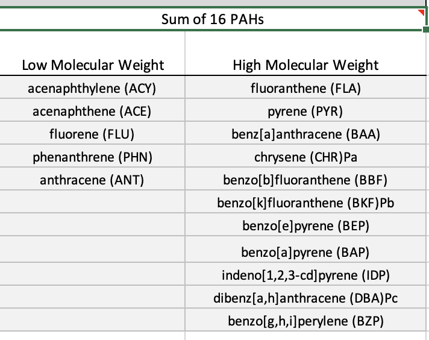

### Plan of the Week: March 9 - 15, 2026

-   *Working week listed from Mon - Sun*

#### Daily Focus

-   Monday: Mapping out the plan of attack for the week
-   Tuesday: UW-RUA & Dean's Office Work
-   Wednesday: Lab Meeting & Prep for Thursday's eDNA 'think tank'
    session and UW-AAF events
-   Thursday: eDNA process & literature 'think tank' session with Kassi
    P and Connor, Nanopore and UW-AAF events
-   Friday: Writing Accountability with KPJ, focus on Biomarkers
-   Saturday: NW Straits Meeting - Ecology/ Conservation/ Public
    Sessions
-   Sunday: Biomarker Manuscript

### Plan of the Day

-   My goal for today is to plan out the deliverables I have for the
    week - including the steps for making progress on upcoming
    deliverables to mitigate the 11th hour push that is getting really
    old.
-   The remainder of the day will be spent prepping UW-RUA materials.

### Projects Touched Today

-   Mussel Biomarkers
-   Proposal Chapters 3 & 4
-   Yellow Island
-   Lab Notebook

### Progress Notes

#### Planning/ Lab Notebook

-   Before setting up my plan for the week, I updated my lab notebook by
    adding daily log posts for the weekend, archiving February and
    putting all of those posts into a single file, reviewing my monthly
    goals, and brain dumping for all projects and tasks.
-   Dean Search- ConEv
    -   I caught up with the Dean candidate search by watching Candidate
        A's presentation and providing feedback in the survey.
    -   I virtually attended Candidate B's presentaiton and submitted my
        feedback in the survey provided by the search committee.

#### Yellow Island

-   I sent my requested dates for Yellow Island surveys this spring/
    summer. Since my schedule and priorities have shifted, I am able to
    batch surveys within the longer/ lower low tide series in late May
    and early June.

{fig-align="center" width="400"}

#### Chapter 3 & 4

-   I worked through a scaled- down version of the lab experiment for
    Chapters 3 & 4
    -   Using the 2021-22 WDFW data, I identified the region's highest
        and lowest concentrations of the potential tx chemicals:
        -   Cadmium (mg/kg) - 0.226 (Arroyo Beach) - 0.416 (Penn Cove),
            mean= 0.310
        -   Copper (mg/kg) - 0.774 (Broad Spit) - 5.18 (Chimacum Creek
            Delta), mean= 1.17
        -   Sum of 16 PAHs (ng/g) - 3.6 (Hood Canal Holly) - 1600 (Des
            Moines Marina), mean= 80.74
    -   Only the 74 sites included in the biomarker work are included.
    -   Values listed above are the wet tissue values (blank corrected
        for PAH) with the Detected qualifier only.
    -   I used the Sum of 16 PAHs because they are the longest defined
        PAHs by the EPA for their toxicity to humans. The lowest PAH
        concentration was at a site not included in the earlier work
        (Drayton Harbor).

The individual PAHs are listed in the image below - if a mixture is not
feasible for experimentation, the high molecular weight PAHs are the
most persistent while the low molecular weight PAHs can have higher
acute toxicity; considering long- term exposure as the baseline for
molecular response, we should prioritize the high weight PAHs.

{width="500"}

-   Looking at the experimental design, there are two paths that can be
    taken regarding elevated water temperatures.

    -   Chronic elevated water temperature at 20° C

    -   Acute elevated temperature exposure through the use of resazurin
        assays to mimic tidal fluctuations in warmer months.

The general design without resazurin looks like the design below.

{fig-align="center"}

### Products & Word Count

-   Yellow Plan: 50 words + 2 tables/ time schedules with personnel
    allocation for TNC support
-   Chapter 3 & 4 plan: 100 words + diagram/ sketch of tx options

> **Today's total: 150 words**
>
> **Monthly total to date: 1392 words**
>
> **Annual total to date: 21,845 words**

### Tomorrow's Plan

-   Tuesday is a UW-RUA day, and likely will include no personal science
    work.
