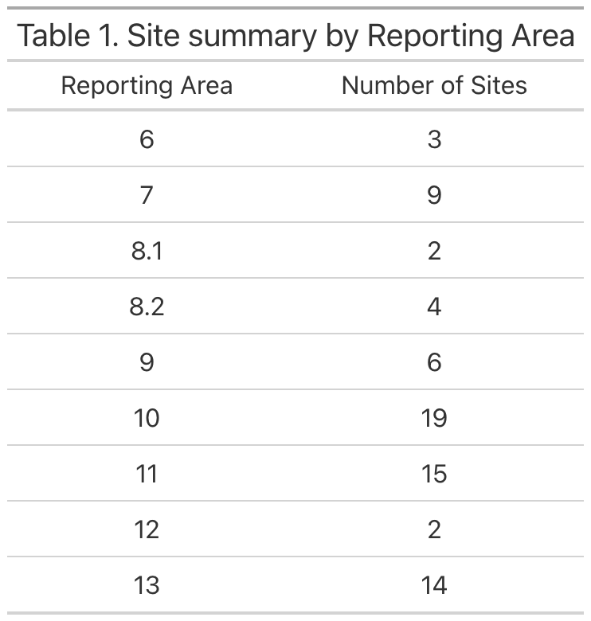
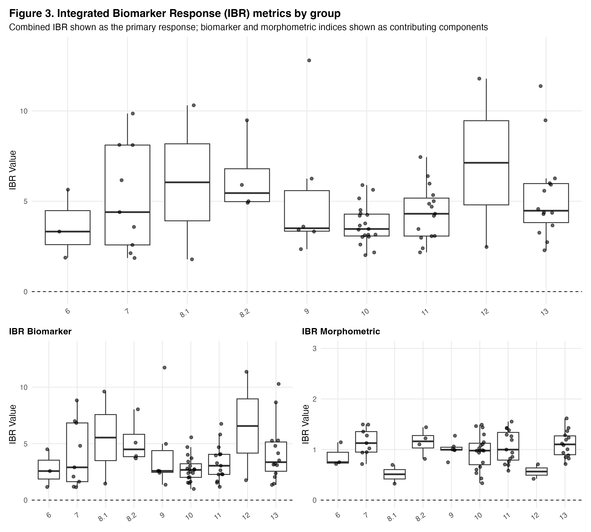
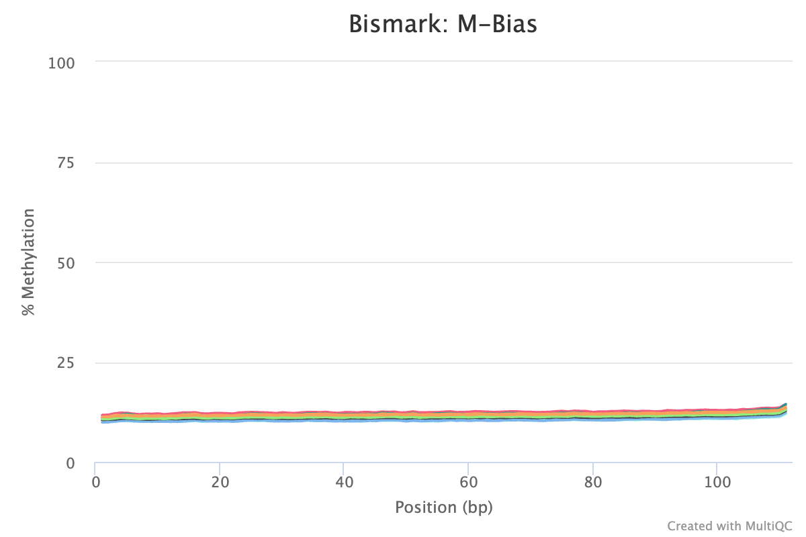
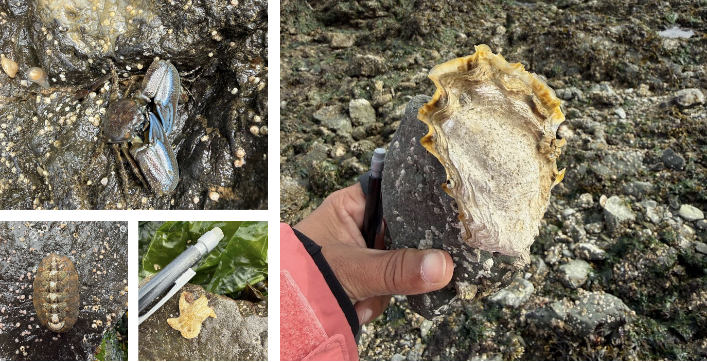
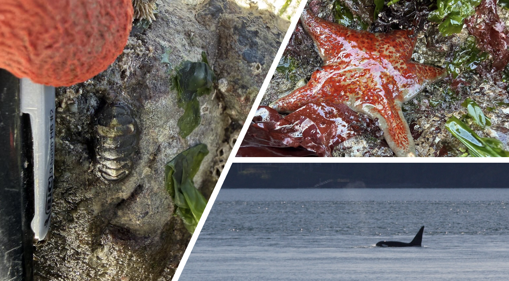
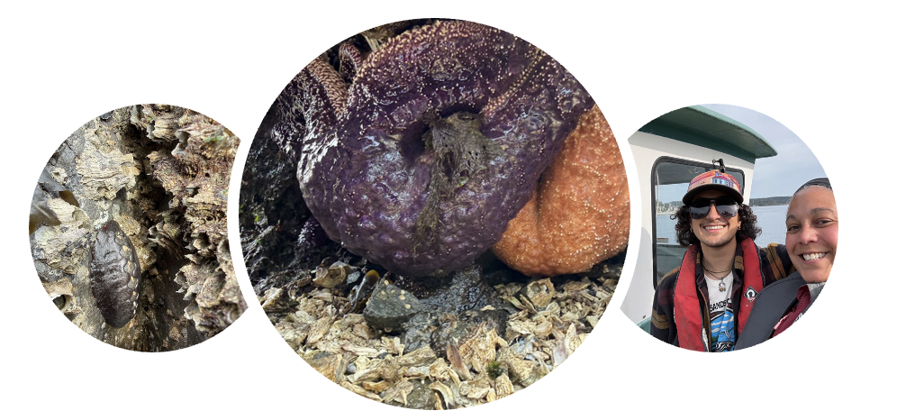

> This page compiles **_all_** daily posts for April 2026.

### 2026-04-01 — No April Goal Setting

##### Plan of the Week: March 30 - April 5, 2026

##### *High- level outline for the week. Adjusted daily to reflect progress of the day before*

-   I am finally as close to healthy as I have been in awhile, so as
    long as the anxiety of being so behind doesn't take me out, I will
    be solid!

------------------------------------------------------------------------

> ~~Monday - Catch up on UW-RUA and NWS Poster~~
>
> ~~Tuesday - UW-RUA, No Science~~
>
> Wednesday - Biomarker Manuscript
>
> Thursday - Biomarker Manuscript
>
> Friday - NWS Symposium
>
> Saturday - Biomarker Manuscript
>
> Sunday - No Science

------------------------------------------------------------------------

##### Plan of the Day

##### *Granular level task list to accomplish the high- level goal outlined above*

-   There are no goals nor plan for today. Nothing like being derailed
    because your brain cannot get out of the death- cycle of replaying
    everything.
-   Goals for the month will be posted before the end of the week and
    today's working sessions will be dedicated to knocking out the mile-
    long list of UW-RUA tasks I have right now.

##### Projects Touched Today

-   DNA Methylation
-   NWS Symposium

------------------------------------------------------------------------

##### Progress Notes

-   Today packed a 1-2 punch across two very important axes of my life
    at current. Since deep work is almost impossible, I will move
    forward with task management.
    -   First, finalized and submitted the poster overview of the
        outcomes of conservation opportunities.
        -   I doubt I'll be able to present it, but at least now it is
            complete in case I can.
    -   Second, I had to clear out the remainder of my schedule for more
        pressing appointments, so that just feels like kicking the can
        down the road...
        -   The can will be kicked further down the road based on some
            department- level information.
    -   In my task processing, I was able to inspect and restart the
        methylation analysis.
        -   Sample 95, amongst the last to be aligned, has failed twice.
            The first time was due to a disconnection, and the second
            time is because I didn't clean out the temporary BAM files
            and it was skipped as already aligned.
        -   I properly cleaned up the repo, synced it to Gannet, and
            restarted the script.
    -   The remainder of the day was doing nothing but knocking out
        tasks mostly unrelated to science.

------------------------------------------------------------------------

##### Outcomes: Products & Word Count

-   No science products

> **Today's total: 0 words**
>
> **Monthly total to date: 0 words**
>
> **Annual total to date: 32,672 words**
>
> **Annual target total to date: 45,500 words**

##### Next Up: Tomorrow's Plan

-   I have back to back obligations in and out of the home, Connor's
    defense, and depending on my capacity, we shall see what can be
    done.

### 2026-04-02 — April Showers for Sure

##### Plan of the Week: March 30 - April 5, 2026

##### *High- level outline for the week. Adjusted daily to reflect progress of the day before*

-   I am finally as close to healthy as I have been in awhile, so as
    long as the anxiety of being so behind doesn't take me out, I will
    be solid!

------------------------------------------------------------------------

> ~~Monday - Catch up on UW-RUA and NWS Poster~~
>
> ~~Tuesday - UW-RUA, No Science~~
>
> ~~Wednesday - Biomarker Manuscript~~
>
> Thursday - Biomarker Manuscript
>
> Friday - NWS Symposium
>
> Saturday - Biomarker Manuscript
>
> Sunday - No Science

------------------------------------------------------------------------

##### Plan of the Day

##### *Granular level task list to accomplish the high- level goal outlined above*

-   The plan today is to try and focus for short working blocks in
    between my obligations.

##### Projects Touched Today

-   DNA Methylation

------------------------------------------------------------------------

##### Progress Notes

-   I started today handling personal business.
-   Next up was Connor's MS defense where he demonstrated how morphology
    helped clarify some of the evolutionary relationships amongst
    diverse fishes using the skull shape of sticklebacks. It was very
    cool to see the culmination of a ton of hard work!
-   I pulled my log notes from Notion to update my lab notebook. Not too
    many things going on so far this week so that was quick.
-   I checked in on the methylation work and found that at some point
    prior to lunchtime my terminal disconnected. I got to repeat the
    erase/ rerun circle from yesterday.
    -   Since I don't trust the option to close the browser and continue
        the work, the humpback whale sanctuary in Hawaii has been
        running any time I have to leave my computer to ensure the final
        alignment runs and lets me move forward in the methylation
        analysis. As of 1738, sample 95M has been running since
        about 1345. Let's hope it will wrap up before the morning.
    -   It did finish and I was able to get the deduplication and
        MultiQC up and running by 1920, so that should be finished
        before morning.
-   I outlined/ brain dumped the methylation chapter sections into a
    Google doc while I watched the deduplications run for a bit, and
    called it a day.

------------------------------------------------------------------------

##### Outcomes: Products & Word Count

-   Outlining Methylation Chapter: 553 words

> **Today's total: 553 words**
>
> **Monthly total to date: 553 words**
>
> **Annual total to date: 33,225 words**
>
> **Annual target total to date: 46,000 words**

##### Next Up: Tomorrow's Plan

-   Will be determined tomorrow.

### 2026-04-03 — Methylation Analysis

##### Plan of the Week: March 30 - April 5, 2026

##### *High- level outline for the week. Adjusted daily to reflect progress of the day before*

-   Moving forward.

------------------------------------------------------------------------

> ~~Monday - Catch up on UW-RUA and NWS Poster~~
>
> ~~Tuesday - UW-RUA, No Science~~
>
> ~~Wednesday - Biomarker Manuscript~~
>
> ~~Thursday - Biomarker Manuscript~~
>
> Friday - NWS Symposium
>
> Saturday - Biomarker Manuscript
>
> Sunday - No Science

------------------------------------------------------------------------

##### Plan of the Day

##### *Granular level task list to accomplish the high- level goal outlined above*

-   Keep the methylation analysis moving forward
-   Present at the NWS Symposium

##### Projects Touched Today

-   DNA Methylation
-   NWS Symposium

------------------------------------------------------------------------

##### Progress Notes

-   Checked my methylation outputs - the deduplication, MultiQC, and
    output organization wrapped up at 0745.

    -   Next step is to run the deduplication and parameter checks on
        the first 10k basepairs to have for later checks - not making
        any adjustments based on these yet.

    -   I used the methylation extraction and qc script from ceasmaller
        (Sam’s repo) to create the extraction script for the next step.

-   Ran the methylation extraction after the parameter checks were
    completed.

    -   Started the methylation extractions with my modified code. Had
        to rebuild tool paths after the first fail because I didn’t
        update them correctly in the modified script

    -   After repeated attempts where it seems to detect methylation
        extraction where there was none, I realized two major things:

        -   First, I build the stupid skip loops wrong - got too caught
            up in humming fe, fi, of, fum I guess. 

        -   Second, it was a blessing in disguise since I had two
            directories mislabeled and would have been really confused
            why my extractions and their reports ended up in my code or
            reference directories…

    -   During my work block with KPJ, she helped me talk through the
        steps of what I was asking the code to do and my anticipated
        outcomes, and fix the loops since I was still a little stuck.

-   Adding to my decision/ defense of decisions log, coverage (analysis
    decision) and buffer size (computer decision) explanations.

    -   Coverage is set at 5 in the scripts in all of the lab repos I
        have searched. I know it is number of times a read is completed
        at a particular site in the sequence, but I don’t know why 5 is
        the choice.

        -   Coverage, a.k.a. total reads at a particular site= number of
            unmethylated reads + number of methylated read

        -   It is the minimum number of reads to support the proportion
            of methylation. If you have 3 reads- 1 methylated and 2 not,
            that is not a reliable 33% methylation. If you have 5+ reads
            and methylation is 1 of 5, that 20% is likely more accurate.

        -   Coverage values are a balancing act between our ‘confidence’
            in the results and the amount of data we exclude based on
            read count.

        -   Since these are whole genome BS sequences (not RR), I may
            want to play with this coverage value to compare results
            since there is more to work with - may be a fools errand,
            but maybe not. I do not know the implications of higher
            coverage values based on the DNA extraction and sequence
            quality, nor do I know if increasing coverage will knock out
            relevant sites of methylation since inverts are ‘normally’
            methylated in a scattered way versus verts.

    -   Buffer size is an indication to the computer how much data to
        hold before writing it out.

        -   This is a space and speed balancing act; 50% buffer is just
            asking the computer not to write out anything until it
            reaching 50% of the available working memory.

        -   Not sure if it is appropriate on Raven since I modified this
            code from Sam’s script that was running on Klone. 

        -   Will leave it in the script in hopes it will also help speed
            up the process without screwing up anyone else running stuff
            on Raven

-   A later task is to run a quick script to put all of the checksums
    into a table or excel file or whatever for quick side by side
    comparisons and to keep with all of the other metadata. This is a
    clean-up step, not a process step.

-   Created an exact duplicate of the extraction script to run with a
    cover 10 for comparison.

    -   I can run this after the extractions for cover 5 because I will
        need to take my time through the results to really lock in what
        I do and do not understand before reviewing those results in
        comparison.

-   Next snag- the sorted BAM files are not in an order recognized… 

    -   Error message in the log for 105M:

    -   “The IDs of Read 1
        (LH00469:254:22HGFVLT4:2:2361:52054:3816_1:N:0:GTTACGCA+ATGGCGAT)
        and Read 2
        (LH00469:254:22HGFVLT4:2:2441:28449:5398_1:N:0:GTTACGCA+ATGGCGAT)
        are not the same. This might be the result of sorting the
        paired-end SAM/BAM files by chromosomal position which is not
        compatible with correct methylation extraction. Please use an
        unsorted file instead or sort the file using 'samtools sort -n'
        (by read name). This may also occur using samtools merge as it
        does not guarantee the read order. To properly merge files
        please use 'samtools merge -n' or 'samtools cat’.”

-   Remember: Bismark methylation extractor requires R1 and R2 to remain
    adjacent; sorted BAMS are not going to work.

-   I fixed the script to pull the unsorted BAM files, and once it began
    working, I left it to get ready to go.

-   Finally, I fixed my lab notebook not showing up on the handbook page
    and not showing up in the lab feed per GH Issue #2090 guidance.

    -   The handbook page update worked. I think I added my name to the
        path twice instead of once...

    -   I can't see if the feed that drops into Slack worked, so I will
        wait until tomorrow to verify in case it only pulls once a day
        or at specific times or whatever.

------------------------------------------------------------------------

##### Outcomes: Products & Word Count

-   Extraction Analysis (Cover 5 and 10): 2 scripts
-   Methylation Analysis Details: 368 words

> **Today's total: 368 words**
>
> **Monthly total to date: 921 words**
>
> **Annual total to date: 33,593 words**
>
> **Annual target total to date: 46,500 words**

##### Next Up: Tomorrow's Plan

-   Set April goals and attainment plan.

### 2026-04-04 — Methylation and Biomarker Visualizations

##### Plan of the Week: March 30 - April 5, 2026

##### *High- level outline for the week. Adjusted daily to reflect progress of the day before*

-   Moving forward.

------------------------------------------------------------------------

> ~~Monday - Catch up on UW-RUA and NWS Poster~~
>
> ~~Tuesday - UW-RUA, No Science~~
>
> ~~Wednesday - Biomarker Manuscript~~
>
> ~~Thursday - Biomarker Manuscript~~
>
> ~~Friday - NWS Symposium~~
>
> Saturday - Biomarker Manuscript
>
> Sunday - No Science

------------------------------------------------------------------------

##### Plan of the Day

##### *Granular level task list to accomplish the high- level goal outlined above*

-   Keep the methylation analysis moving forward
-   Review biomarker visualizations

##### Projects Touched Today

-   DNA Methylation
-   Mussel Biomarkers

------------------------------------------------------------------------

##### Progress Notes

-   Returning to the biomarker visualizations in R, not just GIS, I had
    to review what I had, figure out if it was correct, and adjust what
    wasn’t.
    -   First, reviewing the existing viz, I created many with gt(),
        this will not render beyond HTML - a thing I did not know until
        too much Googling put me on the right path. To have tables/ data
        visualizations render in a Word or PDF, the kable() package has
        to be used in place of the gt() call that is great for my lab
        notebook, but not for my outputs. 

    -   Shifting to kable() also means a change in syntax that took
        waaaaaaaay too long - I have gotten into a rhythm with tidy and
        the html rendering since I add something to my digital notebook
        more often than adjusting my other work - so I focused on web-
        based rendering, instead of investigating the differences, this
        made the whole thing feel really silly.

        -   I took the existing code, used the
            [R-Ladies](https://rladies.org/) platform that has been a
            huge help in other work, and compared based on output before
            fixing, getting CoPilot to help with syntax, and running the
            new part correctly.

        -   After that, I rendered the remaining plots in R before
            deciding what needed to be adjusted - don’t want to waste
            time. The tables, in manuscript and supplementary, needed to
            be reworked, along with the multi-faceted plots for the
            IBRs. I went to work on those.

        -   The base structures are good and can be adjusted once
            revisions are underway. 
-   For the methylation work, I checked in multiple times throughout the
    day to ensure my extractions were continuing to run properly.
    -   By the end of the day, the extractions were about halfway
        completed.

        

        ------------------------------------------------------------------------

        

##### Outcomes: Products & Word Count

-   Biomarker Plots: 1 multi-panel
-   Biomarker Tables: 2 tables

> **Today's total: 0 words**
>
> **Monthly total to date: 921 words**
>
> **Annual total to date: 33,593 words**
>
> **Annual target total to date: 46,500 words**

##### Next Up: Tomorrow's Plan

-   Tomorrow is Easter, so I have some cooking and family time ahead.

### 2026-04-05 — Plotting

##### Plan of the Week: March 30 - April 5, 2026

##### *High- level outline for the week. Adjusted daily to reflect progress of the day before*

-   Moving forward.

------------------------------------------------------------------------

> ~~Monday - Catch up on UW-RUA and NWS Poster~~
>
> ~~Tuesday - UW-RUA, No Science~~
>
> ~~Wednesday - Biomarker Manuscript~~
>
> ~~Thursday - Biomarker Manuscript~~
>
> ~~Friday - NWS Symposium~~
>
> ~~Saturday - Biomarker Manuscript~~
>
> Sunday - No Science

------------------------------------------------------------------------

##### Plan of the Day

##### *Granular level task list to accomplish the high- level goal outlined above*

-   Keep the methylation analysis moving forward
-   Biomarker visualizations

##### Projects Touched Today

-   DNA Methylation
-   Mussel Biomarkers

------------------------------------------------------------------------

##### Progress Notes

-   Today's working window is limited because it is Easter and I have
    Easter bunny, Easter chef, Easter everything duties.
-   First checked in on the methylation extractions. They’re still
    running and looking good for what I understand at this moment. 
    -   Tried to rsync and failed again- getting an error that my
        directory isn’t found. I triple checked the syntax, double
        checked my passwords, verified the location and paths, double
        checked gannet… I will check again when I’m less frustrated to
        make sure I’m not overlooking a simple error. 
-   Shifted over to the biomarker plots from yesterday. 
    -   I realized most of the plotting for the manuscript does not
        align with the narrative, so I prioritized the manuscript plots
        (IBR scores, contaminant indices, maps), identified the
        extraneous plots (transformed data before IBR creation,
        contaminant plots that are redundant because of the maps, radar
        plots), and moved over to the tables to do the same thing. The
        only two tables that are important are the correlation tables,
        the rest are supplementary. 

    -   Worth note, because there are 74 sites, these plots are created
        at the reporting area level for ease of understanding and the
        larger take home message clarity. The non-map plots are all box
        and whisker plots with the individual site data indicated as
        points. 

    -   First up, reviewing where I left off on the IBRs since I got the
        multi-panel layout setup but stopped before reviewing the axes,
        labels, take home message alignment. 

    -   The goal of this plot is to keep the combined score front and
        center since the analysis is based on that, and then to show how
        the biomarkers and morphometrics contributed to the combined
        score. 

    -   I didn’t mess with the labels because they are currently good
        enough for what I need. 

    -   I will need some feedback on how to handle the outliers that are
        compressing the graphs themselves into negligible boxes. 

Shifting to the kable() package makes an easily formatted table with
almost no effort, like the one below. Most notably, this table is
important becasue of the variability in site number - it is something I
have not spoken to re: manuscript, but will have to. Additionally, the
outlier problem is clear in the IBR plot (below).

{fig-align="left" width="300"}

------------------------------------------------------------------------

##### Outcomes: Products & Word Count

-   Refining plots: 4 plots

> **Today's total: 0 words**
>
> **Monthly total to date: 921 words**
>
> **Annual total to date: 33,593 words**
>
> **Annual target total to date: 47,000 words**

##### Next Up: Tomorrow's Plan

-   Set April goals and attainment plan, begin to frame my 1v1 with
    Steven for Wednesday.

### 2026-04-06 — Methylation and UW-RUA

##### Plan of the Week: April 6 - April 12, 2026

##### *High- level outline for the week. Adjusted daily to reflect progress of the day before*

-   This week's plan is to continue to move forward with the methylation
    analysis, refresh mutual goals, expectations and priorities with
    Steven, and set goals for April.

------------------------------------------------------------------------

> Monday - Planning the week & Setting April Goals
>
> Tuesday - UW-RUA, No Science
>
> Wednesday - Friday: Will Outline post Steven 1v1
>
> Saturday - No Science
>
> Sunday - Reading

------------------------------------------------------------------------

##### Plan of the Day

##### *Granular level task list to accomplish the high- level goal outlined above*

-   Continue to move forward with the methylation analysis.
-   Knockout UW-RUA tasks, including traveler management

##### Projects Touched Today

-   DNA Methylation

------------------------------------------------------------------------

##### Progress Notes

-   Today's first priority was checking in on the methylation
    extractions; they were almost finished last night.
    -   All sequences were completed by 0500. All reports from Bismark
        and MultiQC were completed by 0600.
    -   My rsync problem was that I was trying to run it from my code
        directory... I knew I just needed to step away before trying
        again. I was able to get that running before Apple decided my
        computer update was more important - so I restarted it after
        being disconnected, but it is decidedly slower than molasses in
        January so we wait.
    -   Next up is to commit the smaller files to GH and start to look
        at the reports and ask questions.
-   Next, I updated my notebook posts from the weekend. I started them
    each day, but didn't finish them.
    -   Once that was done, I had to shift to some UW-RUA traveler
        management tasks that are time sensitive. My next step is April
        goal planning and building my 1v1 agenda for Wednesday.
-   I took a look at the methylation extraction reports from Bismark and
    MultiQC. A couple things I jotted down while reviewing:
    -   M-Bias reports/ plots. 'M'ethylation bias across read positions.
        M-bias looks at the percentage of cytosines are 'called'
        methylated across every single base in the sequence.
        Additionally, the lack of any 'jumps' or 'spikes' in the lines
        indicate nothing external (non-biological) has created noise in
        the sequences.
        -   On average, all sequences are around 11% methylation at CpGs
            (see sample 272M plot from Bismark below). This means things
            like the trimming parameters and bisulfite conversion are
            consistent and not driving the methylation percentage up or
            down from a process POV.

{fig-align="left"}

-   Since I like a good list over a plot, I took the multiQC data table,
    added pertinent sample information and put it below. It helped me
    see that methylation, on average was the same across all samples -
    that makes the upcoming work of figuring out where that methylation
    is occurring very interesting.

{fig-align="left"
width="500"}

-   Additionally, the low percentages of methylation at CHG or CHH (any
    cytosine that is not followed by a G(uanine) directly are low. This
    is important because what we know about animal methylation and it's
    potential functional relevance tells us CpGs are where it's at, so
    high numbers could indicate a bisulfite conversion issue in the
    data.

    -   Fun fact, methylation in plants typically occurs at CG, CHG or
        CHH sites. Check out this [*Muyle et
        al*](https://pmc.ncbi.nlm.nih.gov/articles/PMC8995044/). paper
        from 2022 that explains it way better than me!

-   After looking over my reports, I returned to UW-RUA to prep for
    tomorrow.

------------------------------------------------------------------------

##### Outcomes: Products & Word Count

-   Something: 0 words

> **Today's total: 0 words**
>
> **Monthly total to date: 921 words**
>
> **Annual total to date: 33,593 words**
>
> **Annual target total to date: 47,500 words**

##### Next Up: Tomorrow's Plan

-   Wrapping up my agenda for my 1v1 with Steven, setting up some April
    goals, and of course, UW-RUA.

### 2026-04-07 — Tuesday's are UW-RUA Days

##### Plan of the Week: April 6 - April 12, 2026

##### *High- level outline for the week. Adjusted daily to reflect progress of the day before*

-   This week's plan is to continue to move forward with the methylation
    analysis, refresh mutual goals, expectations and priorities with
    Steven, and set goals for April.

------------------------------------------------------------------------

> ~~Monday - Planning the week & Setting April Goals~~
>
> Tuesday - UW-RUA, No Science
>
> Wednesday - Friday: Will Outline post Steven 1v1
>
> Saturday - No Science
>
> Sunday - Reading

------------------------------------------------------------------------

##### Plan of the Day

##### *Granular level task list to accomplish the high- level goal outlined above*

-   Continue to move forward with the methylation analysis.
-   Finish filling in the Agenda for my 1v1 with Steven tomorrow.
-   Shift over to UW-RUA work for the remainder of the day. I have 8
    travelers in progress and a ton of programming information to lock
    in.

##### Projects Touched Today

-   DNA Methylation

------------------------------------------------------------------------

##### Progress Notes

-   Tuesday's are my only full- day, UW-RUA days. The rest of the week
    see's RUA tasks/ events sprinkled throughout.
-   In between those obligations, I worked on my agenda for my 1v1 with
    Steven and the GPC, finally rendered that this afternoon around 3:00
    pm to share.
-   At the end of the day, I managed to resolve my github merge problem
    with my smaller files on Raven and called it a day!

------------------------------------------------------------------------

##### Outcomes: Products & Word Count

-   Something: 0 words

> **Today's total: 0 words**
>
> **Monthly total to date: 921 words**
>
> **Annual total to date: 33,593 words**
>
> **Annual target total to date: 48,000 words**

##### Next Up: Tomorrow's Plan

-   Something that will be clear by the end of the day...

### 2026-04-08 — Meetings & Methylation

##### Plan of the Week: April 6 - April 12, 2026

##### *High- level outline for the week. Adjusted daily to reflect progress of the day before*

-   This week's plan is to continue to move forward with the methylation
    analysis, refresh mutual goals, expectations and priorities with
    Steven, and set goals for April.

------------------------------------------------------------------------

> ~~Monday - Planning the week & Setting April Goals~~
>
> ~~Tuesday - UW-RUA, No Science~~
>
> Wednesday - Friday: Will Outline post Steven 1v1
>
> Saturday - No Science
>
> Sunday - Reading

------------------------------------------------------------------------

##### Plan of the Day

##### *Granular level task list to accomplish the high- level goal outlined above*

-   Continue to move forward with the methylation analysis.
-   Lab and 1v1 Meetings

##### Projects Touched Today

-   Mussel Methylation

------------------------------------------------------------------------

##### Progress Notes

-   Today started with lab meeting where we shared updates and discussed
    lab equipment that could be purchased.
-   Next, I added the updated biomarker manuscript visuals to the shared
    Google Drive folder.
-   I met with Steven and Chelsea to go over the a plan to put these
    alerts in the rearview.
    -   I followed up with an email outlining what we discussed in the
        second half of the meeting.
    -   I set up 1- hour working blocks with Steven up through the week
        of May 11th.
    -   I put my project log together for the methylation analysis, so
        we had a jumping- off place beyond just an agenda of next steps.
-   I shifted over to working on the methylKit markdown for the next
    steps in the methylation analysis.
    -   Before getting to that, I looked up the DSS package that is the
        newer analysis package.
        -   It is a package specifically (as far as I can see) for
            assessing DMLs and DMRs...
        -   Fun find- Roberts Lab alum, Professor Yaamini Venkataraman's
            [lab notebook
            post](https://yaaminiv.github.io/Hawaii-Gigas-Methylation-Analysis-Part17/)
            about using DSS for analysis.
        -   methylKit 'DSS' applications can be found
            [here](https://rdrr.io/bioc/methylKit/man/calculateDiffMethDSS-methods.html),
            and DSS applications can be found
            [here](https://bioconductor.org/packages/release/bioc/html/DSS.html).
        -   A paper outlining the application can be found
            [here](https://pmc.ncbi.nlm.nih.gov/articles/PMC8171293/).
        -   I added both the package bookmark to my project bookmarks
            folder, and the paper to my bioinformatics library in Zotero
            before moving back to my methylKit work.
    -   In the process of looking at the DSS v methylKit packages, I
        came across a [DNA Methylation workflow
        tutorial](https://nbis-workshop-epigenomics.readthedocs.io/en/latest/content/tutorials/methylationSeq/Seq_Tutorial.html).
        I haven't really looked at it yet - that is a weekend task when
        I'm not trying to wrap my head around how to work through some
        of the other steps.
    -   Getting back on task, I started by building a proper metadata
        table. This didn't take long, but is definitely important for
        this leg of the work.
        -   I took my sample PAH classifications ranked from 1-6, the
            PAH concentrations, my site names, sample names, and then
            added treatment (0=low, 1=high) and a replicates column in
            case it will be needed later to existing data.
    -   Next I took the markdowns from the oly-repo in the lab handbook
        and created my methylkit files (4 total) following the same
        format and replacing the paths/ object names/ etc. that aren't
        applicable.
        -   Some of the parameter choices in the DML and DMR files are
            unclear at the moment and will be added to my running list
            of Steven questions. Nothing in the initial file import or
            qc work is unclear, so I'm going to go with it and annotate
            where I have questions after ensuring I have working code.
        -   Before I get really rolling, I need to add a few lines re:
            directory outputs for the objects and plots, so I did that
            in the console rather than in the markdowns.
    -   I made notes in the markdowns about what I need to do next, and
        will get back to it tomorrow.

------------------------------------------------------------------------

##### Outcomes: Products & Word Count

-   methylKit markdowns: 4 scripts

> **Today's total: 0 words**
>
> **Monthly total to date: 921 words**
>
> **Annual total to date: 33,593 words**
>
> **Annual target total to date: 48,500 words**

##### Next Up: Tomorrow's Plan

-   Something that will be clear by the end of the day...

### 2026-04-09 — Task Management is the Name of the Game

##### Plan of the Week: April 6 - April 12, 2026

##### *High- level outline for the week. Adjusted daily to reflect progress of the day before*

-   This week's plan is to continue to move forward with the methylation
    analysis, refresh mutual goals, expectations and priorities with
    Steven, and set goals for April.

------------------------------------------------------------------------

> ~~Monday - Planning the week & Setting April Goals~~
>
> ~~Tuesday - UW-RUA, No Science~~
>
> ~~Wednesday~~ - Friday: Will Outline post Steven 1v1
>
> Thursday - Task management
>
> Friday - Biomarker Manuscript - 'Clarify' edits
>
> Saturday - No Science
>
> Sunday - Reading

------------------------------------------------------------------------

##### Plan of the Day

##### *Granular level task list to accomplish the high- level goal outlined above*

-   Get my crap together! I have a multi-car pileup of tasks across so
    many different science projects and personal projects that today is
    the day to knock out what I can, schedule or delegate what I can't,
    and to make a few prioritization decisions to align with some of my
    larger goals and deliverables.

##### Projects Touched Today

-   All of them! No, seriously...
-   Yellow Island
-   Mussel Biomarkers

------------------------------------------------------------------------

##### Progress Notes

-   Today started with knocking out some personal business. I bring it
    up because all of the 'hurry up and wait' gave me time to take a
    look at my brain dump task list from earlier this week, break down
    some of the multi-step tasks, identify what would or would not make
    the boat go faster.
    -   "Will it make the boat go faster?" is the fundamental question
        [Martin
        McElroy](https://whchambers.com/conversation-with-martin-mcelroy-mba-olympic-gold-medal-winning-coach-faster-podcast/#:~:text=He%20is%20also%20credited%20with%20creating%20the,on%20what%20he's%20learned%20over%20the%20years)
        asked of the British rowing team while they were going for (and
        attained) the gold medal in the 2000 Olympics.
        -   Are the preparations, decisions, or actions I'm making and
            taking making my boat go faster? Going back to one of my
            favorites, Nick Saban, he is all about the process, not the
            outcome. So when you put these together you get the
            reinforcement of the daily task of focusing on what makes a
            difference (McElroy), and a commitment to meeting the daily
            task with 100% (Saban).
        -   All that to say that today was a mini-reset and refocus on
            what makes my boat go faster.
    -   First up, I knocked out the logistics for the 5 tide series on
        Yellow.
        -   I made my ferry reservations, bought my tickets, pulled
            together my supply lists, touched base with the land steward
            to confirm the volunteers'/ interns' schedules for support,
            and verified transport times to and from the ferry landings.
            Made my next steps list for food and travel days, pulled out
            the gear I'll need to keep in the trunk, and blocked my
            travel time in addition to the tide survey times rather than
            having 24hr blocks on my calendar.
    -   Next up, I pivoted to some event management for the upcoming
        UW-RUA event's I'm coordinating.
        -   I followed that up with a touch-base style 'office hours'
            with a few travelers that need some additional support in
            getting their visits planned and on their way.
    -   Next on the list was a critical review of the biomarker
        manuscript. I keep making 'large' to-do's like 'write the
        abstract', rather than the actual steps. This took a long time
        to keep myself focused on the critical look rather than fixing
        the thing I put on the list. It yielded a coupe of pages of
        notes that feels a little daunting.
        -   I batched the type of notes into writing, citing, and
            clarifying. Any notes that don't fall into those categories
            are not a priority to get the work out.
        -   The clarifying section includes notes like, "lines 22-26
            state but don't explain the connection between legacy
            contaminants and climate- driven stressors." What is one
            sentence that ties these together?
        -   The citing section includes notes like, "line 31, 34, and 37
            have synthesized for the public report-level citations."
            What are the individual papers/ research that support this
            synthesis?
        -   The writing section includes notes like, "lines 242-249 is
            about the spatial pattern of the biomarkers, but not the
            spatial pattern of the contaminant classes that is clearer
            and statistically significant." This is where the results
            are misaligned; the contaminants are spatially significant,
            but the biomarker response is not, this is where the IBR and
            Contaminant Indices come into play - justify why these
            'scores' are important in the narrative by connecting the
            spatial analyses to the biomarkers.
    -   I attended Maya Groner's seminar and learned more about marine
        diseases than I thought! Some very interesting and 'pugilistic'-
        themed research going on in the Bering!
    -   Finally, I made a plan of attack for tomorrow's edits on the
        Biomarker manuscript, identified the one report I want to review
        this evening to dig into in the morning, and called it a day.

------------------------------------------------------------------------

##### Outcomes: Products & Word Count

-   Biomarker manuscript critical review: \~800 words

> **Today's total: 800 words**
>
> **Monthly total to date: 1721 words**
>
> **Annual total to date: 34,394 words**
>
> **Annual target total to date: 49,000 words**

##### Next Up: Tomorrow's Plan

-   Biomarker manuscript. My goal is to work through the 'clarify' notes
    and complete the research for the wdfw report I want to support with
    not only the report, but the published research backing it.

### 2026-04-10 — Continuing Prioritization/ Task Management & Biomarkers

##### Plan of the Week: April 6 - April 12, 2026

##### *High- level outline for the week. Adjusted daily to reflect progress of the day before*

-   This week's plan is to continue to move forward with the methylation
    analysis, refresh mutual goals, expectations and priorities with
    Steven, and set goals for April.

------------------------------------------------------------------------

> ~~Monday - Planning the week & Setting April Goals~~
>
> ~~Tuesday - UW-RUA, No Science~~
>
> ~~Wednesday~~ - Friday: Will Outline post Steven 1v1
>
> ~~Thursday - Task management~~
>
> Friday - Biomarker Manuscript - 'Clarify' edits
>
> Saturday - No Science
>
> Sunday - Reading

------------------------------------------------------------------------

##### Plan of the Day

##### *Granular level task list to accomplish the high- level goal outlined above*

-   Pull the individual manuscripts from the WDFW reports to identify
    the original work, not the synthesis.
-   Start working through the 'Clarify' list of edits on the biomarker
    draft

##### Projects Touched Today

-   Mussel Biomarkers

------------------------------------------------------------------------

##### Progress Notes

-   Working through the 2021-22 WDFW and 2014 and 2016 reports is the
    first task of the day.
    -   I skimmed through the sections I was most interested in, matched
        what I could to the references in the reports, and made a list
        of topics/ writing within the reports where the citations may
        not be enough for what I need.
        -   The goal here is to cite the original papers alongside the
            report for any sentences in the manuscript that incorporate
            more than just the 'outcome' of that section of the report.
        -   For example, the sections that talk about mussel biology and
            their role as a monitoring tool is basic organism biology,
            so the report is not aligned with that as a citation. I have
            used Gosling's tome on mussels, but Puget Sound specific
            information should include the papers that have come out of
            here.
        -   The further I went with this, the more my side-notes running
            doc was populating with better, cleaner ideas to translate
            the biomarker work. I shifted to working on the edits and
            put the citation work aside.
-   Moving over to the clarify list of editing needs, my goal was to
    identify the quick fixes over the more complex ones.
    -   Right out of the gate, the overall narrative of the manuscript
        was everywhere but where it should have been. I found myself
        asking what I was trying to convey and I did the damn work. So I
        forced myself to write out what I wanted to say, a single (maybe
        two) sentence that explains the most important part of each
        section.
    -   That was harder than it sounded...
        -   Introduction: We tested integrating contaminant
            concentration data and paired, traditional (and validated)
            biomarker response to evaluate the extent to which
            biomarkers can inform ecological interpretation of
            contaminant data.
        -   Method: This part is solid!
        -   Results: The contaminants, by class, were highly spatially
            correlated, however the biomarker response and IBR were less
            only moderately correlated.
        -   Discussion: The complexity of biological impact requires
            multiple levels of assessment, including the traditional
            biomarkers, to clarify the contaminant- organism
            relationship. Adding molecular, and environmental layers of
            evaluation can improve the capacity of existing monitoring
            programs.
    -   By the end of all of this, I managed to get a drafted abstract,
        a few bits for the introduction, and a few bits for the
        discussion of the P450 and SOD biomarker responses in contrast
        to the contaminant indices.
        -   I was also able to identify my lack of enforcement around
            the choice to use an IBR, and my lackluster discussion of
            potential confounding or collaborative effects of the
            contaminant mixtures in the biomarker responses.

------------------------------------------------------------------------

##### Outcomes: Products & Word Count

-   Biomarker drafting: 1078 words

> **Today's total: 1078 words**
>
> **Monthly total to date: 2799 words**
>
> **Annual total to date: 35,472 words**
>
> **Annual target total to date: 49,500 words**

##### Next Up: Tomorrow's Plan

-   Saturday is a day off.

### 2026-04-11 — Weekly Wrap-Up & Biomarkers

##### Plan of the Week: April 6 - April 12, 2026

##### *High- level outline for the week. Adjusted daily to reflect progress of the day before*

-   This week's plan is to continue to move forward with the methylation
    analysis, refresh mutual goals, expectations and priorities with
    Steven, and set goals for April.

------------------------------------------------------------------------

> ~~Monday - Planning the week & Setting April Goals~~
>
> ~~Tuesday - UW-RUA, No Science~~
>
> ~~Wednesday~~ - Friday: Will Outline post Steven 1v1
>
> ~~Thursday - Task management~~
>
> ~~Friday - Biomarker Manuscript - 'Clarify' edits~~
>
> Saturday - No Science
>
> Sunday - Reading

------------------------------------------------------------------------

##### Plan of the Day

##### *Granular level task list to accomplish the high- level goal outlined above*

-   Saturday offers a few bonus hours of working time as I was able to
    wrap–up some of my other obligations earlier than expected.
    -   Goal 1- get a [weekly
        wrap-up](https://chrismantegna.github.io/labnotebook/weekly/2026_0411/)
        post knocked out.
        -   Summarize the week's activities, put the priority dates on
            my physical wall calendar, and start to layer-in the weekly
            plan for the methylation manuscript.
    -   Goal 2- review my writing updates on the biomarker manuscript
        and either update the manuscript or make notes on what can be
        improved.

##### Projects Touched Today

-   Mussel Biomarkers
-   Mussel Methylation

------------------------------------------------------------------------

##### Progress Notes

-   I started by writing my weekly wrap-up post.
    -   I have gotten out of the habit of reviewing the past week in
        totality, identifying what did and did not work, and using it to
        build the plan for the upcoming week, so this helped me return
        to the practice.
    -   It also made it clear that my process may be helpful to others
        who are struggling to balance multiple priorities, so I included
        it as I worked it.
    -   Finally, doing this helped me with the schedule review I
        typically do on Sunday. It's a short week, next week, because
        I'll be heading up to Yellow for my first tide series. I have to
        make sure I don't overload it!
-   Next, while working through my planning process, I created the list
    of weekly tasks/ deliverables for the writing portion of the
    methylation work.
    -   It's still a little loosey-goosey, but I'm getting closer to
        something with manageable momentum.
    -   The only constant right now is the reading load. Unlike how I
        was reading for biomarkers, I am going to add an annotated
        bibliography. I spent way too much time reviewing my notes over
        and over, so rather than have to do that every time I sit down
        to write, I'm going to add a column for the annotation to the
        lit table that makes it much easier to only review the papers I
        need for the portion I'm working on rather than using the tag-
        system to choose.
-   Returning to the biomarker manuscript, I didn't realize that the
    draft and visuals were in my personal Google Drive rather than my UW
    one. I set those up properly before reviewing my writing from
    yesterday.
    -   The new link to the products is
        [here](https://drive.google.com/drive/folders/1se75vO0siKTq4Bu4R7wSmX-Aa72IUh2V?usp=sharing).
    -   I took a look at my newer pieces, my current existing draft, and
        fought with my brain a bit to keep it on track. A good chunk of
        my drafting yesterday is a bit elementary in structure and word
        choice, so rather than fight with it, I made notes as to which
        lines in each section the sentences supported and 'struck out'
        what was already covered in the full draft.
    -   That was the extent of it. Fresh brain in the morning = fresh
        writing and incorporation.

------------------------------------------------------------------------

##### Outcomes: Products & Word Count

-   Weekly wrap-up post: 1621 words

> **Today's total: 1621 words**
>
> **Monthly total to date: 4420 words**
>
> **Annual total to date: 37,093 words**
>
> **Annual target total to date: 50,000 words**

##### Next Up: Tomorrow's Plan

-   Back at the biomarker draft.

### 2026-04-12 — Mussels, Mussels, and More Mussels

##### Plan of the Week: April 6 - April 12, 2026

##### *High- level outline for the week. Adjusted daily to reflect progress of the day before*

-   This week's plan is to continue to move forward with the methylation
    analysis, refresh mutual goals, expectations and priorities with
    Steven, and set goals for April.

------------------------------------------------------------------------

> ~~Monday - Planning the week & Setting April Goals~~
>
> ~~Tuesday - UW-RUA, No Science~~
>
> ~~Wednesday~~ - Friday: Will Outline post Steven 1v1
>
> ~~Thursday - Task management~~
>
> ~~Friday - Biomarker Manuscript - 'Clarify' edits~~
>
> ~~Saturday - No Science~~
>
> Sunday - Reading

------------------------------------------------------------------------

##### Plan of the Day

##### *Granular level task list to accomplish the high- level goal outlined above*

-   Sunday's original goal was to catch up on my reading re: methylation
    papers, but based on my upcoming week, I will shift to working on
    the biomarker manuscript and methylation analysis today instead.

##### Projects Touched Today

-   Mussel Methylation

------------------------------------------------------------------------

##### Progress Notes

-   I started by updating the Methylation Project Log to include a page
    dedicated to [questions and
    clarifications](https://chrismantegna.github.io/labnotebook/project_log/mussel_methylation/questions.html).
    -   This is in conjunction with the rest of the project
        documentation to date. That project log can be found
        [here](https://chrismantegna.github.io/labnotebook/project_log/mussel_methylation/).
    -   The big goal is to keep as much documentation together as
        possible, so this is a test run for how it may operate.
-   Next, I set up the Agenda outline for my working session with Steven
    for Wednesday.
    -   The Agenda is
        [here](https://chrismantegna.github.io/labnotebook/weekly/2026_0414/) -
        but definitely will not be complete until Tuesday.
-   I moved over to cleaning up and running the first methylKit script
    (06.0) to see if I know what I'm doing...
    -   Before that, I added the context column to the metadata table
    -   I had a feeling that I misinterpreted the methylKit code files
        from their original repos, and I was correct. So, I am going to
        make the following adjustments that match my current workflow
        without duplicating effort in any single script.
        -   Up first, the most basic is to fix the titles of each script
            so that they are formatted properly.
        -   Next, I'm going to adjust the setup. In
            6.0-methylKit_import_and_qc, I'm going to also add the
            'unite' step and PCA creation to put anything 'data prep' in
            the same script.
        -   I put that together and started- or so I thought- I had to
            install methylkit first. Using Bioconductor and the
            documentation from the [package
            site](https://bioconductor.org/packages/release/bioc/html/methylKit.html),
            it was a nice reminder that a perfect script doesn't exist
            and you should probably check your tools as well! The time
            it takes to load the tools you could be working on the
            script.
        -   That failed repeatedly because of the R version, the
            data.table package version, and a whole host of other issues
            that me & ChatGPT worked through, so I went to the GitHub
            install of methylKit via the [al2na Github
            repo](https://github.com/al2na/methylKit).
            -   To do that, I had to install devtools - I feel like I'm
                constantly installing this - this is a sign that I need
                to do a little investigation at another time.
            -   After devtools install and call, a whole host of things
                needed updating and then methylKit gave me hope...
            -   Once this failed, I took a step back, rethought through
                the actual problem, and while staring at my screen was
                reminded that I built an environment to start work on my
                home device rather than the remote - it's a container
                based in conda.
            -   Pivoting to my existing environment, I tried to activate
                my conda environment - nothing, I tried mamba instead
                thinking I just forgot - wrong.
            -   So, rather than fight the tide and keep trying to find
                these package version mismatches - which BTW were only
                the beginning problem - I am trying to remove the
                conflicts by 'containing' the work environment.
            -   In terminal, I checked for both mamba and conda again,
                came up empty, and installed minimamba to go back to the
                controlled environment to try and install methylKit.
                It's taking a bit, but once that is finished, I have a
                complete environment that should allow me to load
                methylKit- fingers crossed.
            -   I lost it because I restarted R because renv() prompted
                it - this is uncool. Found it again, downloaded
                BiocManager again with the correct version. Got to
                methylKit - it failed.
            -   This time the dependencies were the cause- PROGRESS!
            -   I installed the other packages: c( "GenomicRanges",
                "GenomeInfoDb", "Rsamtools", "fastseg", "rtracklayer",
                "Rhtslib") and tried again.
            -   None of that worked - I have literally tanked it at all
                troubleshooting or installation or whatever. That feels
                like time to take a break.
        -   Following that, I'm going to put the DML and DMR code
            together into a single script, and then follow up with the
            tiles markdown.

------------------------------------------------------------------------

##### Outcomes: Products & Word Count

-   Updated methylKit scripts: 3

> **Today's total: 0 words**
>
> **Monthly total to date: 4420 words**
>
> **Annual total to date: 37,093 words**
>
> **Annual target total to date: 50,500 words**

##### Next Up: Tomorrow's Plan

-   Biomarkers and methylation analysis.

### 2026-04-13 — Patience Please...

##### Plan of the Week: April 13 - April 19, 2026

##### *High- level outline for the week. Adjusted daily to reflect progress of the day before*

-   This week is all about biomarkers and methylation.

------------------------------------------------------------------------

> Monday - Methylation, `methylKit` run
>
> Tuesday - UW-RUA, biomarkers
>
> Wednesday - Biomarkers
>
> Thursday - Biomarkers
>
> Friday - Task management & ferry to FH/ Yellow
>
> Saturday - Yellow Island Surveys
>
> Sunday - Yellow Island Surveys

------------------------------------------------------------------------

##### Plan of the Day

{fig-align="left"}

##### *Granular level task list to accomplish the high- level goal outlined above*

-   My primary goals for today are as follows:
    -   Fix my RStudio/ R updates that crashes my local machine before
        it gets the printer treatment...
    -   Get `methylKit` loaded in Raven or open an issue for help
    -   Biomarker drafting

##### Projects Touched Today

-   Mussel Methylation

------------------------------------------------------------------------

##### Progress Notes

-   I left off yesterday making a mess in R and RStudio. My local
    machine caught me slipping and I updated the working R version when
    switching between projects. Cue the BS.
    -   To add insult to injury, I was already making an installation
        mess in Raven, so I wrapped up, made my notes, and considered
        leaving my laptop out in the rain...
    -   A little sleep and a timer made all of the difference. First, I
        uninstalled and then re-installed R and then RStudio and fixed
        my local machine issue.
    -   I also disabled my `.RData` and any `.Rprofile` docs temporarily
        until I can figure out what I setup that keeps making a mess in
        my stuff!
-   I pivoted to some UW-RUA traveler tasks that are time sensitive
    before returning to fixing my software.
-   Returning to Raven and the `methylKit` install from hell...
    -   During my working block with KPJ, I decided to go back with
        fresh reasoning and install `methylKit` since I'd done some
        clear- headed thinking about the issues and Kristin is a great
        resource for coding conundrums.
    -   First, working through all of the options back to back yesterday
        clouded my goal. The goal is to get the correct versions of
        `BiocManager` and `methylKit` installed so I can keep moving
        forward with the analysis.
    -   I verified I was in my `bio-cli` environment to prevent
        competing versions of R, and maximize capabilities in my
        micromamba 'container' of sorts, aka `bio-cli`. Once I activated
        that, I navigated to R in terminal, verified the version
        (4.3.3), verified where my R libraries are located, and my
        working directory:

> `[1]"/home/shared/8TB_HDD_02/cnmntgna/R/x86_64-pc-linux-gnu-library/4.2"`
> `[2]"/home/shared/8TB_HDD_02/cnmntgna/micromamba/envs/bio-cli/lib/R/library"`
>
> `[1] "/home/shared/8TB_HDD_02/cnmntgna"`

-   I then went back to the BiocManager documentation, verified the
    version should be 3.18, not 3.16 (which I was trying yesterday) for
    R versions 4.3.x. I then crossed my fingers and watched the
    install...

::: callout-warning
Trying to solve an installation or actual coding problem
99.999999999999% requires me to take a step back and identify - out
loud - what I am actually trying to do before accessing the internet! I
lost a few hours yesterday trying to jump into the middle to fix
something I already laid a foundation for. Go back to the basics...
:::

Moving on...

-   `BiocManager` installed and version 3.18 verified.

    -   `methylKit` failed.
        `Error: object ‘key<-’ is not exported by 'namespace:data.table' Execution halted`

    -   Remembering to go back to the basics... I checked my paths, my
        working directories, and the `methylKit` documentation in the
        [al2na GitHub
        repo](https://github.com/al2na/methylKit/issues/350). Even in my
        updated environment, R version 4.2 is overrunning 4.3 - what a
        bully. So I will fix that, and then the `data.table` issue.

    -   Working with KPJ, I created new directories in my environment
        that are exactly the same except they terminal in 4.3 instead of
        4.2, and re-pointed my environment to chose the newer
        libraries...

    -   Next hurdle - the `data.table` package is too new- it is
        1.18.2.1. Installed the older 1.16.4 version successfully.

`find.package("data.table") packageVersion("data.table")`

`[1] "/home/shared/8TB_HDD_02/cnmntgna/R/x86_64-pc-linux-gnu-library/4.3/data.table" [1] ‘1.16.4’`

-   Now, for `methylKit`... to fail. Segmentation fault (core dumped)...
    sounds egregious. More troubleshooting.

-   Halfway through trying to understand the error message, Kristin and
    I remembered we have this really nice conda/ mamba environment. So,
    I found the [Bioconda
    GitHub](https://bioconda.github.io/recipes/bioconductor-methylkit/README.html)
    page with instructions to install via my `micromamba` environment.

    -   Helpful within that is the compatible versions list of the
        gazillion packages needed for this program.

    -   `rtracklayer` was the next culprit, so installing and loading
        that, version 1.62.0, finally opened the door to
        `methylkit version 1.28.0`. I am rating this escape room 0/10.

-   Now for the true test- the code in the markdown.

    -   Which failed.

-   After knocking out some UW-RUA tasks, I returned with a fresh set of
    eyes.

    -   Problem 1 - no matter how many times (or ways) I set my working
        directory or activate my working environment, the markdown is
        fighting me.

    -   Problem 2 - my launch/ `.Renviron` / `.Rhistory` files are in a
        fight to pull me into insanity.

    -   Fixing problem 2 first will hopefully solve have the fight.

        -   I became a recursive remover with impunity! I suspect the
            repeat attempts and fails created a bunch of mixed signals.

        -   I did that because in my documentation perusal, I found that
            while `conda` and `mamba` are discussed kind of
            interchangeably, they are companions, not options - this
            helped me clarify my primary conflict - several
            'environments' that could be one.

        -   Once I renamed my old history and environment files, I
            changed my global options in R to stop loading from the
            previous session, restarted and followed the bioconda
            instructions to get my tools in one environment.

    -   I now have a `wgbs` environment - outside of the methylation
        project - that I can use for this work and all subsequent
        projects. The environment includes the QC and alignment tools as
        well. I am very pleased!

        -   It did activate within the markdown once I rendered the
            markdown as quarto & now my next step is to fix the actual
            coding errors I have created by modifying the chunks to test
            against the other environments and workarounds I attempted
            earlier today.

{fig-align="left" width="600"}

------------------------------------------------------------------------

##### Outcomes: Products & Word Count

-   WGBS environment!

> **Today's total: 0 words**
>
> **Monthly total to date: 4420 words**
>
> **Annual total to date: 37,093 words**
>
> **Annual target total to date: 50,500 words**

##### Next Up: Tomorrow's Plan

-   UW-RUA and biomarker edits.

### 2026-04-14 — UW-RUA, Taxes & Mussels

##### Plan of the Week: April 13 - April 19, 2026

##### *High- level outline for the week. Adjusted daily to reflect progress of the day before*

-   This week is all about biomarkers and methylation.

------------------------------------------------------------------------

> ~~Monday - Methylation, `methylKit` run~~
>
> Tuesday - UW-RUA, biomarkers
>
> Wednesday - Biomarkers
>
> Thursday - Biomarkers
>
> Friday - Task management & ferry to FH/ Yellow
>
> Saturday - Yellow Island Surveys
>
> Sunday - Yellow Island Surveys

------------------------------------------------------------------------

##### Plan of the Day

##### *Granular level task list to accomplish the high- level goal outlined above*

-   My primary goals for today are as follows:
    -   Knocking out UW-RUA meetings, tasks & traveler management
    -   Updating my 1v1 Agenda with Steven for tomorrow
    -   Helping the kid file her taxes...

##### Projects Touched Today

-   1v1 Agenda

------------------------------------------------------------------------

##### Progress Notes

-   I kicked off the day working on UW-RUA tasks - it is Tuesday after
    all.
-   Next, I updated my [1v1
    Agenda](https://chrismantegna.github.io/labnotebook/weekly/2026_0414/)
    with Steven for tomorrow - the big items only
    -   I wrote out the plan for the methylation manuscript
    -   Added some of my paragraph revisions and placeholder figures to
        the biomarker manuscript
-   The goal for the rest of the day is to complete the smaller items I
    left out of the agenda in between meetings.
-   Wrapped up the day filing taxes with the kid...

------------------------------------------------------------------------

##### Outcomes: Products & Word Count

-   No tangible products today

> **Today's total: 0 words**
>
> **Monthly total to date: 4420 words**
>
> **Annual total to date: 37,093 words**
>
> **Annual target total to date: 50,500 words**

##### Next Up: Tomorrow's Plan

-   Steven 1v1 and more biomarker updates.

### 2026-04-15 — Working Session & Re-Focusing

##### Plan of the Week: April 13 - April 19, 2026

##### *High- level outline for the week. Adjusted daily to reflect progress of the day before*

-   This week is all about biomarkers and methylation.

------------------------------------------------------------------------

> ~~Monday - Methylation, `methylKit` run~~
>
> ~~Tuesday - UW-RUA, biomarkers~~
>
> Wednesday - Biomarkers
>
> Thursday - Biomarkers
>
> Friday - Task management & ferry to FH/ Yellow
>
> Saturday - Yellow Island Surveys
>
> Sunday - Yellow Island Surveys

------------------------------------------------------------------------

##### Plan of the Day

##### *Granular level task list to accomplish the high- level goal outlined above*

-   My primary goals for today are as follows:
    -   Continue working through the biomarker draft updates
    -   1v1 with Steven
    -   Verify my supplies, working gear, and transportation are set for
        Yellow.

##### Projects Touched Today

-   Mussel Biomarkers
-   Mussel Methylation
-   Yellow Island

------------------------------------------------------------------------

##### Progress Notes

-   I started the day by making ferry reservations up through my 4th
    tide series. Holding off on the 5th series until I know if I need
    it.
-   I wrapped up UW-RUA tasks I couldn't get to yesterday.
-   Returned to Yellow work by verifying my survey sheets, guides, gear,
    and Rite in the Rain paper are all good to go for the last
    preparation steps on Thursday.
    -   Have to check the boxes in the office to see if I am out after
        this series.
-   Met with Steven for our first of this new style of working session.
    The key takeaways are:
    -   Biomarker draft to committee on 4/17 with a feedback deadline of
        5/8.
    -   Shifting the methylation manuscript timeline to to use [this DML
        table](https://github.com/RobertsLab/project-mytilus-methylation/blob/main/output/11-methylkit-klone/myDiff_1055p.tab),
        determine the number of DMLs (17), the number of DMLs that are
        annotated, and have a drafted methods and results prepared for
        out 4/20 meeting.
    -   An agenda with the deliverables will be prepared and sent to
        Steven no later than Sunday morning, 4/19.
    -   Next week during our working session we will review the drafted
        methods and results, choose the key result, and start framing
        the discussion.
-   Next up, I did a quick review of the DML table and associated
    outputs to ensure I have what I need to move forward with our plan.
    -   There are 17 DMLs using 55% difference and a q-value = 0.01.
        -   Difference= mean methylation of tx 0 - mean methylation of
            tx 1
        -   Q-value = false discovery rate
    -   When you put these parameters together, at these levels, we get
        biologically meaningful (%) and statistically sound (q) results.
    -   A later task is to play around with both to see what is the
        same, different, defensible.
    -   The annotated gene list is in [Steven's notebook
        post](https://sr320.github.io/tumbling-oysters/posts/36-merry/).
        A quick review shows the following:
        -   12 of 17 DMLs mapped to genes that are hypo-, hyper-
            methylated, or both.
        -   4 are hyper-methylated, 6 are hypo-methylated, and 2 have
            both instances.
        -   The magnitudes of methylation in either direction are the
            same.
        -   10/12 have a characterized gene function, and 2/10 are
            uncharacterized.
    -   A task for Friday will be to dig into the result a little deeper
        to understand what I am seeing.
-   I shifted to editing and reworking some of the results of the
    biomarker paper with a focus on:
    -   Shifting the results section from a laundry list to a key
        result, supporting results, and a brief section of non-results
        that were anticipated.
    -   Next, aligning the discussion with both the key results and the
        introduction.
        -   This was a bit surface as I already worked on aligning it
            with the introduction; fresh eyes and a critical editing
            pass will fix this tomorrow morning.
    -   I flagged a few pieces of information that will support a
        coherent read of the paper and deeper look should the committee
        decide. Since that was not the focus, or a strict necessity for
        the draft, only a list of notes was created before moving back
        to reinforcing the citations with the annotated pieces I took
        from the WDFW reports last week.
-   Finally, I wrapped up the day by making a priority list of 'first to
    tackle' edits for tomorrow morning, updated this post, and shifted
    to making sure my deliverables for tomorrow's meetings were ready so
    I didn't derail the morning by already running behind.

------------------------------------------------------------------------

##### Outcomes: Products & Word Count

-   Biomarker edits to results: 274 words

> **Today's total: 274 words**
>
> **Monthly total to date: 4694 words**
>
> **Annual total to date: 37,367 words**
>
> **Annual target total to date: 51,000 words**

##### Next Up: Tomorrow's Plan

-   Biomarkers, biomarkers, biomarkers!

### 2026-04-16 — Biomarkers & UW-RUA

##### Plan of the Week: April 13 - April 19, 2026

##### *High- level outline for the week. Adjusted daily to reflect progress of the day before*

-   This week is all about biomarkers and methylation.

------------------------------------------------------------------------

> ~~Monday - Methylation, `methylKit` run~~
>
> ~~Tuesday - UW-RUA, biomarkers~~
>
> ~~Wednesday - Biomarkers~~
>
> Thursday - Biomarkers
>
> Friday - Task management & ferry to FH/ Yellow
>
> Saturday - Yellow Island Surveys
>
> Sunday - Yellow Island Surveys

------------------------------------------------------------------------

##### Plan of the Day

##### *Granular level task list to accomplish the high- level goal outlined above*

-   My primary goals for today are as follows:
    -   Continue working through the biomarker draft updates
    -   Knock out my personal appointments/ tasks before heading up to
        Yellow

##### Projects Touched Today

-   Mussel Biomarkers

------------------------------------------------------------------------

##### Progress Notes

-   I started the day with a coffee info-session for RUA.
-   Next I moved to my own appointments/ obligations.
-   Returning home to work on the biomarker draft. I worked on
    incorporating the updated paragraphs for both the results and the
    discussion.
    -   Results will need a stronger focus - it is still a 'list-like'
        section, not what we need here.
    -   Plots will be revisited once the draft is sound, but I did make
        a few notes on what should be added to what is currently in the
        doc - can be sorted after the committee gets it.
    -   The introduction feels too broad - going to work on scoping that
        a bit once the rest is in a better place.
    -   Edits, edits, edits - my junkyard doc is getting lengthy!

------------------------------------------------------------------------

##### Outcomes: Products & Word Count

-   Editing biomarkers: ? words (I forgot to turn on track changes to
    get an accurate count)

> **Today's total: ? words**
>
> **Monthly total to date: 4694 words**
>
> **Annual total to date: 37,367 words**
>
> **Annual target total to date: 51,500 words**

##### Next Up: Tomorrow's Plan

-   Biomarkers and heading up to Yellow.

### 2026-04-17 — Biomarkers & Yellow Island

##### Plan of the Week: April 13 - April 19, 2026

##### *High- level outline for the week. Adjusted daily to reflect progress of the day before*

-   This week is all about biomarkers and methylation.

------------------------------------------------------------------------

> ~~Monday - Methylation, `methylKit` run~~
>
> ~~Tuesday - UW-RUA, biomarkers~~
>
> ~~Wednesday - Biomarkers~~
>
> ~~Thursday - Biomarkers~~
>
> Friday - Task management & ferry to FH/ Yellow
>
> Saturday - Yellow Island Surveys
>
> Sunday - Yellow Island Surveys

------------------------------------------------------------------------

##### Plan of the Day

##### *Granular level task list to accomplish the high- level goal outlined above*

-   My primary goals for today are as follows:
    -   Continue working through the biomarker draft updates
    -   Head out to Yellow

##### Projects Touched Today

-   Mussel Biomarkers
-   Yellow Island

{fig-align="left" width="700"}

------------------------------------------------------------------------

##### Progress Notes

-   Today is the day - let's get this draft out and get to the reason
    why spring is awesome - daytime low tides! The above photos capture
    it just right. The left photo was taken by Mark Stone & the right,
    by me.
    -   I packed out the car, got my food items packed up in the fridge,
        ready to go, before shifting to biomarker work.
-   Returning to the biomarker draft.
    -   First up, reviewing my notes from yesterday on where I left off
        and what I wanted to tackle first.
    -   I incorporated the discussion and conclusion paragraphs, removed
        the redundancies and went to work on tightening up the methods.
        -   For the methods, I added the R version, identified the
            packages, fleshed out the IBR creation a bit better.
        -   In addition, I cleaned up the index creation and the spatial
            analyses.
    -   Moving over to the results since I'm a bit stuck on clearly
        reviewing the updated portions,
        -   The spatial results still feel a bit nebulous in the way
            that I describe them, so I am uncertain if I am getting the
            point across - the contaminants are spatially correlated,
            significantly, and consistently; the biomarkers and IBR are
            not.
    -   Skipping back over to the left over line edits and citations for
        a bit since I am basically repeating myself, I have identified
        13 citations for certain that need to be added and 17 I have to
        review before saying yes - of those 17, I believe 8 are
        redundant with added temporal support, so I will focus on the 9
        remaining first.
-   I emailed the draft to Steven in the best state I can get it in
    without another pair of eyes, and will continue to follow-up as
    edits/ suggestions/ adjustments come.

------------------------------------------------------------------------

##### Outcomes: Products & Word Count

-   Abstract, Methods, and Discussion Rewrite: 747 words
-   Results rework: 695 words

> **Today's total: 1442 words**
>
> **Monthly total to date: 6136 words**
>
> **Annual total to date: 38,809 words**
>
> **Annual target total to date: 52,000 words**

##### Next Up: Tomorrow's Plan

-   Surveys on Yellow and DML work for methylation.

### 2026-04-18 — Yellow Island

##### Plan of the Week: April 13 - April 19, 2026

##### *High- level outline for the week. Adjusted daily to reflect progress of the day before*

-   This week is all about biomarkers and methylation.

------------------------------------------------------------------------

> ~~Monday - Methylation, `methylKit` run~~
>
> ~~Tuesday - UW-RUA, biomarkers~~
>
> ~~Wednesday - Biomarkers~~
>
> ~~Thursday - Biomarkers~~
>
> ~~Friday - Task management & ferry to FH/ Yellow~~
>
> Saturday - Yellow Island Surveys
>
> Sunday - Yellow Island Surveys

------------------------------------------------------------------------

##### Plan of the Day

##### *Granular level task list to accomplish the high- level goal outlined above*

-   My primary goals for today are as follows:
    -   Complete first round surveys during the low tide (MLLW at 1210)

##### Projects Touched Today

-   Yellow Island

------------------------------------------------------------------------

##### Progress Notes

-   Started the day by knocking out some UW-RUA emails.
-   Next up, prepping for a solid surveying day.
    -   Mapped out my sections and goals on the island based on low tide
        levels across the first 3 series.
-   Today's focus was on an area that I will revisit during the super
    big low tides at the end of May.
    -   40 low tide and mid-tide level quadrat surveys completed.
    -   Post surveying data clean up and note taking completed to
        clarify any inconsistencies or discrepancies on the survey
        sheets.
    -   Plan for tomorrow's surveys made, and gear/ clipboard ready to
        rock and roll.
-   I genuinely forgot how long it takes the tide to shift, so tomorrow
    should see a higher quadrat count since I will knock out some of the
    high tide- line (read: most boring) before the beginning of the tide
    shift.

Some of today's cool finds, a beautiful porcelain crab, a lovely hairy
chiton, the little-ist mottled star, and a giant oyster. Awesome day.

{fig-align="left" width="700"}

------------------------------------------------------------------------

##### Outcomes: Products & Word Count

-   40 quadrats of low and mid- tide species and algal counts

> **Today's total: 0 words**
>
> **Monthly total to date: 6136 words**
>
> **Annual total to date: 38,809 words**
>
> **Annual target total to date: 52,500 words**

##### Next Up: Tomorrow's Plan

-   Surveys on Yellow and DML work for methylation.

### 2026-04-19 — Yellow Island & Methylation

##### Plan of the Week: April 13 - April 19, 2026

##### *High- level outline for the week. Adjusted daily to reflect progress of the day before*

-   This week is all about biomarkers and methylation.

------------------------------------------------------------------------

> ~~Monday - Methylation, `methylKit` run~~
>
> ~~Tuesday - UW-RUA, biomarkers~~
>
> ~~Wednesday - Biomarkers~~
>
> ~~Thursday - Biomarkers~~
>
> ~~Friday - Task management & ferry to FH/ Yellow~~
>
> ~~Saturday - Yellow Island Surveys~~
>
> Sunday - Yellow Island Surveys

------------------------------------------------------------------------

##### Plan of the Day

##### *Granular level task list to accomplish the high- level goal outlined above*

-   My primary goals for today are as follows:
    -   Complete second round surveys during the low tide (MLLW at 1255)
    -   Finish methylation results and put together notes on DML results

##### Projects Touched Today

-   Yellow Island
-   Mussel Methylation

------------------------------------------------------------------------

##### Progress Notes

-   Started the day going over the plan of attack, prepping my data
    sheets, and then working on the mussel methylation methods drafting.
-   Started surveys at 10:40am and completed them at 5:00pm when reports
    of orcas passing off the northwest side of the island.
    -   4 transients, one large male and 3 little ones passed by.
    -   I completed a total of 52 low and mid- tide level quadrats.
-   Post orca excitement - I QC'd my data sheets and set up the plan for
    tomorrow.
-   After wrapping up surveys, I returned to the methylation writing and
    put together the agenda for tomorrow's working session with Steven.

Today's stars... a Gould's chiton, a leather star, and of course, the
male orca (T123? maybe).

{fig-align="left" width="700"}

------------------------------------------------------------------------

##### Outcomes: Products & Word Count

-   52 quadrats of low and mid- tide species and algal counts
-   Methylation methods draft: 547 words

> **Today's total: 547 words**
>
> **Monthly total to date: 6683 words**
>
> **Annual total to date: 39,356 words**
>
> **Annual target total to date: 53,000 words**

##### Next Up: Tomorrow's Plan

-   Surveys on Yellow and Steven working session.

### 2026-04-20 — Yellow Island & Methylation

##### Plan of the Week: April 20 - April 26, 2026

##### *High- level outline for the week. Adjusted daily to reflect progress of the day before*

-   This week is all about intertidal invertebrates, mussel methylation
    and pulling off the UW-RUA professional development programming
    series.

------------------------------------------------------------------------

> Monday - 1v1 & Yellow Surveys
>
> Tuesday - Yellow Surveys
>
> Wednesday - UW-RUA & Event Prep
>
> Thursday - UW-RUA Events & Methylation
>
> Friday - UW-RUA Professional Development Full Day
>
> Saturday - Methylation
>
> Sunday - Methylation

------------------------------------------------------------------------

##### Plan of the Day

##### *Granular level task list to accomplish the high- level goal outlined above*

-   My primary goals for today are as follows:
    -   Complete third round surveys during the low tide (MLLW \@ 1341)
    -   Finish methylation results and put together notes on DML results

##### Projects Touched Today

-   Yellow Island
-   Mussel Methylation

------------------------------------------------------------------------

##### Progress Notes

-   Started the day going over the plan of attack, prepping my data
    sheets, and then meeting with Steven for our 1v1.
    -   Updated deliverables and plan for this week are in [the
        agenda](https://chrismantegna.github.io/labnotebook/weekly/2026_0419/).
-   I took some time to knock out UW-RUA tasks before getting ready to
    knock out some quadrats today.
    -   I completed 40 quadrats in the low and mid-tide. The jetty is
        hard! I thought I'd at least be able to hit 50 quadrats today,
        but that was not the case. So be it- 40 is a great number
        considering what it took.
    -   I completed post- survey QC and prepped for tomorrow before
        returning to some other work for the UW-RUA events this week.

Some of today's fun finds... The purple pisasters are back in full
effect and the leather limpets were a first for me (at least knowingly),
and of course the obligatory lined chiton photo for the day!

{fig-align="left" width="700"}

------------------------------------------------------------------------

##### Outcomes: Products & Word Count

-   40 quadrats of the low and mid- tide.

> **Today's total: 0 words**
>
> **Monthly total to date: 6683 words**
>
> **Annual total to date: 39,356 words**
>
> **Annual target total to date: 53,000 words**

##### Next Up: Tomorrow's Plan

-   Wrap up on Yellow, get home and catch up with the happenings!

### 2026-04-21 — Yellow Island & UW-RUA

##### Plan of the Week: April 20 - April 26, 2026

##### *High- level outline for the week. Adjusted daily to reflect progress of the day before*

-   This week is all about intertidal invertebrates, mussel methylation
    and pulling off the UW-RUA professional development programming
    series.

------------------------------------------------------------------------

> ~~Monday - 1v1 & Yellow Surveys~~
>
> Tuesday - Yellow Surveys
>
> Wednesday - UW-RUA & Event Prep
>
> Thursday - UW-RUA Events & Methylation
>
> Friday - UW-RUA Professional Development Full Day
>
> Saturday - Methylation
>
> Sunday - Methylation

------------------------------------------------------------------------

##### Plan of the Day

##### *Granular level task list to accomplish the high- level goal outlined above*

-   My primary goals for today are as follows:
    -   Complete fourth round surveys during the low tide (MLLW \@ 1442)
    -   Work on UW-RUA tasks for this week's events

##### Projects Touched Today

-   Yellow Island

------------------------------------------------------------------------

##### Progress Notes

-   Started the day going over the plan of attack, prepping my data
    sheets, and then knocking out some administrative stuff.

    -   I added weekly meetings with Steven from the week of May 18th -
        the week of June 1st.

-   I spent the rest of the morning, before completing surveys, working
    on UW-RUA tasks for the three events going on this week.

-   Shifting over to surveys, I completed 32 low nd mid-tide surveys. My
    working window was shorter today since I was supporting the land
    steward and the technician who came out in other island tasks
    related to the water supply before heading back to catch the late
    ferry home.

-   On the ferry home I read and took notes on the [Fei et al., 2026
    paper](https://doi.org/10.1016/j.aqrep.2025.103264) re: clams and
    methylation.

    -   I have questions about:
        -    Their alignment efficiencies (98.29% for L01 and 98.58 for
            L02) using the Nanopore sequencers.
        -   Their methylation stats (65,649 DMRs, 36,130 6 mA, 24,689
            CHH, 4998 CHG, 1832 CpG sites). I have been focusing on the
            balance of lower CHH and CHG as we are unclear in their role
            in bivalve methylation.
        -   Why they acclimated all of the clams they took (from what I
            believe is an aquaculture site) in a lab for 3 weeks before
            they took mantle tissue to sequence.

    Rounding out the tide series fun finds, a leather chiton, the only
    non-purple pisaster I saw this week, and Ángel (land steward) and I
    on our way to Friday Harbor Marina.

{fig-align="left" width="650"}

------------------------------------------------------------------------

##### Outcomes: Products & Word Count

-   32 quadrats of low and mid-tide surveys.

> **Today's total: 0 words**
>
> **Monthly total to date: 6683 words**
>
> **Annual total to date: 39,356 words**
>
> **Annual target total to date: 53,500 words**

##### Next Up: Tomorrow's Plan

-   Wednesday's plan is to get back into the swing of things on campus.

### 2026-04-22 — Tidepools & Task Management for Earth Day

##### Plan of the Week: April 20 - April 26, 2026

##### *High- level outline for the week. Adjusted daily to reflect progress of the day before*

-   This week is all about intertidal invertebrates, mussel methylation
    and pulling off the UW-RUA professional development programming
    series.

------------------------------------------------------------------------

> ~~Monday - 1v1 & Yellow Surveys~~
>
> ~~Tuesday - Yellow Surveys~~
>
> Wednesday - UW-RUA & Event Prep
>
> Thursday - UW-RUA Events & Methylation
>
> Friday - UW-RUA Professional Development Full Day
>
> Saturday - Methylation
>
> Sunday - Methylation

------------------------------------------------------------------------

##### Plan of the Day

##### *Granular level task list to accomplish the high- level goal outlined above*

-   My primary goals for today are as follows:
    -   Celebrate Earth Day!
    -   Set-up some small deliverables for today - Friday in each active
        project
    -   Outline my agenda for next week's 1v1 with Steven

##### Projects Touched Today

-   Mussel Biomarkers
-   Mussel Methylation
-   Yellow Island

------------------------------------------------------------------------

##### Progress Notes

-   Today was a challenge balancing ongoing responsibilities while also
    carving out the time to prepare for the next few days.

    -   I have large events for my student assistance-ship that are time
        sensitive as three of the four events in our professional
        development series are Thursday and Friday.

    -   Big goal is not to lose momentum in my own work while not
        over-promising what I have the capacity to do.

-   I started the day working on event and traveler management.

-   Next up was lab meeting.

-   Following was a review of the biomarker draft feedback from Steven
    and making a plan of attack.

    -   First - rework figure plan. I don't have to make them currently,
        just evaluate and decide on what they should be to reinforce the
        main data takeaways.

    -   Second is to rework the methods and results to reinforce why we
        made the analysis decisions we made.

    -   Third step is to adjust the introduction and discussion to
        reflect the changes made in the methods and results.

-   Looking at methylation and DML results writing. The plan is to

    -   Do a speed run on the abstracts in my Zotero library and
        identify the relevant papers that support my interpretation of
        the results. The goal is to have 2-3 papers fully reviewed on
        Thursday, 1-2 on Friday, and 4-5 on Saturday to flesh out a
        decent result section, and then identify where I need more
        support on Monday.

-   I completed the perfunctory parts of the NSF activities report, due
    May 1st, but will be reviewed on my April 28th 1v1 with Steven.

    -   The first 7 of 9 sections in the report are pretty simple, so I
        knocked that out, earmarking the written portion of the report
        for Sunday completion.

    -   I also grabbed a blank GSAR for completion simultaneously with
        the NSF review.

        -   I knocked out the basic questions. Will complete the goals
            and activities on Monday prior to agenda submission to
            Steven.

-   Next up was more UW-RUA work and last minute logistics
    confirmations.

-   I shifted to a quick review of the Yellow datasheets before imaging
    and uploading to the Yellow project in Google Drive.

    -   I spent some time reviewing MLLW levels across the next two tide
        series to draft a plan for maximizing survey times. Since the
        island experiences longer periods of time with the high and
        upper- mid tide lines exposed, front-loading the higher surveys
        (read: earlier start times) may help me reduce the more tedious
        workload for volunteers during the late May/ early June series.

        -   On this trip out, I averaged 6 hours/ day surveying, and
            could probably get that up by an hour (about 8 quadrats of
            data in low, 10 in mid) on the next round before adding
            volunteer training on the third one.

        -   This will reduce output pressure and supervision, and make
            room for line changes as smooth as the NHL...

        -   The target goal for the total number of quadrats is 500 to
            keep it comparable with the 2023 - 2025 years of data
            collection. Breakdown is generally 100 in upper- tide, 250
            in mid-tide (the largest section), and 150 in the low- tide.

        -   Prioritizing volunteers in low- tide sections during the
            June series when the MLLW gets down to -3' to -3.8' is key,
            so knocking out the higher levels early on is crucial to
            hitting our goal.

        -   Each quadrat in 0.5 meters x 0.5 meters - that's a lot of
            snails to count!

-   After review, I had to laugh, because random sampling means this
    always happen when you drop your transect line.... so close to
    getting the star of the show, but forced to 'ignore' it because it
    is outside of your line!

{fig-align="left" width="700"}

------------------------------------------------------------------------

##### Outcomes: Products & Word Count

-   Task Management

> **Today's total: 0 words**
>
> **Monthly total to date: 6683 words**
>
> **Annual total to date: 39,356 words**
>
> **Annual target total to date: 53,500 words**

##### Next Up: Tomorrow's Plan

-   Manage UW-RUA PD Programming Kick-Off and knocking out 2-3 papers to
    support the methylation results.

### 2026-04-23 — Best Laid Plans

##### Plan of the Week: April 20 - April 26, 2026

##### *High- level outline for the week. Adjusted daily to reflect progress of the day before*

-   This week is all about intertidal invertebrates, mussel methylation
    and pulling off the UW-RUA professional development programming
    series.

------------------------------------------------------------------------

> ~~Monday - 1v1 & Yellow Surveys~~
>
> ~~Tuesday - Yellow Surveys~~
>
> ~~Wednesday - UW-RUA & Event Prep~~
>
> Thursday - UW-RUA Events & Methylation
>
> Friday - UW-RUA Professional Development Full Day
>
> Saturday - Methylation
>
> Sunday - Methylation

------------------------------------------------------------------------

##### Plan of the Day

##### *Granular level task list to accomplish the high- level goal outlined above*

-   My primary goals for today are as follows:
    -   Kick-Off the UW-RUA Programming
    -   Attend Ariana's Seminar

##### Projects Touched Today

-   None

------------------------------------------------------------------------

##### Progress Notes

-   Today's original goals was to get some reading and writing knocked
    out... that was not possible as I spent my entire day managing the
    logistics for the UW-RUA programming across the next 2 days.

    -   I supported the facilitator (and attended) the Finding Your
        (Perfect) Postdoc seminar.

    -   I attended Ariana's job talk.

    -   I wrapped up the day knocking out the last food item pickup and
        programming logistics for the full day of programming tomorrow.

------------------------------------------------------------------------

##### Outcomes: Products & Word Count

-   A successful first workshop completed! One down, two to go!

> **Today's total: 0 words**
>
> **Monthly total to date: 6683 words**
>
> **Annual total to date: 39,356 words**
>
> **Annual target total to date: 54,000 words**

##### Next Up: Tomorrow's Plan

-   UW-RUA PD Programming all day.

### 2026-04-24 — UW-RUA Professional Development Programming

##### Plan of the Week: April 20 - April 26, 2026

##### *High- level outline for the week. Adjusted daily to reflect progress of the day before*

-   This week is all about intertidal invertebrates, mussel methylation
    and pulling off the UW-RUA professional development programming
    series.

------------------------------------------------------------------------

> ~~Monday - 1v1 & Yellow Surveys~~
>
> ~~Tuesday - Yellow Surveys~~
>
> ~~Wednesday - UW-RUA & Event Prep~~
>
> ~~Thursday - UW-RUA Events & Methylation~~
>
> Friday - UW-RUA Professional Development Full Day
>
> Saturday - Methylation
>
> Sunday - Methylation

------------------------------------------------------------------------

##### Plan of the Day

##### *Granular level task list to accomplish the high- level goal outlined above*

-   My primary goals for today are as follows:
    -   Facilitate the full day of UW-RUA professional development
        programming with our Stanford facilitators.

##### Projects Touched Today

-   None

------------------------------------------------------------------------

##### Progress Notes

-   Today's Design Your Postdoc & Creating a Writing Habit - facilitated
    by Sofie & Robin from Stanford.

    -   No science today, all UW-RUA

------------------------------------------------------------------------

##### Outcomes: Products & Word Count

-   Nothing science related.

> **Today's total: 0 words**
>
> **Monthly total to date: 6683 words**
>
> **Annual total to date: 39,356 words**
>
> **Annual target total to date: 54,500 words**

##### Next Up: Tomorrow's Plan

-   Will be determined in the morning.

### 2026-04-25 — Sunshine & DNA

##### Plan of the Week: April 20 - April 26, 2026

##### *High- level outline for the week. Adjusted daily to reflect progress of the day before*

-   This week is all about intertidal invertebrates, mussel methylation
    and pulling off the UW-RUA professional development programming
    series.

------------------------------------------------------------------------

> ~~Monday - 1v1 & Yellow Surveys~~
>
> ~~Tuesday - Yellow Surveys~~
>
> ~~Wednesday - UW-RUA & Event Prep~~
>
> ~~Thursday - UW-RUA Events & Methylation~~
>
> ~~Friday - UW-RUA Professional Development Full Day~~
>
> Saturday - Methylation
>
> Sunday - Methylation

------------------------------------------------------------------------

##### Plan of the Day

##### *Granular level task list to accomplish the high- level goal outlined above*

-   My primary goals for today are as follows:
    -   Read, read, and read some more.

##### Projects Touched Today

-   Mussel Methylation

------------------------------------------------------------------------

##### Progress Notes

-   In my best procrastination effort, I knocked out a [weekly wrap-up
    post](https://chrismantegna.github.io/labnotebook/weekly/2026_0425/)
    about National DNA Day.
    -   Truly though, I was struggling to get the writing on a roll, so
        I switched the goal for an hour and knocked it out.
    -   Then I returned to working on my own projects.
-   I picked 5 papers from the methylation work and read through them,
    and took notes on how they can be applied to the mussel methylation
    work.
    -   Notably, what is being seen, what is not, and do the DMLs
        identified in the mussel work fall into these explanations or
        some combination of these (more likely).
-   That was the extent of today - too many errands and too much
    sunshine not to take a break.

------------------------------------------------------------------------

##### Outcomes: Products & Word Count

-   DNA Day Post: 522 words

> **Today's total: 522 words**
>
> **Monthly total to date: 7205 words**
>
> **Annual total to date: 39,878 words**
>
> **Annual target total to date: 55,000 words**

##### Next Up: Tomorrow's Plan

-   Will be determined in the morning.

### 2026-04-26 — Setting Up for the Upcoming Week

##### Plan of the Week: April 20 - April 26, 2026

##### *High- level outline for the week. Adjusted daily to reflect progress of the day before*

-   This week is all about intertidal invertebrates, mussel methylation
    and pulling off the UW-RUA professional development programming
    series.

------------------------------------------------------------------------

> ~~Monday - 1v1 & Yellow Surveys~~
>
> ~~Tuesday - Yellow Surveys~~
>
> ~~Wednesday - UW-RUA & Event Prep~~
>
> ~~Thursday - UW-RUA Events & Methylation~~
>
> ~~Friday - UW-RUA Professional Development Full Day~~
>
> ~~Saturday - Methylation~~
>
> Sunday - Methylation

------------------------------------------------------------------------

##### Plan of the Day

##### *Granular level task list to accomplish the high- level goal outlined above*

-   My primary goals for today are as follows:
    -   Wrap-up yesterday's daily post... I totally forgot!
    -   Make notes on the papers I read yesterday
        -   More accurately, collate the notes I took and identify the
            gaps
    -   Map out this week's deliverables while I:
        -   Pull together my agenda for my Steven 1v1 on Tuesday, 4/28
        -   Pull together my agenda for my Julia 1v1 on Monday, 4/27

##### Projects Touched Today

-   Mussel Methylation

------------------------------------------------------------------------

##### Progress Notes

-   I built the basic agenda format for my 1v1 with Steven, but have to
    go back and fill it in.
-   I have been reading and looking for support around my genes (from
    the DML table), but realized I have been doing way more than this
    stage requires, and to boot - my brain will not retain what I'm
    reading despite taking notes.
    -   Throwing in the towel today and starting fresh tomorrow.
        Definitely going back to handwriting notes rather than typing
        them directly into my Notion table, the thoughts aren't
        connecting.

------------------------------------------------------------------------

##### Outcomes: Products & Word Count

-   Nothing today.

> **Today's total: 0 words**
>
> **Monthly total to date: 7205 words**
>
> **Annual total to date: 39,878 words**
>
> **Annual target total to date: 55,500 words**

##### Next Up: Tomorrow's Plan

-   Will be determined during weekly planning.

### 2026-04-27 — Working on Deliverables

##### Plan of the Week: April 27 - May 3, 2026

##### *High- level outline for the week. Adjusted daily to reflect progress of the day before*

-   This week is all about making progress in my writing deliverables.

------------------------------------------------------------------------

> Monday - UW-RUA
>
> Tuesday - Finishing my Annual Evals
>
> Wednesday - Methylation & Biomarkers
>
> Thursday - Methylation
>
> Friday - Methylation and Biomarkers
>
> Saturday - No Science
>
> Sunday - Methylation

------------------------------------------------------------------------

##### Plan of the Day

##### *Granular level task list to accomplish the high- level goal outlined above*

-   My primary goals for today are as follows:
    -   Get my agenda items wrapped up for my meeting with Steven this
        morning - I am woefully behind.
    -   Knockout my UW-RUA Leadership Team meeting and deliverables
    -   Get my DML results worked up for discussion with Steven

##### Projects Touched Today

-   Mussel Methylation

------------------------------------------------------------------------

##### Progress Notes

-   I am far more overloaded than I expected. The best thing to happen
    this morning was pushing back my meeting with Steven until
    Wednesday.
-   I worked on the DML results via literature search, but didn't get my
    notes and outputs together.
-   The rest of the day was spent on RUA work.

------------------------------------------------------------------------

##### Outcomes: Products & Word Count

-   Notes on DMLs: \~250 words

> **Today's total: 250 words**
>
> **Monthly total to date: 7455 words**
>
> **Annual total to date: 40,128 words**
>
> **Annual target total to date: 56,000 words**

##### Next Up: Tomorrow's Plan

-   Will be determined during weekly planning.

### 2026-04-28 — UW-RUA

##### Plan of the Week: April 27 - May 3, 2026

##### *High- level outline for the week. Adjusted daily to reflect progress of the day before*

-   This week is all about making progress in my writing deliverables.

------------------------------------------------------------------------

> ~~Monday - UW-RUA~~
>
> Tuesday - Finishing my Annual Evals
>
> Wednesday - Methylation & Biomarkers
>
> Thursday - Methylation
>
> Friday - Methylation and Biomarkers
>
> Saturday - No Science
>
> Sunday - Methylation

------------------------------------------------------------------------

##### Plan of the Day

##### *Granular level task list to accomplish the high- level goal outlined above*

-   My primary goals for today are as follows:
    -   Get UW-RUA tasks and meetings knocked out.
        -   Leadership meeting is this morning and I have traveler
            meetings, an exit interview, and the AA Team meeting later
            today.

##### Projects Touched Today

-   None

------------------------------------------------------------------------

##### Progress Notes

-   Today was dominantly focused on UW-RUA work.
-   I worked on pulling the literature from Notion into a Google Drive
    Doc for support of my explanation of the DML functions and potential
    implications.

------------------------------------------------------------------------

##### Outcomes: Products & Word Count

-   DML Results Drafting: 1034 words

> **Today's total: 1034 words**
>
> **Monthly total to date: 8489 words**
>
> **Annual total to date: 41,162 words**
>
> **Annual target total to date: 56,500 words**

##### Next Up: Tomorrow's Plan

-   Will be determined tomorrow.

### 2026-04-29 — Methylation and Task Knockdown

##### Plan of the Week: April 27 - May 3, 2026

##### *High- level outline for the week. Adjusted daily to reflect progress of the day before*

-   This week is all about making progress in my writing deliverables.

------------------------------------------------------------------------

> ~~Monday - UW-RUA~~
>
> ~~Tuesday - Finishing my Annual Evals~~
>
> Wednesday - Methylation & Biomarkers
>
> Thursday - Methylation
>
> Friday - Methylation and Biomarkers
>
> Saturday - No Science
>
> Sunday - Methylation

------------------------------------------------------------------------

##### Plan of the Day

##### *Granular level task list to accomplish the high- level goal outlined above*

-   My primary goals for today are as follows:
    -   UW-RUA day
    -   Steven 1v1

##### Projects Touched Today

-   Mussel Methylation

------------------------------------------------------------------------

##### Progress Notes

-   Today was dominantly focused on UW-RUA work.
-   I cleaned up my DML notes, finished my notes on the DMLs overall,
    and met with Steven to discuss the Results and direction for the
    Discussion Sections.
    -   The plan for the remainder of the week is as follows:
        -   Complete the NSF Activities report and get to Steven for
            signature by the end of the day on Thursday
        -   Move forward with the Biomarkers edits by first, choosing
            and updating the primary figures, then reworking the results
            to match, and finally, following up with an adjustment to
            the discussion by Monday.
        -   Continue to move forward with the methylation work while
            ensuring that I zoom out a bit to capture the high- level
            themes before making assessments on the smaller gene (loci)
            interpretations.
    -   I wrapped up the day doing some management for the current
        international travelers for RUA.

------------------------------------------------------------------------

##### Outcomes: Products & Word Count

-   Nothing but edits today

> **Today's total: 0 words**
>
> **Monthly total to date: 8489 words**
>
> **Annual total to date: 41,162 words**
>
> **Annual target total to date: 57,500 words**

##### Next Up: Tomorrow's Plan

-   Will be determined tomorrow.

### 2026-04-30 — Tasks, Tasks, and More Tasks

##### Plan of the Week: April 27 - May 3, 2026

##### *High- level outline for the week. Adjusted daily to reflect progress of the day before*

-   This week is all about making progress in my writing deliverables.

------------------------------------------------------------------------

> ~~Monday - UW-RUA~~
>
> ~~Tuesday - Finishing my Annual Evals~~
>
> ~~Wednesday - Methylation & Biomarkers~~
>
> Thursday - Methylation
>
> Friday - Methylation and Biomarkers
>
> Saturday - No Science
>
> Sunday - Methylation

------------------------------------------------------------------------

##### Plan of the Day

##### *Granular level task list to accomplish the high- level goal outlined above*

-   My primary goals for today are as follows:
    -   Catch up with my own tasks, comms, and deliverables management

##### Projects Touched Today

-   None

------------------------------------------------------------------------

##### Progress Notes

-   Today was dominantly focused on emptying inboxes, taking care of
    some personal responsibilities, and then finally attending the UW
    Lecture Series event (virtually).
    -   I have been so behind on planning out my days/ tasks/
        deliverables, that I have spent most of the week underwater.
        Fortunately, after some morning obligations, I was able to spend
        the day knocking out meetings, tasks that are blocking larger
        progress, and smaller tasks that will help me either free up
        physical time or headspace to stop splitting my focus between
        the anxiety of being behind and the small things that can
        unblock other from their next steps.

------------------------------------------------------------------------

##### Outcomes: Products & Word Count

-   No overt products

> **Today's total: 0 words**
>
> **Monthly total to date: 8489 words**
>
> **Annual total to date: 41,162 words**
>
> **Annual target total to date: 58,000 words**

##### Next Up: Tomorrow's Plan

-   Will be determined tomorrow.

