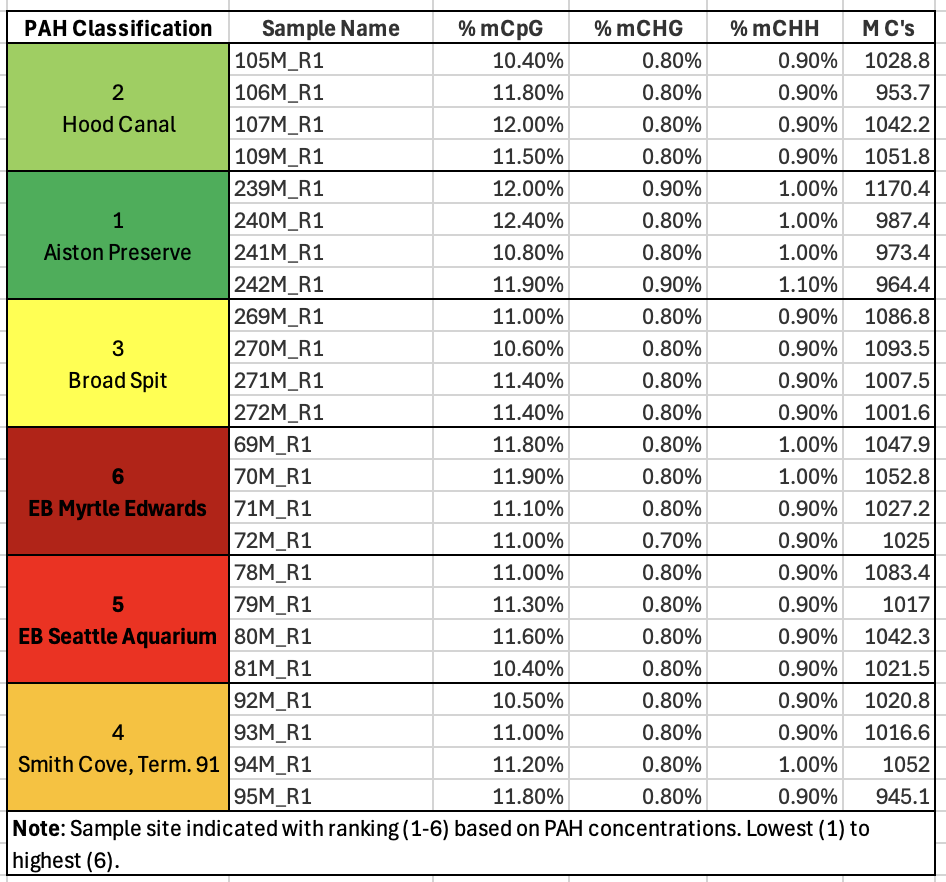

### Plan of the Week: April 6 - April 12, 2026

#### *High- level outline for the week. Adjusted daily to reflect progress of the day before*

-   This week's plan is to continue to move forward with the methylation
    analysis, refresh mutual goals, expectations and priorities with
    Steven, and set goals for April.

------------------------------------------------------------------------

> Monday - Planning the week & Setting April Goals
>
> Tuesday - UW-RUA, No Science
>
> Wednesday - Friday: Will Outline post Steven 1v1
>
> Saturday - No Science
>
> Sunday - Reading

------------------------------------------------------------------------

### Plan of the Day

#### *Granular level task list to accomplish the high- level goal outlined above*

-   Continue to move forward with the methylation analysis.
-   Knockout UW-RUA tasks, including traveler management

### Projects Touched Today

-   DNA Methylation

------------------------------------------------------------------------

### Progress Notes

-   Today's first priority was checking in on the methylation
    extractions; they were almost finished last night.
    -   All sequences were completed by 0500. All reports from Bismark
        and MultiQC were completed by 0600.
    -   My rsync problem was that I was trying to run it from my code
        directory... I knew I just needed to step away before trying
        again. I was able to get that running before Apple decided my
        computer update was more important - so I restarted it after
        being disconnected, but it is decidedly slower than molasses in
        January so we wait.
    -   Next up is to commit the smaller files to GH and start to look
        at the reports and ask questions.
-   Next, I updated my notebook posts from the weekend. I started them
    each day, but didn't finish them.
    -   Once that was done, I had to shift to some UW-RUA traveler
        management tasks that are time sensitive. My next step is April
        goal planning and building my 1v1 agenda for Wednesday.
-   I took a look at the methylation extraction reports from Bismark and
    MultiQC. A couple things I jotted down while reviewing:
    -   M-Bias reports/ plots. 'M'ethylation bias across read positions.
        M-bias looks at the percentage of cytosines are 'called'
        methylated across every single base in the sequence.
        Additionally, the lack of any 'jumps' or 'spikes' in the lines
        indicate nothing external (non-biological) has created noise in
        the sequences.
        -   On average, all sequences are around 11% methylation at CpGs
            (see sample 272M plot from Bismark below). This means things
            like the trimming parameters and bisulfite conversion are
            consistent and not driving the methylation percentage up or
            down from a process POV.

{fig-align="left"}

-   Since I like a good list over a plot, I took the multiQC data table,
    added pertinent sample information and put it below. It helped me
    see that methylation, on average was the same across all samples -
    that makes the upcoming work of figuring out where that methylation
    is occurring very interesting.

{fig-align="left"
width="500"}

-   Additionally, the low percentages of methylation at CHG or CHH (any
    cytosine that is not followed by a G(uanine) directly are low. This
    is important because what we know about animal methylation and it's
    potential functional relevance tells us CpGs are where it's at, so
    high numbers could indicate a bisulfite conversion issue in the
    data.

    -   Fun fact, methylation in plants typically occurs at CG, CHG or
        CHH sites. Check out this [*Muyle et
        al*](https://pmc.ncbi.nlm.nih.gov/articles/PMC8995044/). paper
        from 2022 that explains it way better than me!

-   After looking over my reports, I returned to UW-RUA to prep for
    tomorrow.

------------------------------------------------------------------------

### Outcomes: Products & Word Count

-   Something: 0 words

> **Today's total: 0 words**
>
> **Monthly total to date: 921 words**
>
> **Annual total to date: 33,593 words**
>
> **Annual target total to date: 47,500 words**

### Next Up: Tomorrow's Plan

-   Wrapping up my agenda for my 1v1 with Steven, setting up some April
    goals, and of course, UW-RUA.
