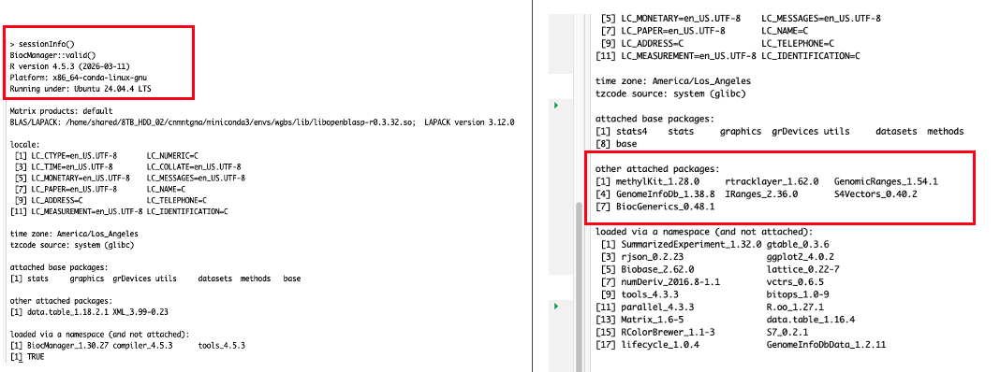

### Plan of the Week: April 6 - April 12, 2026

#### *High- level outline for the week. Adjusted daily to reflect progress of the day before*

-   This week is all about biomarkers and methylation.

------------------------------------------------------------------------

> Monday - Methylation, `methylKit` run
>
> Tuesday - UW-RUA, biomarkers
>
> Wednesday - Biomarkers
>
> Thursday - Biomarkers
>
> Friday - Task management & ferry to FH/ Yellow
>
> Saturday - Yellow Island Surveys
>
> Sunday - Yellow Island Surveys

------------------------------------------------------------------------

### Plan of the Day

{fig-align="left"}

#### *Granular level task list to accomplish the high- level goal outlined above*

-   My primary goals for today are as follows:
    -   Fix my RStudio/ R updates that crashes my local machine before
        it gets the printer treatment...
    -   Get `methylKit` loaded in Raven or open an issue for help
    -   Biomarker drafting

### Projects Touched Today

-   Mussel Methylation

------------------------------------------------------------------------

### Progress Notes

-   I left off yesterday making a mess in R and RStudio. My local
    machine caught me slipping and I updated the working R version when
    switching between projects. Cue the BS.
    -   To add insult to injury, I was already making an installation
        mess in Raven, so I wrapped up, made my notes, and considered
        leaving my laptop out in the rain...
    -   A little sleep and a timer made all of the difference. First, I
        uninstalled and then re-installed R and then RStudio and fixed
        my local machine issue.
    -   I also disabled my `.RData` and any `.Rprofile` docs temporarily
        until I can figure out what I setup that keeps making a mess in
        my stuff!
-   I pivoted to some UW-RUA traveler tasks that are time sensitive
    before returning to fixing my software.
-   Returning to Raven and the `methylKit` install from hell...
    -   During my working block with KPJ, I decided to go back with
        fresh reasoning and install `methylKit` since I'd done some
        clear- headed thinking about the issues and Kristin is a great
        resource for coding conundrums.
    -   First, working through all of the options back to back yesterday
        clouded my goal. The goal is to get the correct versions of
        `BiocManager` and `methylKit` installed so I can keep moving
        forward with the analysis.
    -   I verified I was in my `bio-cli` environment to prevent
        competing versions of R, and maximize capabilities in my
        micromamba 'container' of sorts, aka `bio-cli`. Once I activated
        that, I navigated to R in terminal, verified the version
        (4.3.3), verified where my R libraries are located, and my
        working directory:

> `[1]"/home/shared/8TB_HDD_02/cnmntgna/R/x86_64-pc-linux-gnu-library/4.2"`
> `[2]"/home/shared/8TB_HDD_02/cnmntgna/micromamba/envs/bio-cli/lib/R/library"`
>
> `[1] "/home/shared/8TB_HDD_02/cnmntgna"`

-   I then went back to the BiocManager documentation, verified the
    version should be 3.18, not 3.16 (which I was trying yesterday) for
    R versions 4.3.x. I then crossed my fingers and watched the
    install...

::: callout-warning
Trying to solve an installation or actual coding problem
99.999999999999% requires me to take a step back and identify - out
loud - what I am actually trying to do before accessing the internet! I
lost a few hours yesterday trying to jump into the middle to fix
something I already laid a foundation for. Go back to the basics...
:::

Moving on...

-   `BiocManager` installed and version 3.18 verified.

    -   `methylKit` failed.
        `Error: object ‘key<-’ is not exported by 'namespace:data.table' Execution halted`

    -   Remembering to go back to the basics... I checked my paths, my
        working directories, and the `methylKit` documentation in the
        [al2na GitHub
        repo](https://github.com/al2na/methylKit/issues/350). Even in my
        updated environment, R version 4.2 is overrunning 4.3 - what a
        bully. So I will fix that, and then the `data.table` issue.

    -   Working with KPJ, I created new directories in my environment
        that are exactly the same except they terminal in 4.3 instead of
        4.2, and re-pointed my environment to chose the newer
        libraries...

    -   Next hurdle - the `data.table` package is too new- it is
        1.18.2.1. Installed the older 1.16.4 version successfully.

`find.package("data.table") packageVersion("data.table")`

`[1] "/home/shared/8TB_HDD_02/cnmntgna/R/x86_64-pc-linux-gnu-library/4.3/data.table" [1] ‘1.16.4’`

-   Now, for `methylKit`... to fail. Segmentation fault (core dumped)...
    sounds egregious. More troubleshooting.

-   Halfway through trying to understand the error message, Kristin and
    I remembered we have this really nice conda/ mamba environment. So,
    I found the [Bioconda
    GitHub](https://bioconda.github.io/recipes/bioconductor-methylkit/README.html)
    page with instructions to install via my `micromamba` environment.

    -   Helpful within that is the compatible versions list of the
        gazillion packages needed for this program.

    -   `rtracklayer` was the next culprit, so installing and loading
        that, version 1.62.0, finally opened the door to
        `methylkit version 1.28.0`. I am rating this escape room 0/10.

-   Now for the true test- the code in the markdown.

    -   Which failed.

-   After knocking out some UW-RUA tasks, I returned with a fresh set of
    eyes.

    -   Problem 1 - no matter how many times (or ways) I set my working
        directory or activate my working environment, the markdown is
        fighting me.

    -   Problem 2 - my launch/ `.Renviron` / `.Rhistory` files are in a
        fight to pull me into insanity.

    -   Fixing problem 2 first will hopefully solve have the fight.

        -   I became a recursive remover with impunity! I suspect the
            repeat attempts and fails created a bunch of mixed signals.

        -   I did that because in my documentation perusal, I found that
            while `conda` and `mamba` are discussed kind of
            interchangeably, they are companions, not options - this
            helped me clarify my primary conflict - several
            'environments' that could be one.

        -   Once I renamed my old history and environment files, I
            changed my global options in R to stop loading from the
            previous session, restarted and followed the bioconda
            instructions to get my tools in one environment.

    -   I now have a `wgbs` environment - outside of the methylation
        project - that I can use for this work and all subsequent
        projects. The environment includes the QC and alignment tools as
        well. I am very pleased!

        -   It did activate within the markdown once I rendered the
            markdown as quarto & now my next step is to fix the actual
            coding errors I have created by modifying the chunks to test
            against the other environments and workarounds I attempted
            earlier today.

{fig-align="left" width="600"}

------------------------------------------------------------------------

### Outcomes: Products & Word Count

-   WGBS environment!

> **Today's total: 0 words**
>
> **Monthly total to date: 4420 words**
>
> **Annual total to date: 37,093 words**
>
> **Annual target total to date: 50,500 words**

### Next Up: Tomorrow's Plan

-   UW-RUA and biomarker edits.
