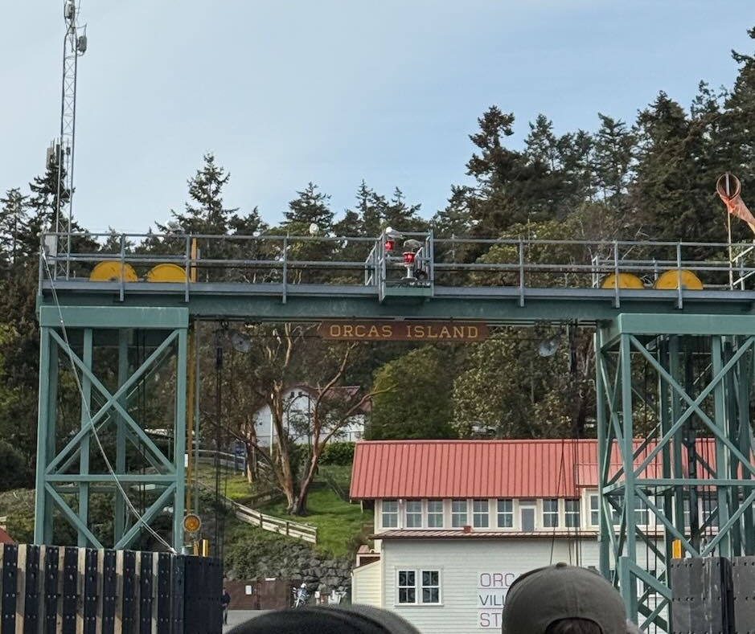

### Plan of the Week: April 27 - May 3, 2026

#### *High- level outline for the week. Adjusted daily to reflect progress of the day before*

-   This week is all about making progress in my writing deliverables.

------------------------------------------------------------------------

> ~~Monday - UW-RUA~~
>
> ~~Tuesday - Finishing my Annual Evals~~
>
> ~~Wednesday - Methylation & Biomarkers~~
>
> ~~Thursday - Methylation~~
>
> ~~Friday - Methylation and Biomarkers~~
>
> ~~Saturday - No Science~~
>
> Sunday - Methylation

------------------------------------------------------------------------

### Plan of the Day

### *Granular level task list to accomplish the high- level goal outlined above*

-   My goal for today is to get these samples and beat traffic back.

### Projects Touched Today

-   Yellow Island

------------------------------------------------------------------------

### Progress Notes

-   Nothing like getting up at 4a to make a ferry that is now the
    catchall for the earlier ferries that were cancelled...
    -   Made it to Orcas Island, then Yellow to collect my samples
        before the low tide window closed.
    -   Something hilarious about being so short that even when you
        fully extend your arms you are not taller than the cyclists in
        front of you to get a better photo of landing!

{fig-align="left" width="400"}

------------------------------------------------------------------------

### Outcomes: Products & Word Count

-   eDNA samples collected.

> **Today's total: 0 words**
>
> **Monthly total to date: 0 words**
>
> **Annual total to date: 41,162 words**
>
> **Annual target total to date: 59,500 words**

### Next Up: Tomorrow's Plan

-   Will be made during weekly set-up.
