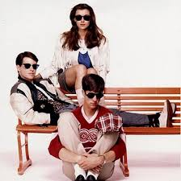
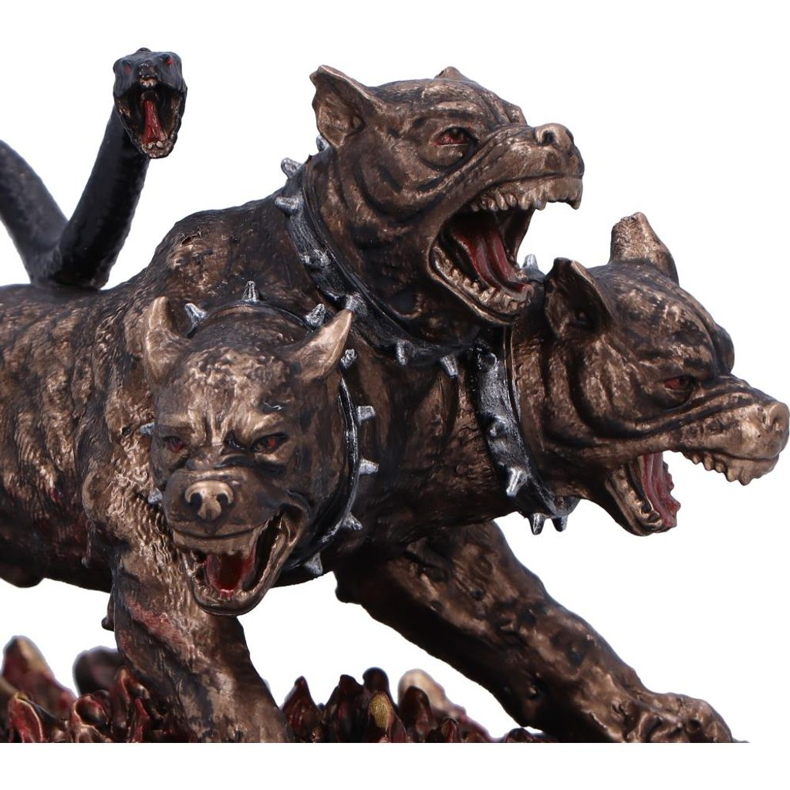

{fig-align="left"}

It has been a minute since I did a proper recap, and since this week was all about planning and realigning myself with the work that will move me forward, it felt like a good time to start fresh. Since October's pivot to tighten up the scope of my work, I have been playing catch up. It's been a bit stagnant, so I had to go back to basics to get it together!

#### Focus for the Week: 

1.  Realign outcomes (or products), direction, and deliverables with Steven.

2.  TKO this Biomarker manuscript draft.

3.  Keep the methylation analysis moving forward.

#### Progress Made: 

1.  Realignment. After a great meeting on Wednesday with Steven and Chelsea, the department GPC, I believe we have a solid working plan for alignment and moving forward.

2.  Biomarkers. I have completed the first step of critically reviewing the state of the draft, identified what can get it to committee- ready status, and began work on the first of 3 categories of refinement.

    1.  The three categories are writing, citing, and clarifying. I broke down the first major WDFW report I cite into it's 'backing' scientific lit on Thursday and Friday.

    2.  I then shifted to the clarification notes and began focusing on the argument and narrative breakdowns. This helped me identify that I was burying the lead - the big takeaway from this work is that while contamination is clearly characterized across Puget Sound, the biological outcomes were much more variable using traditional tools, so turning the monitoring program into a bio-monitoring program is more complex than anticipated despite having traditionally validated tools.

3.  Methylation analysis. Analysis up through methylKit is complete, and base scripts for the methylKit steps are 90% ready to go. Additionally, I created a project log and running questions list to help me prepare for my weekly working sessions with Steven.

#### Challenges: 

The largest challenge this week was getting my To-Do list and my sense of overwhelm under control - I'll explain a bit more about that below.

#### Synthesis: 

Spending the time to really sit in the current 'state of the union' allowed me to think more critically about the work I'm engaged in, the supports I will need, and how to better benchmark my progress and day-to-day capacity.

#### Next Week: 

Weekly working sessions with Steven start next week. This will help move the methylation analysis and manuscript forward so it doesn't lag in the way the biomarkers manuscript has.

### So, How Exactly are We Making the Realignment Stick?

{fig-align="left"}

Ferris Bueller's Day Off is a quintessential 1980s movie most fondly summarized by the fun of playing hooky and driving around in a vintage convertible, and the lines, "Life moves pretty fast. If you don't stop and look around once in a while, you could miss it."

This sentiment is easily translated to taking a break, but it also applies to gaining broader clarity and alignment with your goals and the process to achieve them; task overwhelm obscures the finish line, and we need to stop and look around at what we're doing. I was reminded this week, that taking the time to just let it rip - write it all down, confront what is spiraling and do something about it - it the ultimate first step in *actually* getting the work done.

For this whole thing to work, you have to know your goals and what life area you are trying to clarify progress around; obviously this is my lab notebook, so we're focused on my Master's work. You **cannot** successfully redesign every area of your life at one time, I don't care how motivated you are at midnight on a Tuesday with a blank Notion landing page and YouTube waiting for you...

My three major goals for Spring Quarter, in order of priority are:

1.  Completed, polished draft of the biomarker manuscript.
2.  Completed, polished draft of the methylation manuscript.
3.  Clearly drafted introduction and a clearly outlined Chapter 3 & 4 of my PhD proposal.

Each of these will take multiple steps and even more tasks to complete; this is how I do that.

Step 1 of 7 is to pick the two to three categories of one goal you want to prioritize first, and then one to two categories that will follow the completion of the first goal. The key to this being successful is extremely clear categories based on your hierarchical goal list. For example, a complete biomarker manuscript is my first goal, but not a clear category. The manuscript goal can be broken into three categories:

1.  Line edit- level of my writing to assess for alignment with the key results and larger narrative.
2.  Critical review of citations (currently only 24 of the 67 papers I've read are in the draft) and their applicability to the manuscript. This to be done by major section (intro, methods, results, conclusion).
3.  Sufficient visualizations to tell the story, not overwhelm the manuscript. I think 3-5 plots/ maps is the target number based on the analysis and result.

Step 2 of 7 is taking the time to just brain dump all that is swirling in your mind - even if it's not goal- related; we're multi-faceted, work with that and not against it. This parctice prevents tunnel vision, poor prioritization, and action paralysis (both the failure to start & the narrowing of focus to minutia rather than broader task, a.k.a. tunnel vision).

Step 3 of 7 is organizing that list into the categories you defined earlier - ***Do Not Create New Ones*** - this will help you separate the important from the peripheral. My biggest pitfall has been deciding on the categories after looking at the list, not beforehand. Most of my overwhelm and aspirational sense of productivity comes from making this mistake. We have identified the big priorities, stick to them! This part feels like you're going backwards because the list grows wildly but it stops the lie you tell yourself that "it’s only three things, why can’t I get three things done." In fact, it is 10 things slotted into a time block built for two things. 

Worth a pause and a callout - this is no place to let embarrassment, shame, or disappointment takeover. Get your Hercules on, wrangle that Cerberus, and get back to business. The energy wasted by chastising yourself is clouding your judgement. Instead, get into the practice of completing a post-mortem for goal or milestone achievement to help separate the story from the facts.

[{fig-align="left" width="500"}](https://www.wulflund.com/cerberus-11cm-figurine)

Step 4 of 7. A mentor told me that only putting deadlines on your calendar, ones that you may or may not meet, is a surefire way to lose motivation because you are unintentionally reinforcing the narrative that you are a person who does not complete things. To combat that, take your expanded task list, assigned to your top goal and goal categories, and add the actual steps to your calendar along with the 'big' deadline. Now you have proof and reinforcement that you are a person who completes things - even if the major deadline is shifted.

Step 5 of 7. Arguably more important than planning your process, is planning your inspriration. You will not always feel as ready to get it done as you do today, so plan for it. I take great inspiration from sports, sports theory, and coaches talks when I can't get focused on the tasks in front of me. I find personal and creative inspiration by looking to writers, artists, and creators; typically as far away from obvious science as possible. I look to painters, sculptures, the fashion icons - designers and critics, mostly. The pursuit of translating the beauty of the human experience provides me both a grounding and an expansiveness that allows my brain to get to the outcome I’m seeking.

Once you identify what motivates you and when, it’s important that you start putting together a few things you can read, a few you can see, and a few more that you can listen to depending on your preferred method. I have content in folders, digital bookmark lists, YouTube playlists, podcast lists, a couple of vision boards, and hand-written quotes from folks I admire. The key here is to put them where you can see them.

Step 6 of 7. We've got our goals, assigned a date for the deliverables for each category, and added a motivation plan for when we need a little help; now we refine. The hardest of the steps is this one. Walk away from it, come back a few hours later and be honest with a side of grace - we cannot plan in a vacuum, which is what we just did. Take a realistic look at your schedule and start moving and shaking. For example, I know heavy meeting days present me two challenges, (1) re-engaging my focus as I shift tasks, and (2) getting into deep work when I know it's on a timetable bounded by others.

Creating plots and maps are multi-step things I can pick-up and drop without significant re-engagement time, so shifting my visualizations tasks to meeting days keeps my progress moving forward. The writing and clarifying tasks require significant engagement, and regular disruptions present progress paralysis for me, so I block morning or guaranteed non-meeting time to work on those. In addition, I don't let my 3-hour time block, for example, to go unplanned. Typically, I plan the specifics just before starting the block, accounting for my mood and motivation. The big caveat being that the task category was defined on the calendar so I know the focus of the block. And, finally...

Step 7 of 7 is to remember to reward yourself for the things you’ve completed. Give yourself a chance to look back and say, "I really have done well." I have a physical jar, the Victory Jar, where once a day I add a 'win' of any size, across any area of my life. Once in awhile I re-read some of them, but once a quarter I put all of them together and read them when I do my quarterly post-mortem. This is the evidence that reinforces that I am exactly who I think I am.

Hopefully this gave you a sense of my planning, motivation, and reinforcement practice, as well as maybe a takeaway or two. I thought it was a good time to share since I am making a large pivot and have to commit or end up really disappointed in myself when I finally stop to notice the opportunity passed me by.
