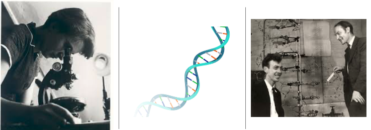
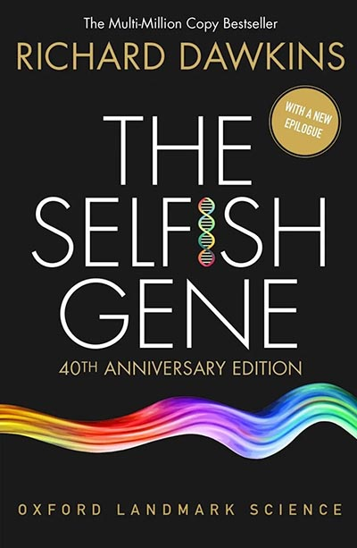

This week's wrap-up is more a celebration of DNA as it is National DNA Day, a.k.a. World DNA Day due to the advancements in global understanding of DNA.

[National DNA Day](https://www.genome.gov/dna-day#:~:text=National%20DNA%20Day%20is%20celebrated%20on%20April,to%20host%20events%20from%20January%20through%20May.) is celebrated to commemorate the discovery of DNA's structure in 1953, and to recognize the completion of the [Human Genome Project](https://www.genome.gov/human-genome-project) in 2003. Both very cool milestones in the field of genetics and molecular biology. But, in honor of the day, I'm going to touch on the human and shift...

The discovery of the double helix is one of the most significant scientific discoveries of the 20th century. Initiated by x-ray imaging work done by Rosalind Franklin, the discovery of the structure of DNA was a awarded a Nobel Prize in 1962; the prize was awarded to other scientists in the group, James Watson, Francis Crick, and Maurice Wilkins. Pictured below are Franklin, the double helix, and Watson and Crick.

{fig-align="left" width="500"}

> *The discovery of the double helix structure of DNA provided a fundamental understanding of how genetic information is stored and transmitted in living organisms.*

I remember when the Human Genome Project launched... in 1990, for two reasons, (1) I couldn't believe that a fully sequenced human genome didn't exist, and (2) I didn't actually know what that meant.

Fast forward some 36 years later, and I can confidently say that (1) I can completely understand how we didn't have that information in 1990, and (2) the more I learn, the more I don't know. DNA is dope.

In between 1990 and today, I have learned a ton - with tons more to go! [The Central Dogma](https://www.genome.gov/genetics-glossary/Central-Dogma), as developed by Francis Crick in 1958, is the reason the world is alight currently with the potential for that to be amended [courtesy of bacteria in 2026](https://www.science.org/content/article/scientists-stunned-fundamentally-new-way-life-produces-dna)... While these are by no means the only breakthroughs in genetics in the last 30+ years, it is a wonderful reminder that, just like space exploration, DNA has always captured our curiosity and fascination.

To celebrate the day, I went back to my copy of The Selfish Gene by Richard Dawkins, a book I read early-on in undergrad, and just looked at my notes, my questions, the things that interested me. I definitely knew I was not as interested in evolution (or the evolution of social behaviors) as I was in other genetic/ genomic areas of study, but there is something really fascinating about making genes the main characters... I guess that's why I ended up doing what I'm doing.

{fig-align="left" width="200"}

That time was a particular storm of old knowledge and new, colliding in my head; some information mis-remembered, other bits fresh enough to be accurate, all crafting my curiosity. I went back to what I learned growing up - the [Sanger method](https://pmc.ncbi.nlm.nih.gov/articles/PMC4727787/) of DNA sequencing and I will reach AARP status really close together - the flux of information, the updates, debates, and eventual steps to access a, "*knowledge of sequences could contribute much to our understanding of living matter." -Sanger*

Here we are, just a few bench lengths down, trying to understand epigenetic mechanisms in bivalves. What a wonderfully lovely place to be. From ecosystem- level inputs, to parental 'priming' and back again; what we do could not be done without the fundamental search to understand ourselves. Very cool.
